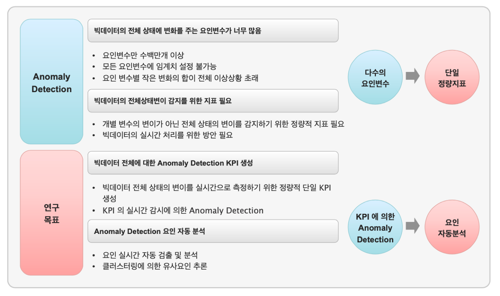
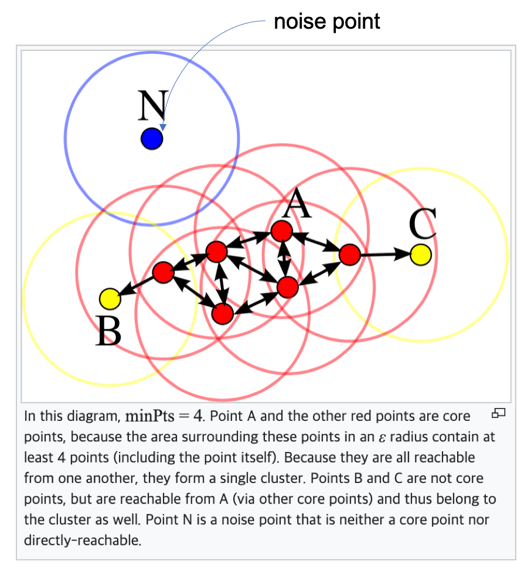

이상 탐지 ( Anomaly Detection ) - 1
===========================================================

개요
------------------

| 이상 탐지(Anomaly Detection)란 예상되거나 기대하는 관찰값, item, event 가 아닌 데이터 패턴(이상징후,anomalies), 개체(이상값) 등 을 찾아내는 것을 의미합니다.
| 이상값은 "정상"이 아닌 값인데, "정상" 에 대한 정의는 적용 분야 및 문제마다 다르게 정의될 수 있습니다. 
| 이상값은 한글 용어로 이상치, 이상값, 이상 징후, 극단값, 비정상 등 으로 부르고, 영어로 anomalies, outliers, novelties, noise, deviations, exceptions 와 같은 표현을 사용합니다.
| 용어의 혼동을 막기 위해 여기서는 주로 이상 징후, 이상값, anomal data, anomalies 로 표시하겠습니다.
|
| 이상 탐지 기법이라는 것은 특정 알고리즘이 있는 것이 아니라 "기대하는 결과" 를 얻기 위해 여러 가지 알고리즘과 분석론을 활용한 분석(application)을 의미합니다.
| 어떤 데이터인지, 어떤 분야에서 적용하는 지, 목적은 무엇인지 등 에 따라 매우 광범위하고 다양한 방법들이 활용되고 있습니다. 
| 즉, 정해진 기법이나 모델을 사용하는 게 아니라 활용 가능한 모든 방안들을 사용할 수 있습니다.
| 이상 탐지는 산업 다방면에서 필요로 하는 분야이지만 적용 현장에 따라 적용 기법이 다 다르고, 명확한 원인 규명의 어려움, 이상값을 가진 데이터 확보의 어려움 등 여러 가지 한계점이 있습니다.
| 하지만 최근까지도 GaN( https://arxiv.org/pdf/1809.04758.pdf ) 과 같은 딥러닝 기반 알고리즘 등의 관련 연구가 활발히 이뤄지고 있습니다.

응용 
------------------

| 이상 탐지는 보안, 금융, 제조, 통신, 의학 등 산업 전반에서 다양한 활용이 가능합니다.

* 보안 분야에서 Cyber 침입 탐지
    * 네트웍 트래픽의 이상 징후 탐지
    * 사용자 데이터로 클러스터링하여 이상 사용 패턴을 탐지
    * Ddos 공격 및 APT 침입 등 Cyber 공격으로 인한 주요 정보 유출과 서비스 다운을 방지하기 위해 활용
* 금융 분야의 fraud 탐지
    * 고객의 평소 구매 장소, 건당 평균 구매 금액과 다른 패턴의 구매 패턴을 탐지하여 신용카드 복제 및 도난 사용 의심 이벤트 추출
* System health 모니터링
    * H/W, S/W system 의 교체 시점 파악 및 유지 보수 기간동안 이상 징후를 미리 탐지하여 예방 보전 활동
* Fault detection
    * 제조업에서 불량 관리
* 센서 네트웍에서의 event 탐지
* 생태계 교란 탐지
* 의학 분야의 MRI 이미지의 anomalies
* 기타 ...

이상 탐지의 목적
------------------

| 이상 탐지를 사이트에 적용하려는 목적 즉 "기대하는 결과" 는 다양할 수 있습니다.

* Chance Discovery 의 목적
    * 예 : 새로운 고객 층의 발견, 보험 상품의 개발,  segmentation 이 필요할 때  
* Fault Discovery 의 목적
    * 예 : 불량율이 증가하는 장비 , 공정 탐지 등
* Novelty Detection : 새로운 것을 찾기 위해
    * 예 : 보안 분야의 새로운 침입 패턴 탐지
* Noise Removal : 노이즈의 제거
    * 예 : 잘못 입력된 값이나 대표성이 없는 극단값의 자동 제거

이상 탐지의 여러 이슈
--------------------------------------

* 정상과 이상 상태를 명확하게 정의 하기가 어렵습니다.
    * 제조, 마케팅 등 많은 분야 에서 이상 상태 데이터의 정량적 수치( 정답 label )를 제공하기가 어렵습니다.
    * 이상 패턴은 정상 패턴과 매우 유사한 패턴을 보일 수 있습니다.
        *  예를 들어 이동통신 다운로드 패킷 사이즈의 변화량은 사용자의 수, 사용 시간, 특별 이벤트에 높은 상관성을 가지므로 이상값과 정상값을 단순 분리하기 어려움

* 알려진 이상값, 이상 패턴과 전혀 다른 이상값, 이상 패턴이 발생할 수 있습니다.
    * 보안의 침입 탐지에서 신규 취약점 공격 패턴

* 양질의 training/validation 데이터 셋을 확보하기가 어렵습니다.
    * 이상값 데이터는 정상 데이터에 비해 매우 적게 발생합니다.
    * 새로운 탐지 알고리즘의 개발과 검증에 필요한 데이터의 경우에는 완벽하게 검증이 완료된 기존 데이터 외에 신규 case 데이터가 있어야 합니다. 
    * 모델의 검증과 재추정 시기 등을 파악하기 위해서는 training 에 사용된 데이터 외에 test 데이터 셋이 필요합니다.

* 정상 패턴도 시간, 상황에 따라 변화합니다.
    * 예 1) 라이프 스타일, 유행 제품의 변화에 따른 전력 사용량 변화
    * 예 2) 킬러앱, 혁신적인 신제품의 등장으로 고객의 데이터 사용 패턴이 달라질 수 있습니다.

* 빅데이터의 문제 - 이상 탐지의 대상 변수( feature ) 가 너무 많고, 데이터의 양( Size )도 방대합니다.
    * 운용자가 수동으로 경험적인 임계치 설정으로 정상-이상 판별 기준을 마련하는 것은 불가능합니다. 기계학습, 딥러닝의 방법들이 필요한 추세입니다.
    * 이상 탐지는 신속하게 탐지하여 조치 및 예방하는 것이 목적이므로 빅데이터 실시간 처리를 위한 방안이 함께 필요합니다.

Anomaly Detection Techniques 종류
----------------------------------------------

기계학습 기반의 이상 탐지
''''''''''''''''''''''''''''''''''''''''''''

**군집(Clustering) 기반 이상 탐지 기법**

| 군집화는 기계 학습 방법 중 ``Unsupervised(비지도)`` 학습이며, 준지도 군집화(Basu et al., 2004)도 최근 연구되고 있습니다.
| "이상값" 으로 가정하는 3가지 case 에 따라 군집화 알고리즘을 나누었습니다.

* 이상값 가정 1 :  ``정상값들은 하나 또는 몇 개의 군집에 모여 있고, 이상값은 군집에 속하지 않는다.``
    * 데이터에서 군집을 찾아낸 후 제거한 뒤 남아있는 데이터를 이상값으로 처리.
        * DBSCAN ( `wikipedia 설명 <https://en.wikipedia.org/wiki/DBSCAN>`__ , `scikit-learn 의 DBSCAN 알고리즘 <https://scikit-learn.org/stable/auto_examples/cluster/plot_dbscan.html>`__ )
        * ROCK ( `Guha et al., 2000 <http://www.facweb.iitkgp.ac.in/~shamik/autumn2012/dwdm/papers/ROCK%20A%20Robust%20Clustering%20Algorithm%20for%20Categorical%20Attributes%20(2000)guha00rock.pdf>`__ )
        * SNN 군집화 ( `ML wiki 설명 <http://mlwiki.org/index.php/SNN_Clustering>`__ )
    
* 이상값 가정 2 : ``군집의 중심(centroid) 중 가장 가까운 것과의 거리가 짧으면 정상값, 길면 이상값이다.``
    * 군집화를 하고 데이터가 포함된 군집의 중심과 데이터 개체 사이의 거리를 "이상 score" 로 두고 이용.
        * K-means ( `wikipedia 설명 <https://ko.wikipedia.org/wiki/K-평균_알고리즘>`__ )
        * EM 알고리즘 ( `wikipedia 설명 <https://ko.wikipedia.org/wiki/기댓값_최대화_알고리즘>`__ )    

* 이상값 가정 3 : ``정상값은 크거나 조밀한 군집에, 이상값은 작거나 sparse 한 군집에 속한다.``
    * 데이터 개체가 속한 군집의 크기나 밀도가 "이상" 여부를 판단.
    * CBLOF(cluster-based local outlier factor) `He et al., 2003 <http://citeseerx.ist.psu.edu/viewdoc/download?doi=10.1.1.20.4242&rep=rep1&type=pdf>`__

**분류(Classigfication) 기반 이상 탐지 기법**

| 분류는 기계 학습 방법 중 ``Supervised(지도)`` 학습의 대표적인 방법입니다.
| 학습(훈련) 할 데이터에 어느 클래스에 속하는지에 대한 정답 label이 있어서 분류기(classifier)를 학습(training)한 뒤, 학습된 모형으로 새로운 데이터가 각각의 클래스에 속할 확률을 예측하는 방법.
| 정답 label 의 개수에 따라 multi-class 와 one-class 로 나뉩니다.
| 분류기가 각 정상 클래스와 나머지를 구분하도록 학습시키고, 어느 클래스에도 포함되지 않는 데이터를 "이상값" 으로 처리합니다.

* 분류기 생성 알고리즘
    * 신경망(Neural Network) : multi-class, one-class 분류에 모두 이용
    * Bayesian networks : multi-class 분류
    * SVM(Support vector machine) 기반 : one-class 분류 
    * 결정 규칙(Decision rule) 기반 : multi-class, one-class 분류에 모두 이용

**NN(Nearest neighbor) 기반 이상 탐지 기법**

| NN 기법은 ``정상값들은 어떤 근방(들)(neighbor)에 밀집되어 있고, 이상값은 각 근방에서 멀리 떨어져 있다`` 고 가정합니다.
| 각 개체 사이의 거리를 측정해서 ``이상 score`` 를 만들어 냅니다. 

* KNN  : 이상 score 를 K번째로 가까운 개체와의 거리로 정의
* LOF(Local Outlier Factor) score : 상대 밀도 기반으로 각 개체 근방의 밀도를 추정하여, 근방의 밀도가 낮은 개체를 이상값이라고 판단

``분류 기준에 대한 출처``  [Chandola, V., Banerjee, A., & Kumar, V. (2009). Anomaly detection: A survey. ACM computing surveys (CSUR), 41(3), 15]
 

통계학적 기반의 이상탐지 
........................................

| 통계학적 기반의 이상탐지 분석에서 ``anomal 데이터의 정의`` 는 "대부분의 데이터가 가지는 확률분포와 부분적으로 또는 완전히 동떨어졌다고 여겨지는 관측값" 으로 정의합니다.
| 통계적 기법은 주어진 자료로 모형을 적합한 뒤 통계적 추론을 통해 새로운 데이터가 그 모형을 따르는지를 판단하며 
| 검정 통계량을 바탕으로 테스트 데이터가 해당 모형으로부터 생성되었을 확률이 낮은 데이터를 이상값으로 봅니다. 

**모수적 기법**

| 테스트 대상 데이터가 추정된 분포에서 생성되었다는 것(정상값)을 귀무가설로 합니다. 이때 가설 검정에 사용한 검정 통계량을 ``이상 score`` 로 활용할 수 있습니다.
| 모수적 기법은 분포의 종류에 따라 다시 나눌 수 있습니다.

* 정규 모형 기반
    * 데이터가 정규모형에서 생성된 것으로 가정하고, 최대우도추정량(maximum likelihood estimator, `MLE <https://en.wikipedia.org/wiki/Maximum_likelihood_estimation>`__) 를 사용.
    * 각 데이터와 추정된 평균값 사이의 거리가 "이상 score" 가 되고, 이상 score 의 경계를 정해서 이상값 여부를 결정합니다.
    * 거리의 정의와 경계를 구하는 방법들이 다양하게 제인되어 있습니다.
        * 상자그림
        * Grubbs 검정
        * Mahalanobis 거리
        * Student t 검정
        * Hotelling's t 검정
        * 카이제곱 검정

* 회귀모형 기반
    * 시계열 데이터에 적용하며, 데이터의 회귀모형을 적합한 뒤에 테스트 데이터와 회귀모형간의 잔차(residual)로 "이상 score" 를 구합니다.
        * Robust 회귀 
        * ARIMA 모형

* 혼합 모형 기반
    * 데이터에 적용할 분포를 혼합하여 이용합니다.
    * 정상값과 이상값에 각각 다른 분포를 적용하는 방법과 정상값에만 혼합 분포를 적용하는 방법이 있습니다.

**비모수적 기법**

| 데이터가 특정 모형을 따른다는 가정을 하지 않습니다. 
| 비모수적 기법은 실제로 데이터가 특정 분포를 따른다는 가정이 성립하지 않을 때가 많기 때문에 현실적인 접근이 용이한 이점이 있습니다.

* 히스토그램 기반
* 커널 함수 기반

**정보 이론 기반 이상 탐지 기법**

| 엔트로피, 상대 엔트로피와 같은 척도를 이용하여 데이터의 정보량을 분석합니다.
| 정보이론의 핵심 아이디어는 ``잘 일어나지 않는 사건(unlikely event)은 자주 발생하는 사건보다 정보량이 많다(informative)`` 는 것입니다

**참고 문헌**

이상탐지, 시계열 분석 https://h3imdallr.github.io/2017-06-20/anomaly_detection
anomaly detection 의 최신 트랜드 https://github.com/hoya012/awesome-anomaly-detection
한국보건사회연구원 정책보고서 https://www.kihasa.re.kr/web/publication/research/view.do?menuId=45&tid=71&bid=12&division=001&ano=2401
https://medium.com/@john_analyst/isolation-forest%EB%A5%BC-%ED%86%B5%ED%95%9C-%EC%9D%B4%EC%83%81%ED%83%90%EC%A7%80-%EB%AA%A8%EB%8D%B8-9b10b43eb4ac
데이터 과학을 위한 R 알고리즘 https://statkclee.github.io/r-algorithm/r-mle-normal.html

