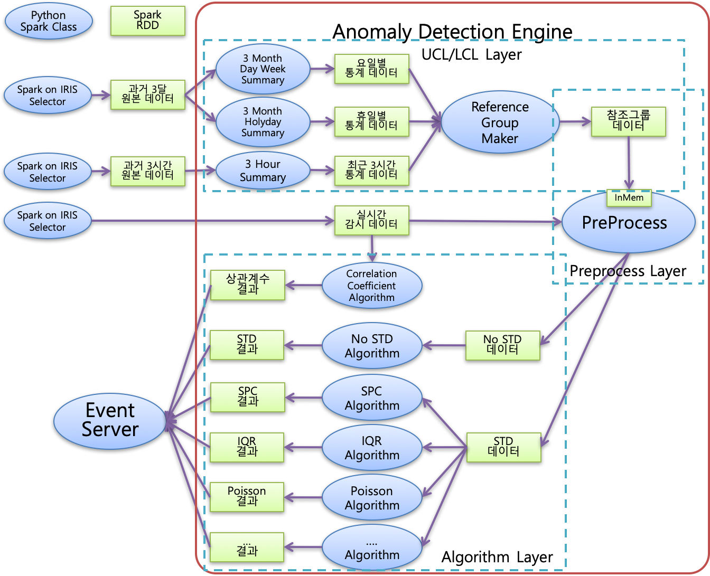

이상 탐지 ( Anomaly Detection ) - 2
===========================================================

모비젠의 Anomaly Detection 엔진
---------------------------------------------------------

용어 
...............................

| ``feature`` : 데이터에서 이상 탐지 대상이 되는 요인 필드를 의미합니다. 예를 들어 서버 상태의 이상 탐지를 위해서 CPU부하, 네트웍트래픽, 메모리사용량,, 이러한 필드가 feature 가 됩니다.
| ``참조 데이터 ( reference data )`` : 장애가 발생한 적 없는 과거 기간의 정상값 데이터.
| ``참조 데이터의 key`` : 참조 기간의 데이터에서 평균, 표준편차 등의 통계량을 계산하는 그룹 단위 데이터를 구하는 key. SQL 에서 "select * from .. group by 참조데이터의 key" 와 유사합니다.
| ``참조 통계량`` : 참조 데이터에서 정상값의 범위를 구하고, 임계치를 설정하기 위해 계산하는 통계량. 분포 기반 평균, 표준편차, 최소값, 최대값, 중간값, IQR 등 

특징
''''''''''''''''''''''

| 장애가 발생한 적 없는 과거 데이터인 참조데이터( 정상값 )를 기반으로 하여 정상 데이터를 정하는 기준이 되는 임계치를 만듭니다.
| 그리고 설정된 임계치를 벗어난 데이터를 이상값으로 판정합니다.

| 모비젠의 이상 탐지 엔진은

* 대량의 system 및 system 이 가진 수많은 개별 feature 들의 ``임계치를 자동 설정`` 합니다.
* 주기가 있는 시계열 데이터의 ``실시간 이상 탐지`` 기능
* 이벤트 로그 데이터(예: 장비의 알람 로그) , 센서 측정 데이터, 큰 oscillation 데이터 등 ``다양한 데이터 특성과 분포`` 에 맞는 이상 탐지 기법 적용
    * smoothing 변환, moving Average, EWMA
    * 정규 분포, poisson 분포, IQR 기반 
* System Heath Monitoring 을 위해 ``이상 score`` 라는 통계량을 계산합니다.
    * system 의 개별 feature 의 이상 탐지와 system 의 이상 score, system cluster, 운용 team 등으로 정량적 수치를 확장해서 감시에 활용할 수 있습니다. 
* Change-point Detection 
    * 주요 system 의 상태 변화 시점 자동 탐지 기능
* 이상 탐지 결과를 이용하여 RCA(Route Cause Analysis) 에 적용
    * LTE Core 망 장비 대상으로 이상 탐지 적용 &  RCA 적용 사례가 있습니다.( SKT )

임계치 자동 설정
''''''''''''''''''''''

| 빅데이터 시스템은 상태에 영향을 주는 feature 가 너무 많고, 상호간에 복잡한 연관성이 존재합니다.
| 예전처럼 도메인의 전문가가 일일이 임계치를 설정하기에는 너무 많으며, 장비 EMS 에서 일괄적으로 설정된 임계치로 인한 잦은 알람 발생은 그 자체로 또 다른 문제를 일으키고 있습니다.
| 실시간으로 감시해야 할 데이터는 대부분 시간에 따른 주기성을 갖고 있거나 영향을 받기 때문에 1개의 feature 라도 시간대, 이벤트 발생 유무에 따른 여러 개의 임계치가 필요합니다.
| 임계치는 시간대별, 데이터 발생 분포별, 데이터 타입에 따라 여러 개의 임계치를 가지게 됩니다.
| 
| 이상 탐지 엔진은 참조 기간 데이터에서 자동으로 feature 개별로 여러 임계치를 자동으로 생성 합니다.

* 장애가 발생하지 않은 과거 데이터( 참조 데이터 ) 를 기반으로 하여 자동으로 임계치 설정
* 요일별 / 휴일별 / 시간대별 key 가 결합된 참조데이터 key 를 만들어서 시계열 데이터의 임계치 설정
* 주기적으로 최신 데이터를 포함하여 임계치 갱신
* 데이터 타입 및 특성에 따른 통계량을 적용하여 임계치를 설정하고, 이에 따라 여러 종류의 탐지 알람을 생성하는 데 활용
    * 정규 분포 기반으로 ``평균 +/- 3 * 표준편차`` 로 하는 상한, 하한 임계치 
    * IQR 기반의 상한, 하한 임계치
    * Poisson 분포 기반의 상한, 하한 임계치
    * Correlation 기반의 상한, 하한 임계치
    * 운용자 설정 기반의 임계치 : 절대적인 기준이 필요하거나 정해진 MAX, MIN 값이 있을 때
 

다양한 이상값 판정 룰
''''''''''''''''''''''''''''''''''''''''''

| 참조 기간 데이터로부터 평균과 표준편차 외에 다양한 통계량을 계산하여 참조 데이터로 저장해 두고, 탐지 대상 데이터에 여러 개의 이상값 판정룰을 적용합니다.

* 다양한 이상값 판정 룰을 적용하기 위한 통계량 계산
    * 정규 분포 기반으로 한 참조 데이터의 평균, 표준편차
    * 분포와 무관한 사분위수, IQR
    * Poisson 분포 기반의 평균, 표준편차
    * Correlation 기반의 임계치 
    * 참조 데이터 기간동안 한번도 발생하지 않은 값의 판정
    * Moving Average 등 Smoothing 변환 데이터로 통계량을 계산하고, 입력 데이터 역시 변환하여 이상값을 판정
    * SPC rule 적용하여 추세 및 징후에 대한 탐지 기능 추가
    * EWMA 처럼 최신 값에 가중치를 준 데이터 변환으로 이상값 탐지 

시계열 데이터의 이상 탐지
''''''''''''''''''''''''''''''''''''''''''

| 이상 탐지의 어려움 중에 하나는 많은 데이터가 시간이라는 요인이 크게 작용한다는 점입니다.
| 예를 들어 2006년부터 2020년 8월까지 월별 최대 전력 사용량 그래프를 보면, 같은 해의 데이터라도 월별로 차이가 크고, 주기성이 보이며, 해마다 전반적으로 전력사용량이 증가하는 추세임을 알 수 있습니다.
| 이러한 시간 변수가 있는 시계열 데이터는 정상값의 기준이 되는 참조 데이터에서 ``시간 요인을 추가`` 하여 임계치를 만들어야 합니다.

| 이동통신 네트웍 트래픽의 이상 탐지를 예로 들면 탐지 대상 데이터의 시간과 동일한 시간 key를 가진 참조데이터와 비교를 해야 합니다.
| (월요일 & 15시 데이터의 이상 탐지 대상 데이터는 과거 4주의 월요일 & 15시 데이터의 임계치를 기준으로 판정합니다.)

| 또, 시계열 데이터 중에는 지진파, 서버의 CPU 사용량처럼 oscillation 이 큰 데이터가 있습니다.
| 여기에서 순간적으로 튀어오르는 값을 전부 이상값으로 탐지하면 너무 잦은 알람 발생으로 운용 피로도 문제와 알람의 신뢰성의 문제가 발생합니다.
| 이런 상황에서 실제 운용자가 이상 징후로 판단하는 시점은 
| 튀어오르는 값이 자주, 연속적인 추세를 가지고 발생할 때 일 것입니다.
| 그래서 이런 특성의 데이터가 있을 때는 시계열 분석에서 많이 사용하는 ``smoothing 변환한 데이터`` 를 대상으로 이상 탐지를 하는 방법을 적용할 수 있습니다.

이상 score 계산
''''''''''''''''''''''''''''''''''''''''''

| 이상 탐지 엔진을 활용하면 다양한 이상 탐지 판정 기준과 함께 정성적 수치가 같이 나옵니다. 
| 이상 탐지 결과로 나오는 정성적 수치인 "이상 score" 를 이용하여 개별 feature 상의 이상 탐지 뿐만 아니라 상위 system 의 health, system cluster 의 health, system 운용 team 의 health 로 확장하여 이상 징후를 탐지할 수 있습니다.
| 이상 score 는 이상 징후를 판단하고자 하는 포인트에 맞춰서 사이트의 전문 지식을 점수 계산에 추가하고, 가중치를 적용하여 사이트의 상황에 맞는 이상 징후 감시가 가능합니다.

* 이상 탐지 후 "이상 score" 에 포함되는 case 사례
    * 판정 기준에 따라 다양한 이상 탐지 알람을 생성한 후 도메인 상황에 맞게 가중치를 적용하여 score 계산에 포함합니다.
        * 평균 + 3*표준편차 (=상한 임계치) 를 벗어난 경우
        * 평균 - 3*표준편차 (=하한 임계치) 를 벗어난 경우
        * 참조 기간 데이터에서 한번도 발생하지 않았던 key
        * 참조 기간 내내 같은 값을 가졌던(=편차값이 0) 데이터였는데 다른 값을 보인 경우
        * poisson 기반 평균 + K * 표준편차 를 벗어난 경우
        * 그 외 IQR 기반, 사용자 설정 값 기반, SPC rule  기반으로 이상 탐지 알람 생성
    * 주요 장비, 주요 알람에 부여한 가중치 적용
    * 발생 시간대에 부여한 가중치 적용
    * 개별 feature 단위로 발생한 이상 탐지 알람에 가중치를 부여한 "이상 score" 를 계산한 후, 이 점수로 "system 의 이상 score" 를 다시 계산합나다.
    * system 의 "이상 score" 를 mimor, major, critical 로 나누어서 모니터링 화면에 표시합니다.
        * critical - 빨간색, major - 주황색, minor - 노란색, warning - 회색
    * system 의  이상 score 를 시계열 heatmap 으로 표시하면, 이상 score 가 증가하는 system 군과 이상 징후 발생 시점을 확인할 수 있습니다.

Change-point Detection
''''''''''''''''''''''''''''''''''''''''''

| 이상 탐지 결과는 system 전반의 health 및 감시 대상 cluster 의 health 관리에 적용할 수 있습니다.
| 특히 이상 탐지 결과로 나온 "이상 score"  자체를 데이터로 분석하면 system 의 상태 변화를 모니터링이 가능합니다.
| 특정 시점 이후로 이상 score 가 증가하는 system 을 추출하거나
| 여러 system 에서 이상 score 의 증가하는 변곡점이 되는 시점을 추출합니다.

| system 의 change-point 시점 후보를 자동으로 추출합니다.

