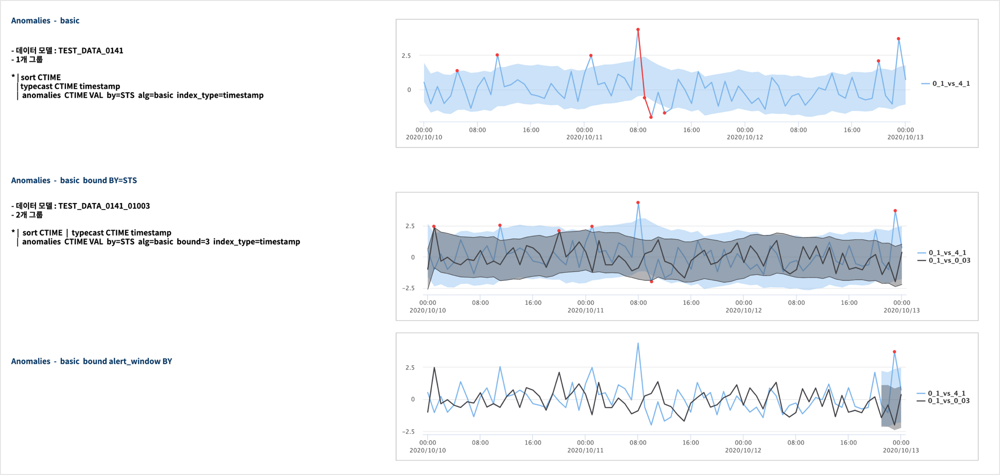
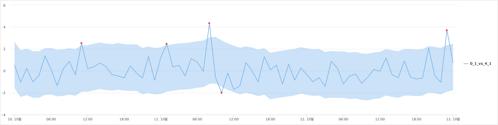
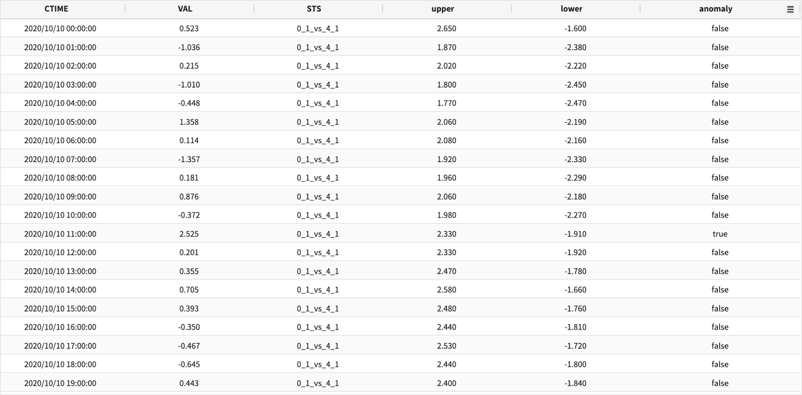
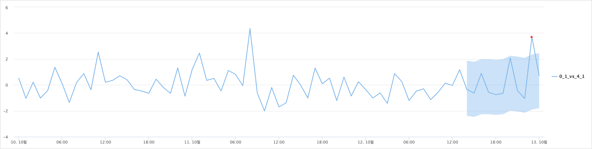
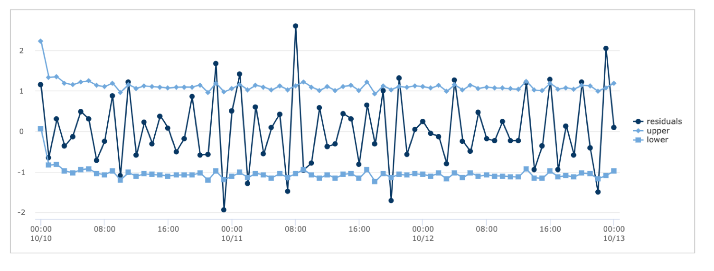
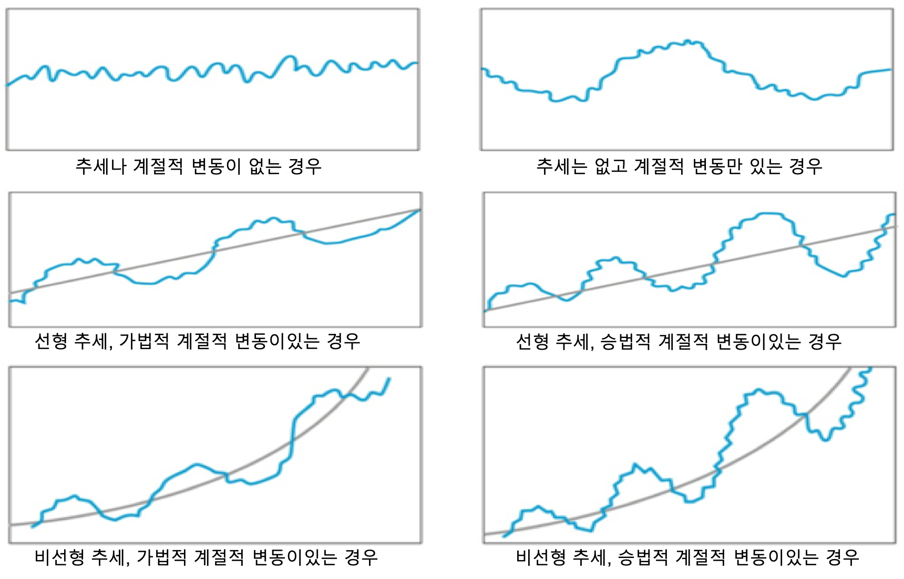

이상 탐지 ( Anomaly Detection ) - 3 :  anomalies
====================================================================

| 웹기반의 IRIS 플랫폼에는 이상 탐지 관련 명령어로 ``anomalies`` 와 ``outlier`` 가 있습니다.

| `anomalies <http://docs.iris.tools/manual/IRIS-Manual/IRIS-Discovery-Middleware/command/commands/anomalies.html>`__ 는 주어진 input 데이터에서 일반적인 범위를 벗어난 비정상적인 값을 찾아내는 명령어 입니다.
| `outlier <http://docs.iris.tools/manual/IRIS-Manual/IRIS-Discovery-Middleware/command/commands/outlier.html>`__ 는 여러 개의 그룹 데이터를 대상으로 클러스터링 기반의 이상값 추출 & 일정 비율 이상으로 이상값이 많이 나오는 그룹 추출 가능이 있습니다.
| 이 두가지 명령어는 주어진 조회 시간 동안의 데이터만을 대상으로 기계학습 기반 알고리즘을 활용하여 정상값과 이상값을 찾아냅니다.
| 입력값으로 주어진 시계열 데이터만을 대상으로 빠르게 이상값을 찾아내는 것이 목적이므로 Z-Score, dbscan, 시계열 분해 등 간단한 알고리즘이 적용됩니다.

anomalies 
-------------------------------------------------

| 시간정보가 있는 입력 데이터만을 기준으로 정상값 범위를 벗어난 데이터를 판별합니다.
| 입력 데이터의 평균, 표준편차, 시계열의 추세, 계절성 변동 등을 구하여 정상값 범위를 구합니다.
| 알고리즘 중 기본 알고리즘 ``basic`` 은 정규 분포 기반의 z-score 를 이용한 방법이며, ``robust`` 는 시계열 분석에서 많이 사용되는 시계열 분해 방식을 이용합니다.
| 알고리즘은 옵션으로 지정할 수 있으며, 판정 후 output 은 anomal 여부를 알 수 있는 컬럼을 입력값에 추가하여 결과로 반환합니다

`anomalies manual <http://docs.iris.tools/manual/IRIS-Manual/IRIS-Discovery-Middleware/command/commands/anomalies.html>`__ 

basic 알고리즘
.............................

| basic 알고리즘은 default 로 적용되는 알고리즘입니다. 입력 데이터의 VALUE 필드의 값 전체를 대상으로 평균, 표준편차를 구한 후 정규 분포 기반의 Z-Score 를 계산합니다.
| Z-Score 값 1.959964 기준으로 { 평균 - Z-Score * 표준편차 * bound 값, 평균 + Z-Score * 표준편차 * bound 값 } 를 기본 상/하한 임계치로 계산합니다.
| 표준값 이라고도 하는 Z-Score 는 개별 값인 VALUE가 전체 입력데이터의 평균값에서 얼마나 떨어져 있는지를 나타내는 값입니다.
| Z-Score = 1.959964  이상의 값을 가지고 있다면 정규 분포를 가정한 데이터에서 5% 정도에 해당하는 값입니다.
| Z-Score 가 2.0 이상이면 전체 데이터에서 2.275％ 에 해당하는 드문 값입니다.
| 개별 입력 값이  ``평균 + 1.959964 * 표준편차``  에 해당하는 값보다 큰 값과  ``평균 - 1.959964 * 표준편차`` 보다 작은 값이라면 전체 데이터에서 5% 에 해당하는 드문 값을 판별하는 기준 임계치가 됩니다.
| anomalies 명령어의 basic 알고리즘에서 파라미터 bound( 디폴트 2 ) 를 bound=1 로 할 때 정규 분포 기준으로 5%에 해당하는 아주 큰 값과 작은 값을 anomaly 로 판정하겠다는 의미입니다.
| bound=2 는 전체 데이터에서 5% 보다 더 작은 확율로 드물게 크거나 작은 값을 anomalies 로 판별합니다. 그래서 정상값의 범위에 해당하는 lower limit <= 입력값 <= upper limit 가 더 큰 range 를 가지게 됩니다.

.. code::

   z = ( 𝜒  -  𝜇 ) / 𝜎
   
   𝜇 :  평균
   𝜎 :  표준 편차
   𝜒 :  개별 입력 값

.. image:: images/Normal_distribution_and_scales
   :scale: 60%
   :alt: anomalies normal dist.

그림 출처 : https://ko.wikipedia.org/wiki/표준_점수

- 명령어 예시 : 

.. code::

    .. | anomalies  TIME_INDEX  VALUE  by=STS  alg=basic bound=3  index_type=timestamp

| bound=3 을 넣으면 이상값 판정기준이 되는 upper / lower limit 의 범위가 커지게 됩니다.
| { 표본평균 - Z-Score * 표준편차 * bound , 평균 + Z-Score * 표준편차 * bound }

| 결과는 챠트와 테이블, 2가지 유형에서 선택하여 시각화할 수 있습니다.

.. code::

   .. | anomalies  CTIME VAL  by=STS  alg=basic bound=3  direct=above index_type=timestamp alert_window = last_10h

| ``direct = above`` 로 상한임계치를 벗어날 때만 이상값으로 판정합니다.
| ``alert_window = last_10h`` 는 마지막 10시간 데이터만 이상값 여부를 판정합니다.

robust 알고리즘
..................................................

| 알고리즘 robust(alg=robust) 옵션은 ``시계열분해(Seasonal_Decomposition)`` 을 사용한 알고리즘입니다.  시계열 데이터의 구성요소인 계절성, 추세, 잔차 값을 분해하여 일반적인 정상 범위 잔차가 가질 수 있는 임계값을 구하여 이상치를 판정하는데 이용합니다.
| 내부 알고리즘 함수로 python 의 시계열 분석 라이브러리인 statsmodels 를 사용합니다.
| statsmodels.tsa.seasonal.seasonal_decompose

| 데이터가 감소/증가 등의 추세를 보이거나, 월평균 기온처럼 주기가 보이는 비정상 시계열 데이터의 경우에 사용하는 알고리즘입니다.
 
| 해당 시계열 데이터의 정상적인 패턴이라고 할 수 있는 추세와 계절성을 분해하고 제거한 후의 나머지 값인 잔차(Noise 또는 residuals) 는 분명한 패턴이 없고,  0을 평균으로 랜덤하게 분포하는 특징을 가져야 합니다. 그런데 평균보다 과도하게 작거나 큰 값 또는 잔차가 시간에 따라 감소, 증가하는 패턴이 보인다면 이 시점의 데이터가 일반적인 패턴, 범주를 벗어난 이상값이기에 잔차 역시 이상 패턴을 보인다고 판단합니다.

- 명령어 예시

.. code::

  .. | anomalies  CTIME VALUE  by=STS  alg=robust period=3  index_type=timestamp

- 잔차의 챠트와 잔차의 상/하한 임계치 

| upper, lower limit 를 벗어난 잔차와 동일 시점의 데이터가 이상치라고 판정합니다.

**시계열 분해**

- 시계열 데이터의 구성 요소 
    - Level : 데이터의 평균값
    - Trend : 데이터의 증가 / 감소 추세를 나타내는 값.
    - Seasonality : 반복되는 짧은 주기성. 계절성이라고도 합니다.
    - Noise : 데이터의 무작위 변동.

- 시계열의 패턴 ( 출처 : Time Series Forecasting With Python - Jason Brownlee 지음 )

| 고전적 시계열 분해법에서는 시계열 데이터는 이러한 네 가지 구성 요소의 집합 또는 조합으로 간주됩니다.
| 모든 시계열 데이터는 구성 요소 중 Level 과 Noise 는 필수적으로 있으며, trend(추세)와 Seasonality(계절성) 은 선택적으로 존재합니다.
| 그리고 각 구성 요소는 가법(Additive), 또는 승법(Multiplicative) 으로 결합되어 있는데, 시계열 분해기법은 이 구성요소들을 분해하는 방법으로 예측 모델을 만드는 가장 간단한 기법 중의 하나입니다.
| 시계열 구성 요소가 가법으로 결합된 모델을 가법 모델, 승법으로 결합된 모델을 승법 모델이라고 합니다.

- 가법 모델 : Additive model
    - y(t) = Level + Trend + Seasonality + Noise
    - 시간이 지나면 동일한 양으로 지속적으로 증가/감소하는 추세(Trend)를 가지는 선형모델입니다.
    - 계절성(Seasonality) 은 동일한 빈도와 진폭을 가지고 있습니다.

- 승법 모델 : Multiplicative Model
    - y(t) = Level * Trend * Seasonality * Noise

| 시계열 분석에 대해 더 자세한 설명은 `여기 자료 링크 <http://contents.kocw.or.kr/contents4/document/lec/2013/Konkuk/Leegiseong/5.pdf>`__  참조하세요.
