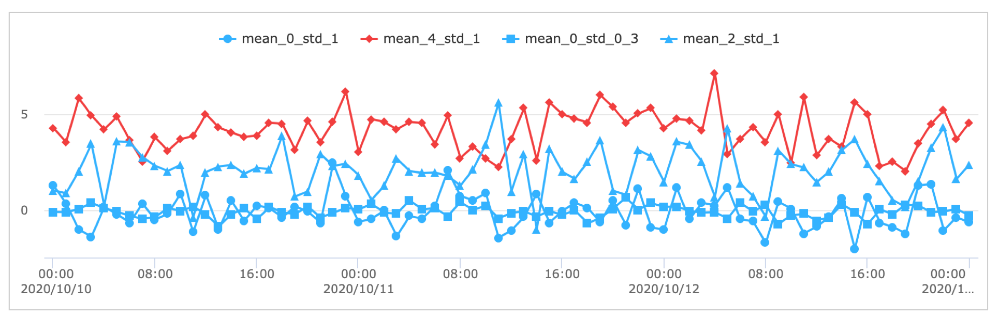
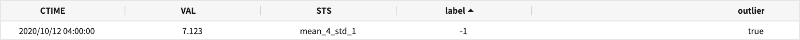
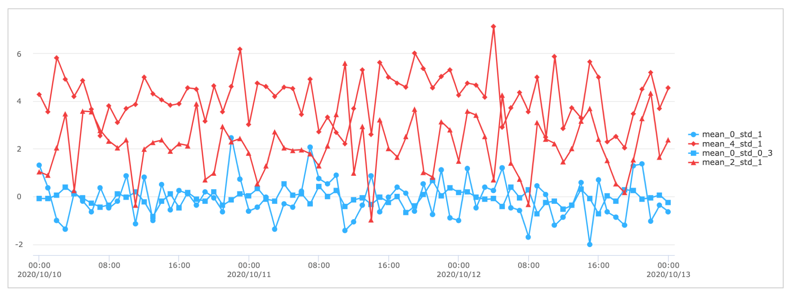
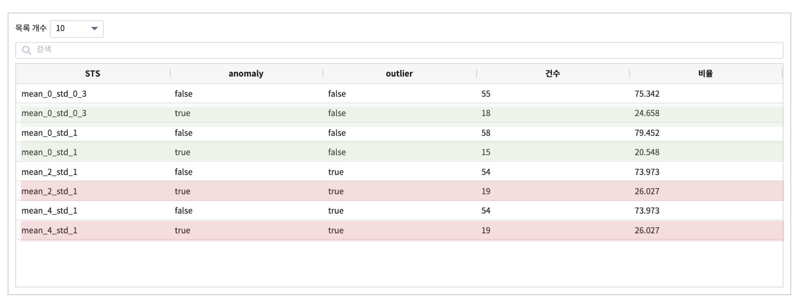

(4) IRIS 의 이상 탐지 검색어 :  outlier
====================================================================

outlier 
-------------------------------------------------

| IRIS 빅데이터 플랫폼에서 제공하는 명령어 중 outlier 는 여러 그룹별 데이터를 대상으로 ``outlier`` 에 해당하는 그룹을 찾는 명령어 입니다.
| 이상 탐지의 대상이 개별 데이터 개체가 아닌 그룹을 판정하는 데 사용됩니다.

**설명**

| 예를 들어 우리 나라 수십개의 측정 지점에서 미세먼지 농도를 한달 동안 측정한다면, 측정 지점이라는 그룹변수별로 미세먼지 농도 데이터가 시계열로 생성됩니다.
| 그리고 이 데이터에서 어떤 측정 지점 A 의 미세먼지 농도와 비슷한 패턴을 가지는 측정 지점이 있는지 궁금할 때 군집화(clustering) 모델링을 통해서 찾아볼 수 있습니다.
| 군집화의 결과로 만약 5개의 cluster 가 생성되고, 각각의 cluster 에는 여러 개의 ``측정 지점`` 의 미세먼지 농도 데이터들이 포함되어 있어서 유사한 그룹의 데이터를 확인할 수 있습니다. 그런데 cluster 중에서 동일한 측정 지점의 데이터만 있는 cluster 가 있을 수 있습니다.
즉 해당 측정 지점의 데이터는 다른 데이터와의 유사성이 낮아서 다른 어느 cluster 에도 포함되지 않은 것이라고 할 수 있습니다.

| 그룹 단위의 이상 탐지는 ``다른 어느 cluster 에도 묶이지 않은`` 데이터를 가진 그룹을 이상 그룹으로 판정합니다.
| balance 가 잘 된 군집화의 결과를 정상 패턴이라고 간주하고, 다른 측정 지점의 데이터와 묶이지 않는 측정 지점 데이터를 이상 패턴을 가진 그룹으로 판정하여 ``이상 패턴이 발생한 대상`` 을 빠르게 탐지하고, 원인을 파악하는 데 활용합니다.
| IRIS 의 명령어 ``outlier``  에서 옵션 alg = dbscan 를 사용하면 ``다른 어느 cluster 에도 묶이지 않은``  그룹의 데이터를 outlier 그룹으로 판정하는 알고리즘을 적용합니다.

| 옵션 알고리즘 alg = mad 를 사용하면 동일 그룹 데이터를 대상으로 중앙값 절대편차를 이용하여 이상 탐지를 적용한 후에 일정 비율 이상의 이상값이 나온다면 해당 그룹을 이상 그룹으로 판정합니다.
| 동일 그룹의 데이터내에서 이상값의 비율이 높은 그룹은 이상 징후가 나타나고 있는 상황으로 판단하고 해당 그룹을 상세 분석의 대상으로 두고 원인을 파악할 수 있습니다.

- 3개 이상의 그룹을 대상으로 outlier 에 해당하는 그룹을 찾아 냅니다.  ``by=그룹필드`` 파라미터를 사용할 때, 3개 이상의 그룹이 있는 데이터를 대상으로 합니다.
- 기본 알고리즘 : dbscan 알고리즘
    - 밀도기반 clustering 알고리즘의 하나인 dbscan 알고리즘을 적용한 clustering 을 실행합니다.
    - 동일 cluster 내에 여러 개의 그룹 데이터가 있다면 그룹 데이터간에 유사성이 높은 데이터가 많다는 것을 의미합니다. ( 정상 그룹으로 간주 )
    - 동일 cluster 내에 오직 1개 그룹 데이터가 있다면 해당 그룹 데이터는 다른 그룹의 데이터와 유사성이 떨어지는 데이터를 가지고 있다는 것을 의미합니다. ( 이상 그룹으로 간주 )
- 옵션 알고리즘 : mad 알고리즘
    - mad(중앙값 절대편차) 알고리즘은 여러 그룹의 데이터 중에서 동일 그룹 내 데이터에 일정 비율 이상의 anomal 한 데이터가 있는 그룹을 이상 그룹으로 탐지합니다.
    - 동일 그룹 내에서 anomal 한 데이터의 판별에 mad(중앙값 절대편차) 알고리즘을 사용하여 정상 범위를 구합니다.
    

`outlier manual <http://docs.iris.tools/manual/IRIS-Manual/IRIS-Discovery-Middleware/command/commands/outlier.html#outlier>`__ 

dbscan 알고리즘
.............................

| DBSCAN(Density-based spatial clustering of applications with noise) 알고리즘은 밀도 기반의 클러스터링 알고리즘 중 하나이며, 점이 세밀하게 몰려 있어서 밀도가 높은 부분을 클러스터링 하는 방식입니다.
| 즉, 어느점을 기준으로 반경 x내에 점이 n개 이상 있으면 하나의 군집으로 인식합니다.

DBSCAN 알고리즘 설명 - 출처 https://wikidocs.net/84774

내부적으로 sklearn.cluster.DBSCAN 클래스를 사용합니다.
http://scikit-learn.org/stable/modules/generated/sklearn.cluster.DBSCAN.html

- 검색어

.. code::

   ## outlier value필드 by=그룹필드 [alg=dbscan] tolerance=0.5
   .. | outlier VAL  by=STS  alg=dbscan  tolerance=0.5

- 결과

.. code::

  # 군집화된 클러스터에서 검출된 그룹KEY 가 만약 1개라면(즉 label 1개에 1개 그룹KEY ) 그 그룹은 outlier = true
  # 1개의 label 에 여러 개의 그룹이 있으면 정상 그룹이라고 판정합니다.
  # tolerance 는 DBSCAN 의 eps 값으로 들어갑니다. 포인트간의 거리 eps
  # min_sample default : 5

  # 예시
  - 데이터 모델 : TEST_DATA_4grp_01_41_003_21

  * |  sort CTIME   | outlier VAL  by=STS  alg=dbscan  tolerance=0.3
  

| 4개 그룹 중 ``mean_4_std_1`` 이 이상 그룹으로 판정되었습니다.

| mean_0_std_1   : 정규분포 평균 0, 표준편차 1 랜덤 데이터
| mean_4_std_1   : 정규분포 평균 4, 표준편차 1 랜덤 데이터
| mean_0_std_0_3 : 정규분포 평균 0, 표준편차 0.3 랜덤 데이터
| mean_2_std_1   : 정규분포 평균 2, 표준편차 1 랜덤 데이터
| 이 4개 그룹에서 dbscan 클러스터링 결과,  2개의 클러스터가 생성되었으며, "label = 0" 인 클러스터에는 4개 그룹의 데이터가 포함되어 있고, "label = -1" 클러스터에는 mean_4_std_1 그룹 1개만 포함되어 있습니다.
| 그래서 "mean_4_std_1" 를 이상 그룹으로 판정하였습니다.
| "label = -1" 클러스터에 포함된 데이터는 mean_4_std_1 데이터 73건 중 1건이 포함되어 있고, 7.123 로 해당 그룹내에서도 이상값으로 간주할 정도의 큰 값이며, 다른 그룹의 데이터와 비교해서도 이상값에 해당하는 값을 가지고 있습니다.
| 군집화를 목적으로 할 때는 mean_4_std_1 의 7.123 데이터를 제외하고 군집화를 진행하는 것이 군집화의 정확도를 높이는 것일 테지만, 여기서는 이 값을 가지고 있는 "mean_4_std_1"  그룹을 상세 분석 대상으로 추출하는 것이 목적이라고 할 수 있습니다.

mad 알고리즘
.............................

| 그룹 내의 데이터중에서 일정 비율 이상의 anomal 한 데이터를 갖고 있는 그룹을 이상 그룹으로 탐지합니다.
| mad(중앙값 절대편차)를 이상값 판정에 적용합니다.
| 중앙값 절대편차는 평균 절대편차(average absolute deviation) 또는 평균 편차(mean deviation)와 더불어 대표적인 산포도의 하나로, 중앙값과 개별 관측치 사이 거리의 절대값으로 표시되는 편차를 의미합니다.
| 중앙값은 평균과는 달리 데이터의 분포에 상관없이 사용할 수 있는 값이며, 편차의 평균 값을 이상치의 판정 임계치로 사용합니다.

- 검색어

.. code::

  outlier target by=field_name alg=mad tolerance=3.0 pct=0.1

| pct : 이상하다고 판단하는 데이터의 그룹내의 비율 입니다. (0.1= 10%) 이 비율 이상으로 이상값이 발생하면 해당 그룹 데이터 전체는 outlier 그룹으로 표시됩니다. 0 < pct < 1
| tolerance : 1.5 ~ 5.0 사이의 값으로 정상값의 범위인 상/하한 임계치를 구할 때 사용합니다. tolerance 가 크면 정상값의 범위가 넓어지고, 이상값으로 판정되는 확률이 줄어듭니다.

| mean_0_std_1   : 정규분포 평균 0, 표준편차 1 랜덤 데이터
| mean_4_std_1   : 정규분포 평균 4, 표준편차 1 랜덤 데이터
| mean_0_std_0_3 : 정규분포 평균 0, 표준편차 0.3 랜덤 데이터
| mean_2_std_1   : 정규분포 평균 2, 표준편차 1 랜덤 데이터

.. code::

   * |  sort CTIME   | outlier VAL  by=STS  alg=mad  tolerance=1.5  pct=0.25

| 중양값 +- 1.5 * mad 를 상/하한 임계치로 두고, 이상값으로 판별되는 비율이 25% 이상인 그룹을 outlier 그룹으로 추출해 봅니다.

- 결과

| mean_4_std_1, mean_2_std_1 그룹이 outlier 그룹으로 판별되었는데, 챠트를 보면 다른 2개 그룹보다 진폭이 큰 데이터가 많은 그룹으로 보입니다.

