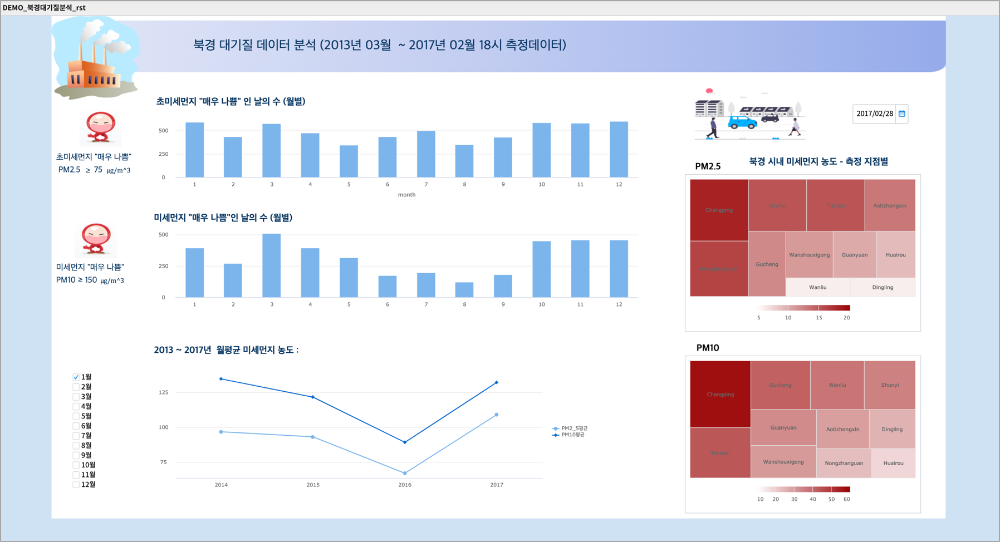
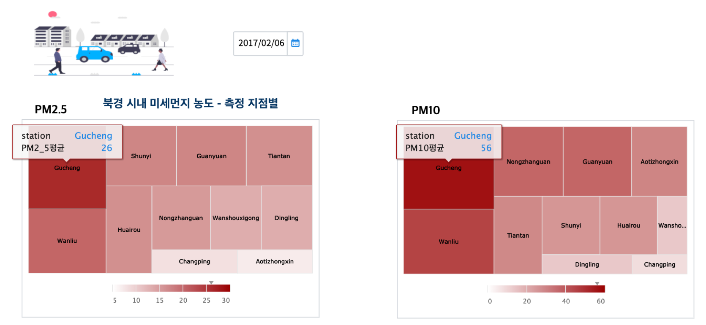

Studio : 북경 대기질 분석
===================================================================

| UCI M/L Repository에는 분석에 사용할 만한 데이터 셋이 많이 있습니다.
| 그 중에서 우리 나라와 가까이 있으면서 우리 나라의 공기질에 큰 영향을 미치는 국가인 중국의 북경 대기질 측정 데이터셋(`Beijing Multi-Site Air-Quality Data <https://archive.ics.uci.edu/ml/datasets/Beijing+Multi-Site+Air-Quality+Data>`__ 을 가져와서 챠트를 그려보았습니다.
| 데이터는 중국 베이징시의 Beijing Municipal Environmental Monitoring Center 에서 베이징 시내 12개 사이트에서 
| 6 개의 주요 대기 오염 물질과 6 개의 관련 기상 변수를 측정한 값으로 이루어져 있습니다.

.. code::

  필드 정보 

  No: row number
  year: year of data in this row
  month: month of data in this row
  day: day of data in this row
  hour: hour of data in this row
  PM2.5: PM2.5 concentration (ug/m^3)
  PM10: PM10 concentration (ug/m^3)
  SO2: SO2 concentration (ug/m^3)
  NO2: NO2 concentration (ug/m^3)
  CO: CO concentration (ug/m^3)
  O3: O3 concentration (ug/m^3)
  TEMP: temperature (degree Celsius)
  PRES: pressure (hPa)
  DEWP: dew point temperature (degree Celsius)
  RAIN: precipitation (mm)
  wd: wind direction
  WSPM: wind speed (m/s)
  station: name of the air-quality monitoring site

- 보고서 

|

| 우리 나라에서는 초미세먼지 농도 PM2.5 75(ug/m^3) 이상인 경우 심각단계로 설정하고 있습니다.
| 북경의 12개 사이트에서 측정기간 4년(12 x 4개월)동안 매일 18시에 측정한 초미세먼지 농도가 75(ug/m^3) 이상인 날의 수가 몇일이었는지 월별 막대그래프로 그려봤습니다.
| 상대적으로 겨울 기간에 초미세먼지 농도가 심각단계인 날이 많은 것으로 나옵니다. (2월달은 일수가 28일로 작은 영향)

| 미세먼지 농도는 PM10 150(ug/m^3) 이상을 심각단계로 설정하고 있는데, 미세먼지 역시 계절적인 요인이 크게 작용하고 있어 보입니다.

| 

- 트리맵으로 12개 측정 사이트별 미세먼지 농도 보기

| 달력에서 선택된 날짜로 12개 사이트의 미세먼지 및 초미세먼지 측정값으로 그린 트리맵입니다.
| 트리맵의 크기와 색깔의 농도는 미세먼지 농도 측정값을 나타냅니다.
| 트리맵의 사각형 영역의 면적이 크면 색깔이 진하게 표현되고, 
| 해당 영역으로 마우스를 대면 툴팁으로 사이트 정보와 미세먼지 농도 측정치를 알 수 있습니다.

