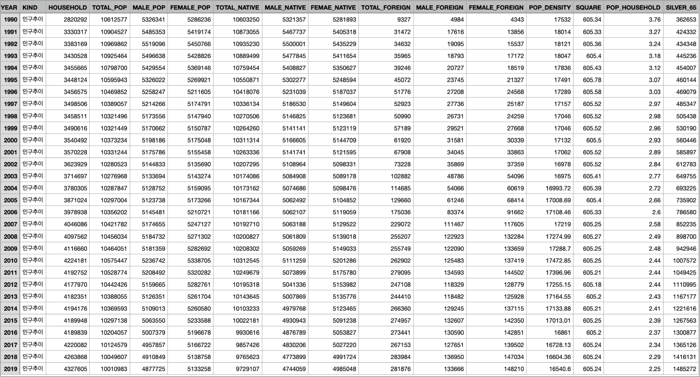
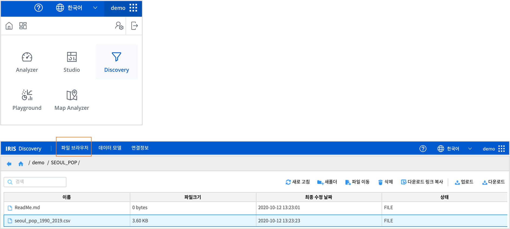
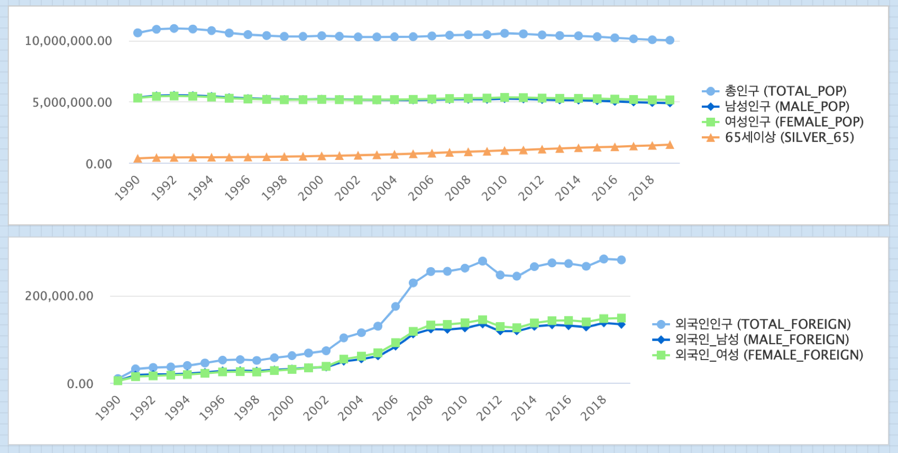

Studio : 서울시 인구 추이 보고서 만들어 보기 (1)
=======================================================================

| 서울시 열린데이터광장에는 서울시 시정 활동 과정에서 수집된 다양한 데이터들이 공개되어 있습니다.
| 보고서로 만들어 볼 데이터로 ``서울시 주민등록표에 등록된 인구 데이터`` 로 서울시 인구의 추이를 챠트로 그려봅니다.
|
1. 서울시 `열린 데이터 광장 <https://data.seoul.go.kr/dataList/datasetList.do>`__  에서 데이터 내려 받기
2. 데이터를 IRIS MINIO 로 업로드하기
3. IRIS Studio 로 챠트를 그려보고 분석해보기

의 과정으로 진행해 봅니다.

데이터 내려 받기
--------------------------

| 대상 데이터는 **서울시 인구 추이 (주민등록인구) 통계** 입니다.

- 서울시 인구 추이 (주민등록인구) 통계 데이터 설명 (출처 : `서울시 인구 추이 (주민등록인구) 통계 <https://data.seoul.go.kr/dataList/418/S/2/datasetView.do?tab=S>`__)

.. code::

  ○ 용어설명
    * 등록인구 = 주민등록인구 + 등록외국인
    * 주민등록인구는 "거주자", "거주불명자", "재외국민"이 포함
        - 거주자: 거주지가 분명한 사람(재외국민 제외)
        - 거주불명자 : 거주사실이 불분명하여 거주불명으로 등록된 사람(2010년 1월부터 통계에 포함)
        - 재외국민: 외국의 영주권을 취득한(영주목적으로 외국거주 포함) 대한민국 국민으로 주민등록을 한 사람(2015년 1월부터 통계에 포함)
    * 등록외국인은 출입국관리법에 의해 90일 초과 장기체류자 중에서 작성기준일 현재
      외국인 등록표에 등재된 자의 집계결과로서 실제로 국내에 거주하고 있는
      외국인 수와는 차이가 있을 수 있음

  ○ 기 타
    * 1958년~1965년, 1967년은 60세이상 인구
    * 출생, 사망, 전입 등의 미신고, 지연·허위신고 등에 따라 실제와는 차이가 있을 수있으며, 
      실제로 국내의 가족과 살고 있지 않더라도 주민등록표에 등재되어 있는 경우에는 집계되기 때문에 상주인구 기준의 조사결과와 차이가 있을 수 있음

| 해당 데이터를 적절한 기간으로 조회하여(예제에서는 1990년 ~ 2019년) ``text`` 형식으로 다운로드합니다.
| 다운로드한 데이터는

   - 컬럼 이름을 빈칸을 제거하고, 영문이름의 컬럼명으로 재지정하고, 
   - 숫자에 표시된 콤마를 제거합니다.
   - 그 후에 컬럼의 구분자를 콤마로 수정하여 csv 로 다시 저장합니다.
|
- 데이터 형태 예시

|

데이터 업로드 / 데이터 모델 생성하기
-------------------------------------------

| IRIS 에서 제공하는 기본 Object 저장소 MINIO 에 해당 데이터 파일을 업로드합니다.
| ``IRIS Discovery >> 파일 브라우저`` 메뉴를 클릭하여 나의 MINIO 저장소로 이동한 후, 데이터가 저장될 새 폴더를 생성하고, 파일을 업로드 합니다.
|

|

| 업로드한 파일을 IRIS 의 ``Analyzer`` , ``Studio`` 에서 사용하기 위해서는 **데이터 모델**로 만들어야 합니다.
| ``IRIS Discovery >> 데이터 모델`` 메뉴에서 **새모델** 버튼을 클릭합니다.
| 데이터 모델 생성은 `Manual >> IRIS Discovery >> 데이터모델 <https://docs.iris.tools/manual/IRIS-Manual/IRIS-Discovery/datamodel.html#id1>`__  을 참조하시기 바랍니다.

| 컬럼명이 영문이라 직관적이지 않으면, 한글 별칭을 추가로 입력할 수 있습니다. 
| 이제부터는 새로 만든 데이터 모델을 **Analyzer** 메뉴와 **Studio** 메뉴 등 에서 사용할 수 있습니다.

Studio : 서울시 인구 변화 그래프(꺾은선형)
----------------------------------------------------

| 새 보고서 작성에 대해서는 `Studio 시작하기 <https://docs.iris.tools/manual/IRIS-Manual/IRIS-Studio/Studio_start.html>`__ 메뉴얼을 참조하세요.

- 데이터 설명
    - 인구는 등록인구를 칭하며, 주민등록인구와 등록외국인을 합한 것입니다.
    - 주민등록인구는 주민등록표에 등재되어 있기만 하면 집계에 포함되며, 등록외국인은 90일 초과 장기체류자 중에서 작성기준일(2020.02.26)에 외국인 등록표에 등재된 사람의 집계입니다.

- 서울시의 인구 변화를 (1990년 ~ 2019년) 꺾은선형 챠트로 그립니다. 

| 1990년 ~ 2019년 동안 서울시 등록 인구는 2010년 총 10,575,447명을 기점으로 계속 감소하는 추세임을 알 수 있습니다.
| 하지만 65세 이상 고령 인구는 꾸준히 증가 추세에 있습니다. 그리고, 외국인은 2005 ~ 2008년 사이에 기울기가 급하게 증가하면서 급증한 것을 알 수 있습니다. 
