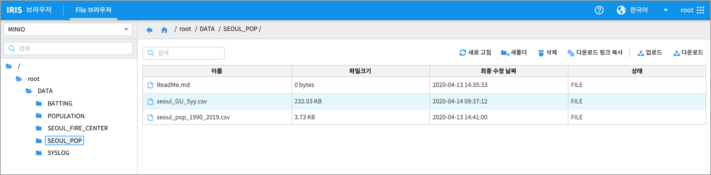
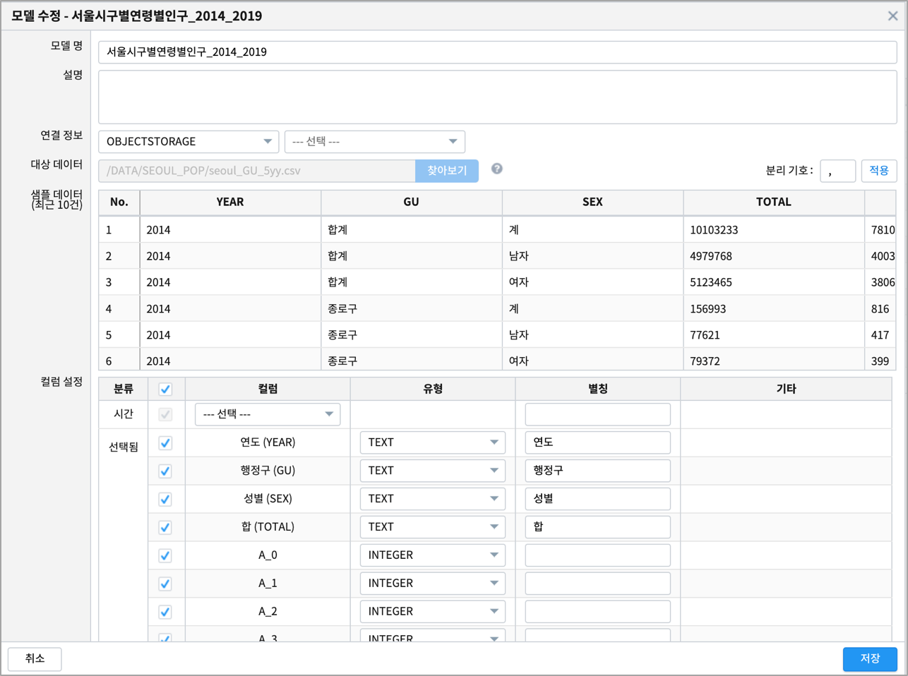
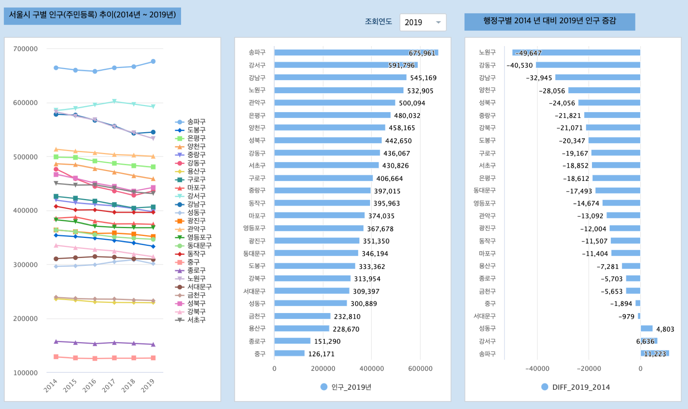
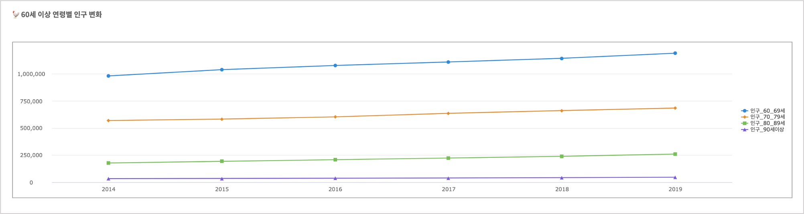

Studio : 서울시 인구 추이 보고서 만들어 보기 (2)
=============================================================

| 서울시 인구 추이 보고서 (1) 편에서 서울시의 총 인구는 점차로 감소하고, 고령층의 인구는 증가추세로 확인 됩니다.
| 이번에는 서울시의 행정구별로 인구 변화가 어떻게 나타나는지 파악하기 위해서 다시 서울시 열린데이터광장에서 데이터를 탐색해 봤습니다.

| 서울시 열린데이터광장에는 2014년 ~ 2019년 동안 서울시의 행정구별로 연령별 인구 집계를 한 데이터가 있습니다.
| `서울시 주민등록인구 (내국인 각세별/구별) 통계 <https://data.seoul.go.kr/dataList/10719/S/2/datasetView.do?tab=S>`__ 데이터를 수집한 후 csv 로 변환하여 IRIS 에 업로드합니다.

-  서울시 주민등록인구 (내국인 각세별/구별) 통계

.. code::

  서울시 주민등록인구 (내국인 각세별/구별) 통계

  ○ 통계개요 
   * 통계명  : 주민등록인구(내국인 각세별/구별) 
   * 통계종류 : 주민등록인구 수를 내국인 각세별로 제공하는 일반·보고통계 
   * 작성목적 : 지역별 인구의 변동상황 및 연령구조를 파악하여 각 지방행정기관의 제반 행정사항의 기초자료로 활용하는 것을 목적으로 함 
   * 조사체계 : 행정자치부·법무부 → 서울특별시 빅데이터담당관 
   * 공표주기 : 정기(매분기) 
   * 공표범위 : 지역 - 서울시 및 자치구·동 
              내용 - 각 연령별 성별 인구수(내국인) 

  ○ 용어설명 
   * 주민등록인구는 "거주자", "거주불명자", "재외국민"이 포함 
    - 거주자 : 거주지가 분명한 사람(재외국민 제외) 
    - 거주불명자 : 거주사실이 불분명하여 거주불명으로 등록된 사람(2010년 1월부터 통계에 포함) 
    - 재외국민 : 외국의 영주권을 취득한(영주목적으로 외국거주 포함) 대한민국 국민으로 주민등록을 한 사람(2015년 1월부터 통계에 포함) 

  ○ 기타 
   * 출생, 사망, 전입 등의 미신고, 지연·허위신고 등에 따라 실제와는 차이가 있을 수 있으며, 
     실제로 국내의 가족과 살고 있지 않더라도 주민등록표에 등재되어 있는 경우에는 집계되기 때문에 상주인구 기준의 조사결과와 차이가 있을 수 있음 

  ○ 출 처 : 서울특별시 빅데이터담당관

|

|

행정구별 인구 추이 (2014년 ~ 2019년)
----------------------------------------------------

첫 번째 챠트는 2014년 ~ 2019년의 서울시 행정구별 인구 추이 그래프로 보고서의 챠트 중 꺾은선형으로 그린 것입니다.
usecase 문서 중 `화재원인별 연간 발생 건수 추이 <http://docs.iris.tools/manual/IRIS-Usecase/usecase3-map/DEMO_map_firecenter_01.html?highlight=%EA%BA%BD%EC%9D%80%EC%84%A0%ED%98%95#id8>`__ 에 그리는 방법이 있습니다.

두번째 챠트는 조회연도인 2019년도의 행정구 인구를 많은 순서대로 `가로 막대 그래프 <http://docs.iris.tools/manual/IRIS-Tutorial/IRIS_Studio/barh/barh.html#id4>`__ 로 그린 것입니다.
콤보 박스에서 조회 연도를 선택할 수 있습니다.

세번쩨 챠트는 행정구별로 2014년 대비 2019년 인구가 얼마나 증가했는지, 감소했는지 가로막대로 그린 그림입니다.

|

이 챠트는 행정구별로 2014년 대비 2019년의 65세 이상 인구의 추이 입니다.
전체 행정구에서 65세 이상 인구는 증가하고 있음을 알 수 있습니다.

정리
""""""""

2014년 ~ 2019년 행정구별 인구추이를 보면 대부분의 행정구별 인구는 감소추세로 보입니다.
송파구,강서구,강남구,노원구,관악구는 인구 50만명(2019년 기준)이상의 인구를 가진 행정구이지만,
이 중 송파구, 강서구만이 인구가 plus로 증가하는 것으로 나타납니다.

서울시 행정구별로 전체 인구 대비 65세 이상 인구의 비율은 2014년 이후로 꾸준히 증가하고 있습니다.
65세 이상 인구 비율이 감소하는 행정구는 없습니다.  
인구 고령화의 큰 흐름을 서울도 크게 영향을 받고 있음을 알 수 있습니다.

다음 번에는 
서울시의 인구변화를 각 연령별로 분석해 볼 필요가 있겠습니다.

