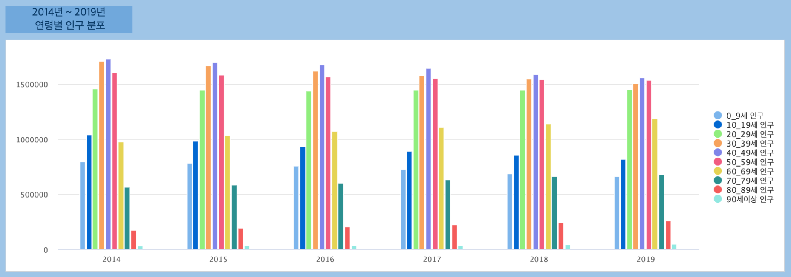
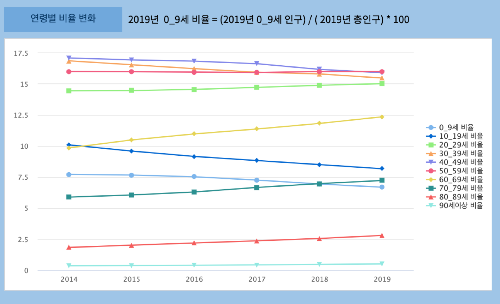
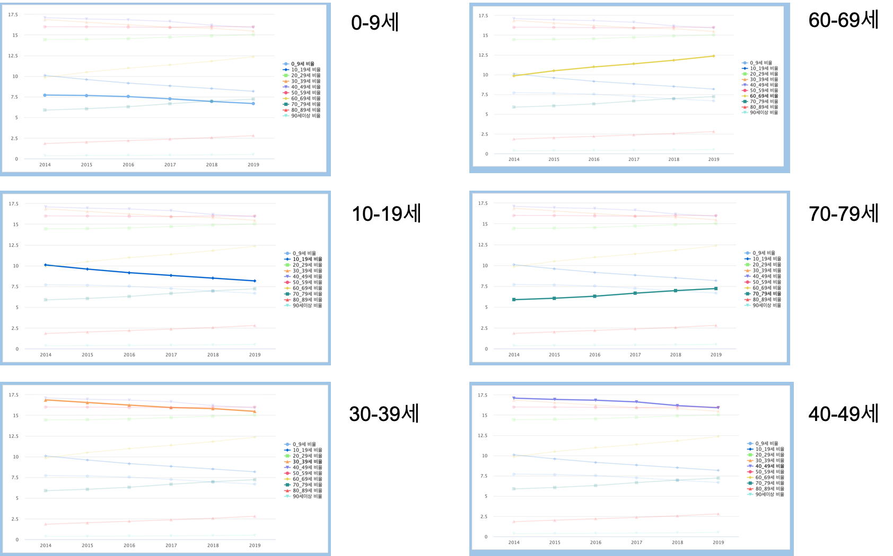
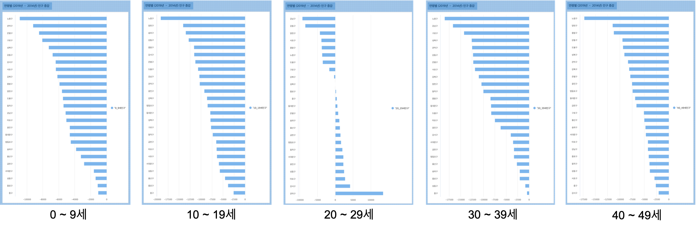
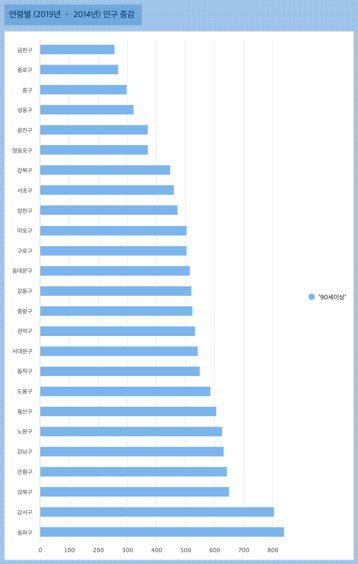
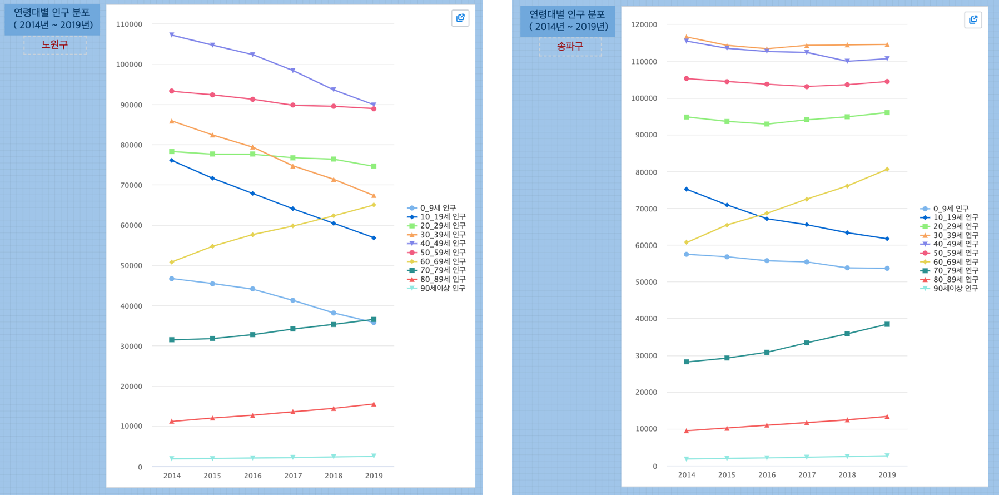

Studio : 서울시 인구 추이 보고서 만들어 보기 (3)
===============================================================

| 서울시 인구 추이 보고서 (1),(2) 편에서 2014 ~ 2019년 동안 서울의 각 행정구의 인구 추이를 살펴보았습니다.
| 서울시의 인구가 점차로 줄어드는 추세이지만, 고령화의 영향으로 65세 이상의 인구는 모든 행정구에서 증가하고 있음을 확인했습니다.
| 이번에는 각 행정구별로 어떤 연령대가 증가/감소하고 있는지 알아보려고 합니다.

| 데이터는 동일하게 `서울시 주민등록인구 (내국인 각세별/구별) 통계 <https://data.seoul.go.kr/dataList/10719/S/2/datasetView.do?tab=S>`__ 데이터를 대상으로 합니다.

2014년 ~ 2019년 연령대별 인구 추이
--------------------------------------------------------------------

2014년 부터 2019년 까지 연령대별 인구를 막대그래프로 그려봤습니다.

| 2014년도에는 30_39세, 40_49세, 50_59세 순으로 인구가 많았다면
| 2019년도에는 40_49세, 50_59세, 30_39세 순으로 비중의 순서가 바뀌었습니다.
| 불과 5년사이에 인구의 가장 많은 축을 차지하는 연령대가 변경되었음을 알 수 있습니다. 
| 그리고 0_9세, 10_19세 인구는 인구수 자체의 감소가 뚜렷하게 보입니다.
|

각 연령대의 인구 비율의 변화 ( 2014년 ~ 2019년 )
----------------------------------------------------------------------

각 연령대가 서울시 전체 인구에서 차지하는 비율을 구해서 챠트로 그린 것입니다.

이 중 특징적인 연령대의 비율을 추이로 확인해 볼 수 있습니다.

예상처럼 10_19세, 0_9세 연령대의 비율이 전체 인구에서 차지하는 비율이 가장 빠르게 감소하고 있음을 알 수 있습니다.
반면 60_69세, 70_79세 연령대 비율은 가파르게 상승하고 있습니다.

|

행정구별로 연령별 인구 증감 비교( 2019년 - 2014년 인구 )
--------------------------------------------------------------------------

* 인구 감소 연령대의 현황

| 0_9세 인구는 2014년 기준 2019년에는 서울시 전체 행정구에서 모두 감소하였습니다.
노원구-관악구-은평구 순으로 감소폭이 크게 나왔습니다.
10_19세 인구역시 전체 행정구에서 모두 감소했으며, 노원구-양천구-송파구 순으로 감소폭이 컸습니다.
| 20_29세는 행정구별로 증가 또는 감소했는데, 강남구, 강동구가 가장 크게 감소했으며, 관악구는 크게 증가한 것으로 나왔습니다.
| 30 ~ 40대 역시 전 행정구에서 모두 감소했습니다.
|

* 인구 증가 연령대의 현황

60대 이상은 전 행정구에서 모두 증가했음을 알 수 있습니다.
특히 노원구, 송파구의 증가가 두드러집니다.

