Studio : 원유 및 석유 제품 수출입 현황 (1)
================================================================

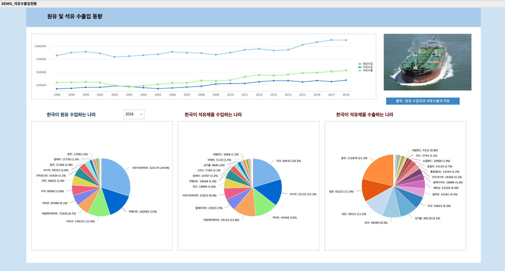

|

| 한국석유공사의 석유수출입통계 자료(1998년 ~ 2018년)를 통해 

  - 원유(crude oil) 수입국과 수입량(1000베럴 단위)
  - 한국이 수입한 원유를 정제하여 만든 석유제품을 수출하는 국가와 수출량(1000베럴 단위)
  - 한국이 석유제품을 수입하는 국가와 수입량(1000베럴 단위)

| 의 추이와 현황을 알아보는 보고서를 생성합니다.
|

| 출처 : 원 자료는 국가통계포털(`KOSIS <http://kosis.kr>`__) 의 ``한국석유공사의 석유수출입통계`` 입니다.

- 국가별 원유수입(1998 ~ 2018)
- 석유제품별 수입(1998 ~ 2018)
- 석유제품별 수출(1998 ~ 2018)

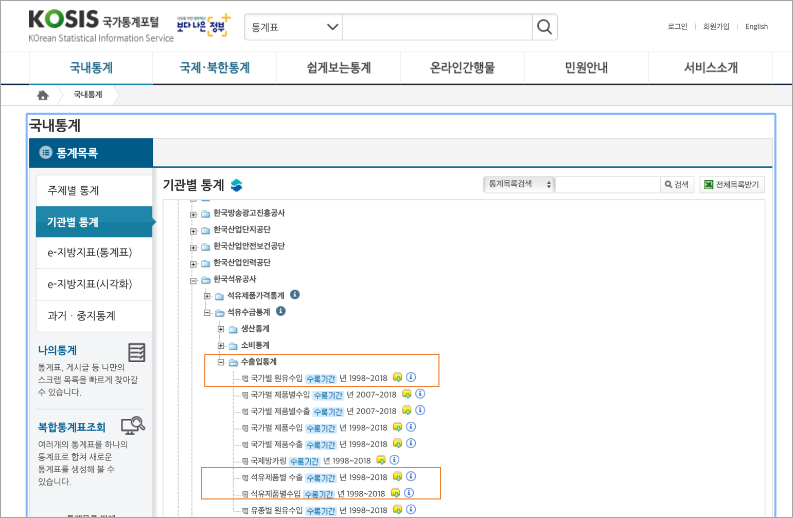
   

| 원본 데이터는 1998, 1999,,, 같은 연도가 컬럼 이름으로 되어 있습니다. 이런 데이터의 형태는 분석에 적합한(tidy) 모양이 아닙니다. 
| 그래서 컬럼의 하나인 1998, 1999 같은 연도가 ``YEAR`` 라는 컬럼의 값이 되는 데이터 형태로 변환을 해야 합니다.

- 데이터 변환
    - 컬럼에 대륙, 국가, 연도, 제품양(1000베럴) 이 되도록 데이터 변환을 합니다. 
    - RStudio 에서 reshape, plyr 패키지의 함수를 사용하여 전처리하였습니다.

- 데이터 변환 R code 예시

.. code::

  library(reshape2)
  library(plyr)

  oil_nation <- read.table('oil_nation_1.csv', header=T, sep = "\t", row.names = NULL, 
                            fileEncoding="EUC-KR", encoding="EUC-KR")

  oil.melt <- melt(oil_nation, id.vars = c('국가별.1.', '국가별.2.'))
  colnames(oil.melt)  <- c('Continent', 'Nation', 'YEAR', 'Barrel')
  oil.melt$YEAR <- substr(oil.melt$YEAR, 2, 5)
  oil.melt$Continent <- as.character(oil.melt$Continent)
  oil.melt$Nation <- as.character(oil.melt$Nation) 

|

- 원본 데이터 (oil_nation) : 원유수입국

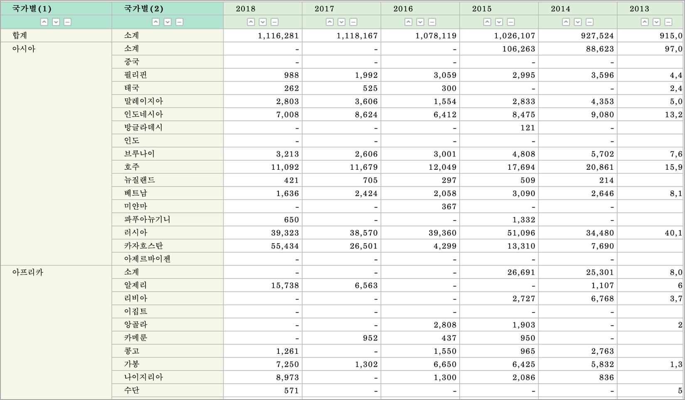

- 변환 후 데이터 (oil.melt) : 원유수입국

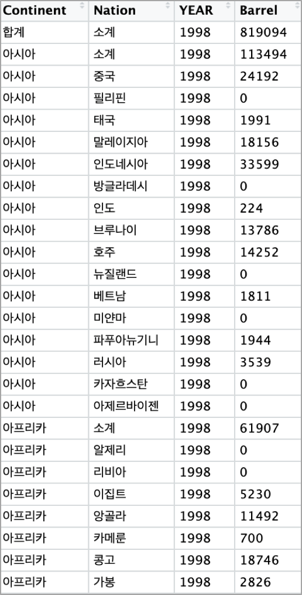

|

원유 및 석유제품 수출입 추이(1998년 ~ 2018년)
--------------------------------------------------------------------

한국의 원유(crude oil) 수입양과 석유 제품 수입양, 석유 제품 수출양의 추이입니다.

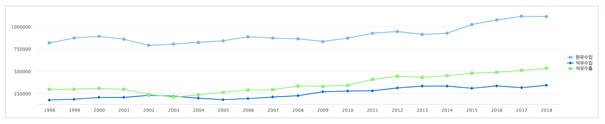

1998년 ~ 2018년 원유 수입양(1000 배럴단위) 추이를 보면 약간의 주기성이 보입니다.

2002년 ~ 2003년의 원유 수입이 줄어든 것은 급격하게 경제 성장 중인 중국의 원유 수요로 인한 유가 급상승을 원인으로 추정하고 있으며,
2008년 ~ 2009년에는 2008년 미국의 금융 위기가 영향을 주었던 해입니다.

2013년 ~ 2014년에는 100달러가 넘는 고유가의 영향이 있었던 해이며,
그 이후 공급 확대 기조로 인한 유가의 안정화가 지속되어 원유 수입량이 증가하고,
더불어 국내 정유사를 통한 석유 제품의 수출양도 증가추세 임을 알 수 있습니다.

|

국가별 원유수입 / 석유제품 수출입 비율 : pie chart
-----------------------------------------------------------------

| 콤보박스에서 연도를 선택한 후, 해당 연도의 국가별 원유수입량, 석유제품의 수출입 양을 Pie Chart 로 그려보았습니다.

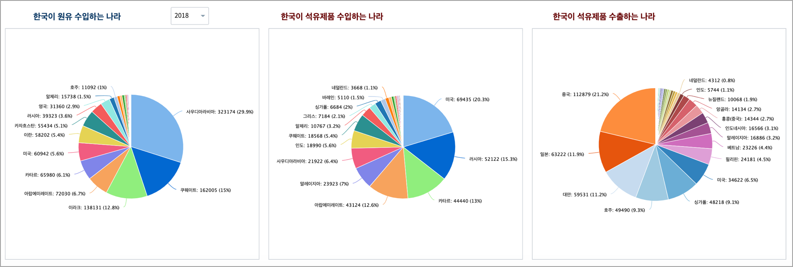

특이한 점은 석유제품 수입국 중 미국이 2015년까지만 헤도 4 ~ 5% 비중이었는데, 2016년 부터 12.9%, 16.2%, 20.3% 로 ``2018년``  석유제품을 수입하는 국가 1위가 되었습니다.

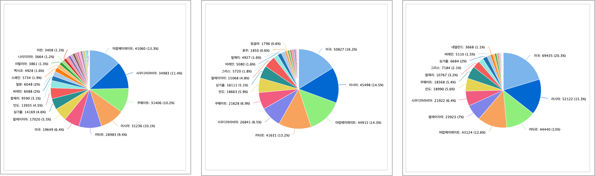

원인은 2014년 부터 미국 셰일가스 개발로 인해 원유 수출 제한이 풀리면서 세일 가스를 정제한 석유 / 원유 수출국으로 변화하게 된 요인이 큽니다.

그리고 미국과의 정치,외교적인 관계로 인해 
미국에서 생산한 셰일 오일을 미국내에서 정제한 석유 제품의 형태로 하여 한국이 수입양을 증가한 원인으로 보입니다.

그래서 2018년에 원유 수입량은 줄어들고, 석유 제품 수입량이 늘어나게 된 것으로 보입니다.

석유 제품의 수출은 지정학적으로 가까운 중국과 일본, 대만, 싱가폴, 호주 등이 큰 비중을 차지하고 있으며
중국은 급속한 경제 발전으로 인한 수요로 인해 수년동안 계속 1위의 수출 대상국입니다.

|

원유 수입국과 석유 제품 수출국 sankey chart
------------------------------------------------------------------

IRIS Studio 의 보고서에는 다른 보고서를 불러올 수 있습니다.(2020년 IRIS 버전에서는 sankey chart가 없었음)

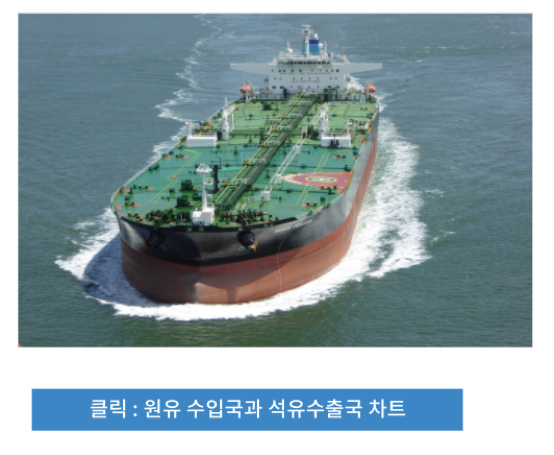

클릭하면 **DEMO_오일_sankeychart_from R**  보고서를 "한국의 원유수입국과 석유제품수출국 현황" 이라는 이름으로 팝업창으로 불러오기를 합니다.

이 보고서는 대화형 분석의 **RStudio** 에서 
2018년에 한국이 원유를 수입한 국가들과 한국이 수출하는 석유 제품의 대상 국가들을 원유량, 석유제품량으로 그린 sankey chart입니다.

from, to 와 같은 link 데이터와 node 데이터로 변환하는 과정이 필요하므로 
R 에서 변환 및 chart 까지 그린 후
이 chart 를 MINIO 로 저장하여 보고서로 URL업로드 한 것입니다.

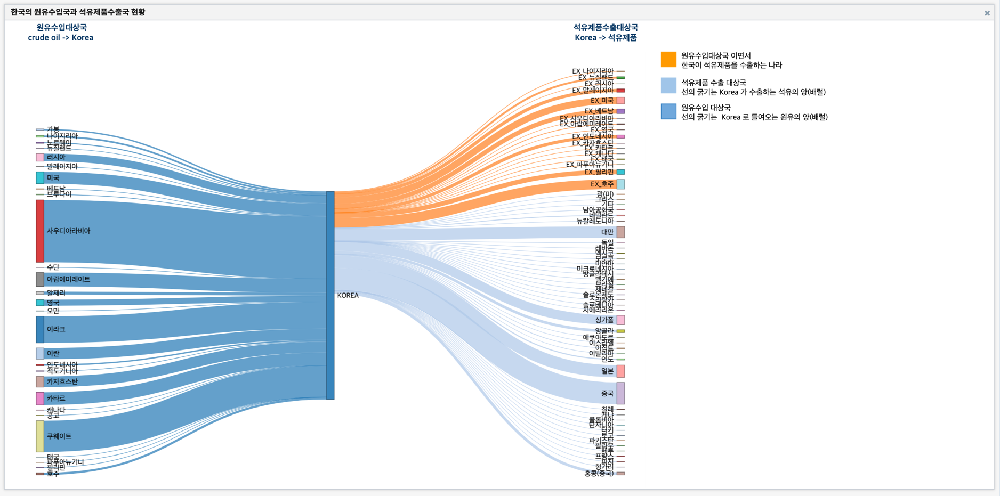

IRIS 에서 그린 sankey chart
-------------------------------------------------------

| 2020년에는 IRIS 챠트에 없었던 sankey chart 가 2021년에 추가되었습니다.

- 데이터모델 : EDU_DEMO_OIL_EDGE

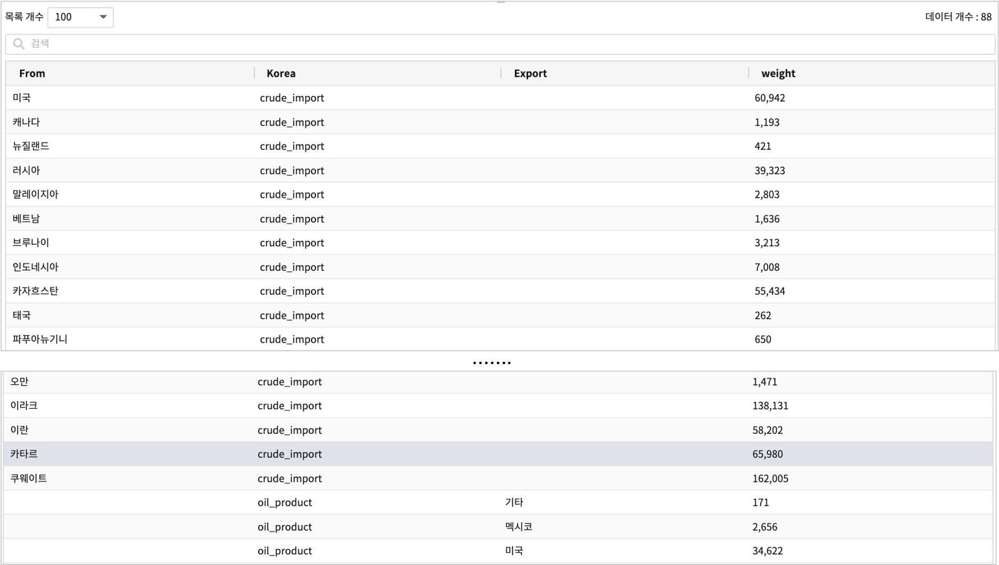

   
- 검색어

.. code::

    * | adv sankey sum(weight) SPLITROW From,Korea,Export
      | fillna TARGET 'Korea'
      | fillna SOURCE 'Korea'

- sankey chart
  
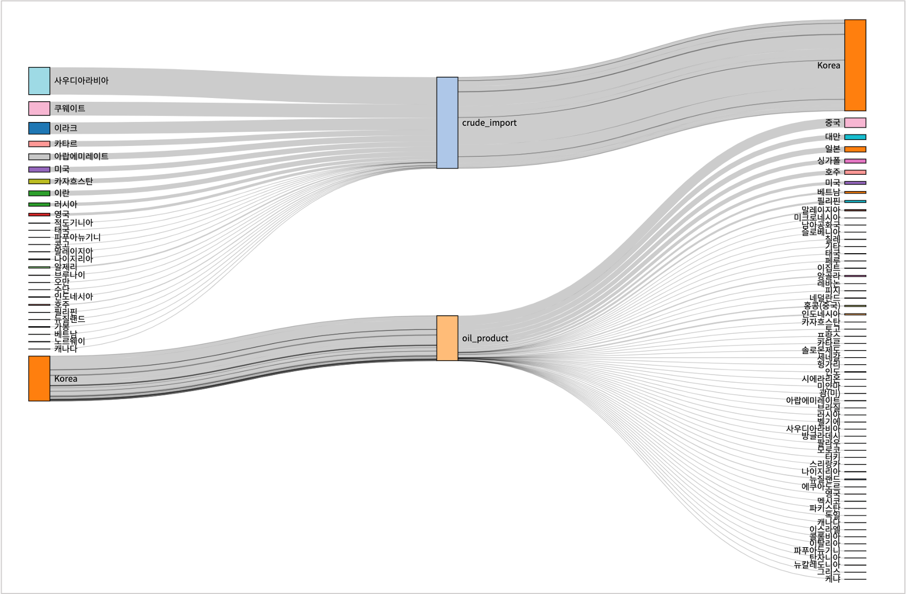

