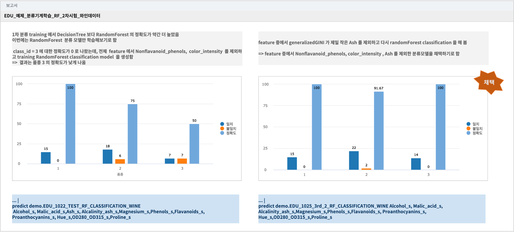

====================================================================================
M/L Classification : Wine 품종 분류하기
====================================================================================

------------------------------
개요와 목적
------------------------------

| 와인에서 측정한 13개 특성값(13개 feature)으로 와인의 포도 품종을 자동 분류하는 분류모델을 학습하려고 합니다. 
|
| 데이터는 3개의 포도 품종으로 만든 와인에서 13개의 특성(feature) 값을 측정한 데이터입니다.
| 데이터 중에서 학습데이터 70%, 테스트 데이터 30% 로 나누어서 학습데이터로 모델을 훈련시키고, 테스트 데이터로 생성된 분류기 모델의 정확도를 검증합니다.
|
| 1차로 13개 feature 전부를 대상으로 
| RandomForest Classification 과 DecisionTree 알고리즘으로 각각의 모델을 생성하고, 두 모델의 정확도를 테스트 데이터로 비교해 봅니다.
|

.. contents::
    :backlinks: top

------------------------------
데이터 준비
------------------------------

''''''''''''''''''''''''''''''''''''''''''''''''''''''''''''''''''''''
출처 사이트에서 데이터 다운로드 
''''''''''''''''''''''''''''''''''''''''''''''''''''''''''''''''''''''

| 와인데이터의 출처 사이트에서 직접 csv파일로 다운로드합니다.

- 출처 : `UCI Machine Learning Repository <http://archive.ics.uci.edu/ml/datasets/Wine>`__  의 WINE 데이터

- 특성값(feature)  : 설명변수 or X 변수

.. code::

    1) Alcohol
    2) Malic acid
    3) Ash
    4) Alcalinity of ash
    5) Magnesium
    6) total phenols
    7) Flavanoids
    8) Nonflavanoid phenols
    9) Proanthocyanins
   10) Color intensity
   11) Hue
   12) OD280/OD315 of diluted wines
   13) Proline

   
| 데이터는 178개 row 입니다.

- 데이터 분리
    - 데이터를 70% 학습데이터, 30% 테스트 데이터로 분리합니다. 
    - 총 178개의 레코드를 랜덤 추출 방식으로 학습데이터와 테스트 데이터를 분리하여 저장합니다.
    - Train_wine_data.csv (125 rows) , Test_wine_data.csv (53 rows)

.. image:: ../images/demo/ml_cls_01.png
    :alt: 데이터 - 01

|

- IRIS에 파일 업로드
    - 학습데이터와 테스트데이터 파일을 ``IRIS Discovery >> 파일 브라우저`` 에서 MINIO 를 선택하여 업로드합니다.
    - MINIO 에 데이터 업로드하기 : `MINIO 에 업로드하기 <http://docs.iris.tools/manual/IRIS-Usecase/usecase4-batting_data/index.html#minio>`__
    

- IRIS 데이터모델 만들기 
    - ``IRIS Discovery >> 데이터 모델`` 메뉴에서 MINIO 에 저장된 Train_wine_data.csv,  Test_wine_data.csv 를 ``IRIS 데이터모델`` 로 생성합니다.
    - 데이터 모델 이름 예) DEMO_TRAIN_WINE ,  DEMO_TEST_WINE 
    - 데이터 모델 생성 시에 숫자형 데이터는 타입을 TEXT 에서 REAL 로 변경합니다.

.. image:: ../images/demo/ml_cls_02.png
    :alt: 데이터 - 02

----------------------------------------------------------------
Machine Learining 모델 만들기
----------------------------------------------------------------

''''''''''''''''''''''''''''''''''''''''''''''''''''''''''
데이터 전처리 : 스케일링 (scaling)
''''''''''''''''''''''''''''''''''''''''''''''''''''''''''

- wine 별로 측정한 13개의 feature 데이터를 스케일링 합니다. 여기서는 minmax scaling 을 사용합니다.
- DSL 명령어 : `scaler <http://docs.iris.tools/manual/IRIS-Manual/IRIS-Discovery-Middleware/command/commands/scaler.html>`__

.. code:: 

    데이터 스케일링은 데이터 전처리 과정의 하나로 Machine learning 에서 중요한 부분이며, 모델의 정확도와 품질에 큰 영향을 미칩니다.
    
    예를 들어, 
    특성값 X_1 : 0<= X_1 <= 1 
    특성값 X_2 : 10000000 <= X_2 <= 1000000000000
    종속변수 Y : 1000000 <= Y <= 100000000
    
    특성값 X_1, X_2 가 스케일 차이가 클 때, 값의 범위가 작은 X_1 은 종속변수 Y 에 그다지 영향을 주지 않는다는 결론이 나올 수 있습니다.
    
    이렇게 각 특성의 값이나 단위 등이 너무 크거나 작은 경우에는 학습과정에서 0으로 수렴하거나 무한으로 발산해버려 학습이 제대로 되지 않는 문제가 있습니다.
    발산, 수렴의 문제 외에 overflow, underflow 문제도 있습니다.
    따라서 모든 특성값의 범위(또는 분포)를 같게 만들어줘야 합니다.
    
    현재 구현된 스케일링은 ``standard`` , ``minmax`` 가 있습니다.

    1) Standard 스케일러
       각 특성값의 평균을 0, 분산을 1로 변경합니다. 모든 특성들이 같은 스케일을 갖게 됩니다.
    2) MinMax 스케일러
       모든 특성값이 0과 1사이에 위치하도록 만듭니다. 데이터가 2차원 셋일 경우, 모든 데이터는 x축의 0과 1 사이에, y축의 0과 1사이에 위치하게 됩니다.

|

- DSL 명령어 예시 

.. code::

    * | scaler minmax  Alcohol to Alcohol_s, Malic_acid to Malic_acid_s, Ash to Ash_s, ...
    

- 원본 데이터와 minmax 스케일링 한 데이터 예시

**스케일러 객체 저장**

| ``개발 예정`` 인 기능입니다.
| 학습 데이터 대상으로 만든 스케일러 객체를 저장합니다. 이 스케일러 객체로 검증 데이터의 특성값을 스케일링해야 합니다.

''''''''''''''''''''''''''''''''''''''''''''''''''''''''''
데이터 전처리 : indexer 
''''''''''''''''''''''''''''''''''''''''''''''''''''''''''

| DSL 명령어인 ``indexer`` 는 숫자형 또는 문자형으로 되어 있는 라벨 컬럼을 0,1,2,,  처럼 ``0부터 시작`` 하는 정수로 변환합니다.
| wine 의 포도품종 컬럼인 classId 는 1, 2, 3 이란 숫자로 3개 품종을 구분했습니다. 
| ``indexer`` 명령어를 이용하여 새 라벨 컬럼 ``classId_s`` 의 값을 0, 1, 2 로 생성합니다.
|

.. csv-table::
    :header: "classId", "classId_s"

    "1", "1"
    "2", "0"
    "3", "2"
    

| 라벨에 해당하는 컬럼이 숫자형으로 되어 있더라도 0, 1, 2,,,  로 되어 있지 않다면 **indexer** 를 사용해야 합니다. 

- 검색어 예시

.. code::

  ... | scaler minmax .... | indexer classId to classId_s 

''''''''''''''''''''''''''''''''''''''''''''''''''''''''''''''''''''''''''''''
모델 학습 : RandomForest classification 모델
''''''''''''''''''''''''''''''''''''''''''''''''''''''''''''''''''''''''''''''

- 사용한 DSL 명령어 : `fit <http://docs.iris.tools/manual/IRIS-Manual/IRIS-Discovery-Middleware/command/commands/fit.html>`__
- 사용한 분류 알고리즘 : `RandomForest Classification <http://docs.iris.tools/manual/IRIS-Manual/IRIS-Discovery-Middleware/command/commands/ml_algorithms/RandomForestClassification.html>`__ 

- RandomForest Classification( `랜덤포레스트 위키설명 <https://ko.wikipedia.org/wiki/랜덤_포레스트>`__ ) 은 앙상블(`앙상블 학습법 위키 설명 <https://ko.wikipedia.org/wiki/앙상블_학습법>`__) 머신러닝 모델의 하나입니다. 
    - 다수의 의사결정 트리를 만들고, 그 나무들의 분류를 취합하여 최종적으로 결론을 도출하는 방식입니다.
    - 다수의 나무를 기반으로 예측하므로, 오버피팅 가능성이 줄어드는 효과를 볼 수 있습니다.

- 검색 명령어 창에서 실행하는 DSL 명령어 예시  

.. code::

    * | scaler minmax Alcohol to Alcohol_s, 
                      Malic_acid to Malic_acid_s, Ash to Ash_s, 
                      Alcalinity_ash to Alcalinity_ash_s, 
                      Magnesium to Magnesium_s, Phenols to Phenols_s, 
                      Flavanoids to Flavanoids_s, Nonflavanoid_phenols to Nonflavanoid_phenols_s, 
                      Proanthocyanins to Proanthocyanins_s, color_intensity to color_intensity_s, 
                      Hue to Hue_s, OD280_OD315 to OD280_OD315_s, Proline to Proline_s 
      | indexer classId to classId_s
      | fit RandomForestClassification 
            FEATURES 
                    Alcohol_s,Malic_acid_s,Ash_s, Alcalinity_ash_s,Magnesium_s,
                    Phenols_s,Flavanoids_s, Nonflavanoid_phenols_s,Proanthocyanins_s,color_intensity_s,Hue_s, OD280_OD315_s,Proline_s 
            LABEL classId_s maxDepth=20 
            INTO DEMO_0713_2_RF_CLASSIFICATION_WINE

- DSL 명령어 의 의미 

.. code::

    13개 feature(X) 컬럼과 포도 품종 라벨 컬럼인 classId(Y) 를 select 후에
     - scaler minmax  A to B :  컬럼 A 를 minmax 스케일링 변환한 데이터는 컬럼 B 로 생성
     - indexer  C to D : 라벨 컬럼 C 를 0,1,2,, 로 인덱싱하여 컬럼 D 로 생성
     - RandomForestClassification 알고리즘으로 ``fit`` 명령어로 모델링

     - FEATURES 뒤에는 13개의 스케일링 변환된 컬럼을 쉼표로 나열
     - LABEL 뒤에는 품종을 나타내는 classId_s 컬럼
     - fit 으로 학습된 모델은 **DEMO_0713_2_RF_CLASSIFICATION_WINE** 이라는 모델이름으로 IRIS 내부에 저장

- IRIS Analyzer 의 **검색** 메뉴에서 **분석 탬플릿** 인 **DEMO_RF_분류_와인_TRAIN**  이 배포되어 있습니다.
    - 학습용 wine데이터 모델과 모델 생성 검색어가 저장되어 있어 더블클릭으로 Analyzer 메뉴로 불러오기를 할 수 있습니다.
    - 모델 결과는 동일한 이름을 사용할 수 없으므로 그대로 실행하면 에러가 발생합니다.
    - **fit** 으로 새 모델을 생성하려면 DEMO_0713_2_RF_CLASSIFICATION_WINE 가 아닌 다른 모델 이름으로 수정해서 실행하시기 바랍니다.

''''''''''''''''''''''''''''''''''''''''''''''''''''''''''''''''
모델 성능 지표 
''''''''''''''''''''''''''''''''''''''''''''''''''''''''''''''''

| ``fit`` 으로 모델 생성이 완료되면 생성한 모델의 성능을 평가하는 지표들이 화면에 같이 출력됩니다.

-  모델 평가 용어 정의

.. code::

    TP (True Positive) : 참을 참으로 정확하게 예측
    TN (True Negative) : 참을 거짓으로 예측
    FP (False Positive) : 거짓을 참으로 예측
    FN (False Negative) : 거짓을 거짓으로 정확하게 예측

    정확도(accuracy)는 전체 샘플 중 맞게 예측한 샘플 수의 비율을 뜻한다. 
    높을수록 좋은 모형이다. 

     accuracy = (TP + FN) / (TP + TN + FP + FN)

    
    정밀도(precision)은 양성 클래스에 속한다고 출력한 샘플 중 실제로 양성 클래스에 속하는 샘플 수의 비율을 말한다. 
    높을수록 좋은 모형이다. 1번 품종으로 예측한 와인이 실제로 1번 품종인 레코드의 비율이다.

     precision = TP / (TP + FP)

    
    재현율(recall)은 실제 양성 클래스에 속한 표본 중에 양성 클래스에 속한다고 출력한 표본의 수의 비율을 뜻한다. 
    높을수록 좋은 모형이다. 
    TPR(true positive rate) 또는 민감도(sensitivity)라고도 한다.
     recall = TP / ( TP + FN)

    F-Score 는 재현율의 가중조화평균(weight harmonic average)을 말한다. 정밀도에 주어지는 가중치를 베타(beta)라고 한다.
    베타가 1인 경우를 특별히 F1 점수 라고 한다.

    F1 = 2 * precision * recall / (precision + recall)

    참고) 조화평균은 측정값의 역수를 합한 값으로 평균을 구한 값. 샘플의 수가 집단별로 동일하지 않을 때 적용하며, 
         극단적인 값의 영향력을 줄이기 위해 사용되곤 합니다. 

- fit 명령어 실행 결과로 정확도(accuracy), 정밀도(precision), 재현율(recall), F1 값을 모델의 성능 지표로 출력합니다.

- 생성한 Machine Learning 모델은 `mlmodel <http://docs.iris.tools/manual/IRIS-Manual/IRIS-Discovery-Middleware/command/commands/mlmodel.html>`__ 명령어로 조회할 수 있습니다.

.. code::

    mlmodel summary DEMO_0713_2_RF_CLASSIFICATION_WINE

- mlmodel 결과 예시

.. image:: ../images/demo/ml_cls_09.png
    :alt: 데이터 - 09

''''''''''''''''''''''''''''''''''''''''''''''''''''''''''''''''''''''''''''''''''''''''''
모델 검증 : 테스트 데이터로 품종 예측하기
''''''''''''''''''''''''''''''''''''''''''''''''''''''''''''''''''''''''''''''''''''''''''

학습데이터로 훈련한 모델 DEMO_0713_2_RF_CLASSIFICATION_WINE 에 input 으로 테스트 데이터를 입력하여 포도 품종을 예측합니다.

`predict <http://docs.iris.tools/manual/IRIS-Manual/IRIS-Discovery-Middleware/command/commands/predict.html>`__  command 를 이용하여 테스트 데이터의 품종을 예측하고, 얼마나 많은 수의 정답을 예측했는지 알아 봅니다.

테스트데이터에서 품종인 classId 를 제외한 13개 feature 데이터를 DEMO_0713_2_RF_CLASSIFICATION_WINE 모델에 input으로 주고, 
output 으로 품종을 예측합니다.

출력되는 결과에서 ``prediction``  변수가 분류기를 통해 예측한 포도 품종 예측값입니다.

품종의 예측값(prediction)과 실제값(classId_s) 을 비교하여 모델의 정확도를 알아 보고, 분류 정확도가 더 높은 모델을 만들기 위한 개선 포인트를 찾아 봅니다.

- 학습 데이터를 대상으로 ``scaler minmax`` 명령어로 생성된 ``스케일러 객체`` 를 테스트 데이터에도 적용하여 스케일링 변환을 합니다.
- 학습 데이터의 indexer 명령어의 결과로 생성된 classId 와 classId_s 와 똑같이 테스트 데이터의 classId 를 변환합니다. 

.. csv-table::
    :header: "classId", "classId_s"

    "1", "1"
    "2", "0"
    "3", "2"

- 검색 명령어 창에서 실행하는 Command 예시 

.. code::
   
    # 스케일링이 완료된 테스트 데이터 대상
  
    ...
    |  case when classId = 2 then 0 
            when classId = 3 then 2 otherwise classId as classId_s

    |  predict  DEMO_0713_2_RF_CLASSIFICATION_WINE   
                Alcohol_s,Malic_acid_s,  Ash_s, 
                Alcalinity_ash_s,  Magnesium_s,  Phenols_s,  
                Flavanoids_s, Nonflavanoid_phenols_s,  Proanthocyanins_s,
                color_intensity_s,  Hue_s,  OD280_OD315_s,  Proline_s

|

''''''''''''''''''''''''''''''''''''''''''''''
예측 결과 분석
''''''''''''''''''''''''''''''''''''''''''''''

테스트 데이터에서 품종 3번은 14개 와인 모두 예측을 하지 못했습니다.

.. image:: ../images/demo/ml_cls_06.png
    :scale: 40%
    :alt: 데이터 - 06

| 원인을 알아보고 더 성능 좋은 모델을 만들기 위해서는, 정확도 높은 모델이 나올 때 까지 
| 2차, 3차 학습 등 1차 학습과 비슷한 과정들이 추가로 필요합니다.

|

- 1차 분류 모델 생성과 검증 결과

.. image:: ../images/demo/ml_cls_07.png
    :alt: 데이터 - 07

- 2차 분류 모델 생성과 결과

