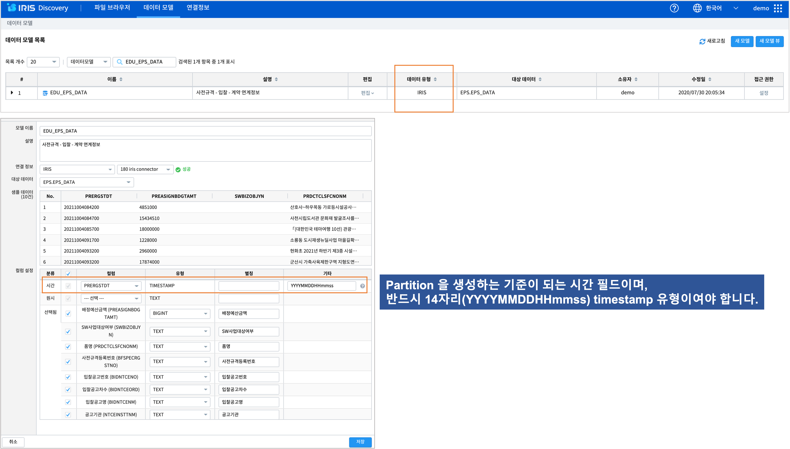
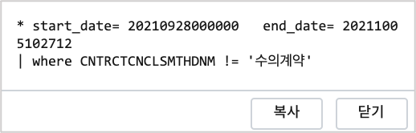
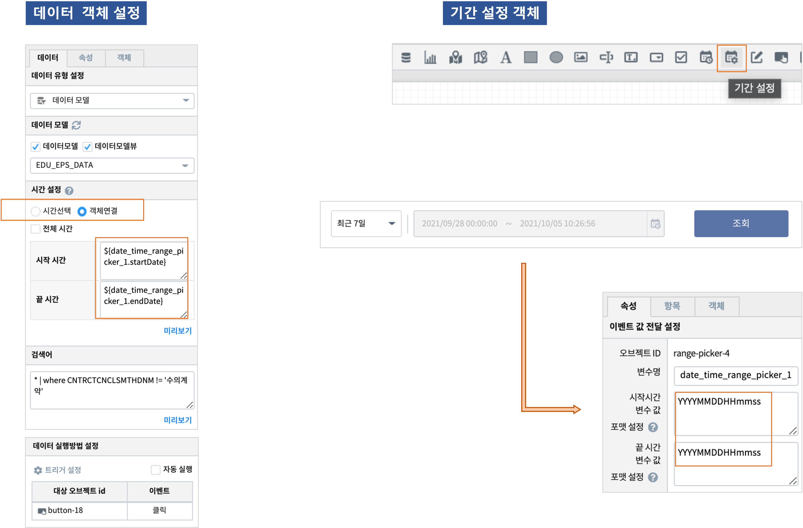
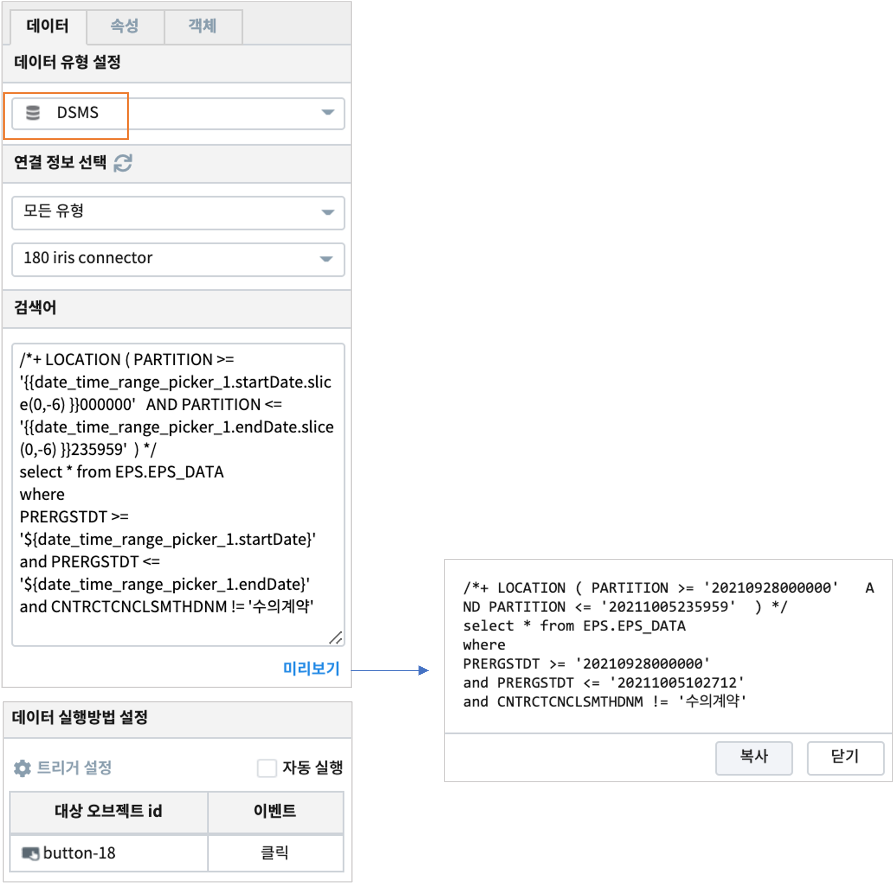

================================================================================
IRIS DB 기반의 데이터 
================================================================================
    
| IRIS Studio 에서 주로 사용되는 **데이터 유형** 에는  "데이터 모델", "DSMS"  가 있습니다.

- 데이터 모델 
    - 데이터를 추상화한 데이터 묶음으로서 IRIS 내에서 별도의 테이블처럼 사용할 수 있습니다.  RDBMS, IRIS DB, OBJECTSTORAGE, HDFS 의 데이터를 데이터 모델로 생성할 수 있습니다.
    - `데이터 모델 manual <https://docs.iris.tools/manual/IRIS-Manual/IRIS-Discovery/datamodel.html#id1>`__  이동

- DSMS
    - Data Source Manager Service, 다양한 데이터에 대한 연결정보를 제공하여 해당 데이터 소스에 맞는 검색어를 사용합니다. 
    - `DSMS manual <https://docs.iris.tools/manual/IRIS-Manual/IRIS-Studio/studio/index.html?highlight=dsms#id10>`__ 이동

| 여기서는 IRIS DB 테이블 중 **로컬 테이블** 데이터를 대상으로 만든 "데이터 모델"  과 "DSMS" 에 대해 설명합니다.
| IRIS DB 의 로컬 테이블 데이터를 IRIS 검색어로 데이터를 빠르고 효율적으로 조회하기 위해서는 다른 RDBMS 의 인덱스를 활용하는 방법과 비슷한 별도의 방법이 필요합니다.
|
| IRIS DB 는 대용량의 시계열 데이터를 실시간으로 저장, 검색을 할 수 있는 분산 DB 입니다.
| 14자리 timestamp 타입의 컬럼을 기준으로 N분, N시간, N일, N달, N분기, N년(year) 으로 PARTITION 을 생성하고, PARTITION KEY 를 생성하여 대량의 데이터를 고속으로 입력할 수 있습니다.
| 그리고 데이터를 조회할 때에는 LOCATION HINT 를 통해 조회 대상 PARTITION 을 지정하여 빠른 검색을 할 수 있습니다.

------------------------------------------------------------
데이터 모델 
------------------------------------------------------------

''''''''''''''''''''''''''''''''''''''''''''''''''''''''''''''''''''''''''''''''
Discovery 에서 데이터 모델 생성하기
''''''''''''''''''''''''''''''''''''''''''''''''''''''''''''''''''''''''''''''''

| ``IRIS Discovery >> 데이터 모델`` 의 목록에서 "데이터 유형" 필드의 값이 **IRIS**  인 경우의 데이터 모델은 IRIS DB 와의 연결정보를 통해 IRIS DB 테이블을 지정한 후 쿼리 결과를 데이터 셋으로 생성한 것입니다.

| 데이터 모델 생성 시에 **시간** 컬럼으로 해당 IRIS DB 테이블의 Partition 생성 기준 시간 컬럼으로 지정한 후에 YYYYMMDDHHmmss 로 포맷을 지정해 줘야 합니다.

''''''''''''''''''''''''''''''''''''''''''''''''''''''''''''''''''''''''''''''''
Studio 에서 데이터 모델 유형으로 데이터 객체 생성하기
''''''''''''''''''''''''''''''''''''''''''''''''''''''''''''''''''''''''''''''''

.............................................
데이터 객체의 시간 설정
.............................................

| ``시간 선택``  또는 ``객체 연결`` 을 사용합니다. 

- 시간 선택
    - ``미리 설정``목록에서 지정을 합니다. 이 때 데이터의 양에 따라 적절한 시간 목록을 선택해야 합니다. 
    - 예) 최근 60분, 최근 4시간, 최근 24시간, 최근 7일
    - "전체 선텍"  은 객체 연결과 같이 **이벤트 변수** 를 받아서 처리하는 경우에만 선택하고, 이벤트 변수로 받은 시간을 검색어 구문 제일 앞에 넣어야 합니다.

.. code-block::

    * start_date= 20210928000000   end_date= 20211005102712 
    | where CNTRCTCNCLSMTHDNM != '수의계약'

- 객체 연결
    - 시간 선택 목록에서 알맞은 목록이 없으면, ``객체 연결`` 을 사용합니다. 객체 연결을 사용하기 위해서는 ``기간설정`` 객체를 **이벤트 변수** 로 받아서 시간을 입력 받아야 합니다.
    - 데이터 객체의 ``실행 방법 설정`` 은 시작 시간, 끝 시간을 기간설정 객체에서 설정이 끝난 후에 ``버튼`` 객체를 클릭하는 이벤트로 트리거를 설정합니다.

..........................................................................................
기간설정 객체의 변수를 이벤트 변수로 받기
..........................................................................................

| ``기간설정`` 객체의 변수 ``${date_time_range_picker_1.startDate}``, ``${date_time_range_picker_1.endDate}`` 를  ``객체 연결`` 에서 시작 시간, 끝 시간으로 설정합니다.
| 그리고 객체 연결에서 사용할 수 있도록 ``기간설정`` 변수의 시작 시간, 끝 시간 변수값 포맷은 **YYYYMMDDHHmmss**  로 설정해야 합니다.

------------------------------------------------------------
DSMS  
------------------------------------------------------------

''''''''''''''''''''''''''''''''''''''''''''''''''''''''''''''''''''''''''''''''
Studio 에서 DSMS 유형으로 데이터 객체 생성하기
''''''''''''''''''''''''''''''''''''''''''''''''''''''''''''''''''''''''''''''''

.............................................
데이터 객체의 검색어 구문
.............................................

| IRIS DB 테이블 중 로컬 테이블 조회시에는 검색어 구문에 조회 시간을 LOCATION HINT 에 넣어야만, 조회 시간에 해당하는 PARTITION 만을 대상으로 빠른 검색이 가능합니다.
| `IRIS 로컬 테이블에서 LOCATION HINT 사용하기 <https://docs.iris.tools/manual/IRIS-Manual/IRIS-Database/user_guide/doc/01.query.html#location-hint>`__

- LOCATION HINT 사용 검색어 예시
    - 데이터 조회 시간 : 2021/10/05 03:40:00 ~ 2021/10/05 23:10:00
    - LOCATION HINT : PARTITION '20211005030000',  '20211005040000',,, '20211005230000' 를 대상으로 합니다.
    - 1시간 단위 PARTITION

.. code-block::

    /*+ LOCATION ( PARTITION >= '20211005030000'   AND PARTITION <= '20211005235959' ) */
    select * from EPS.EPS_DATA 
    where PRERGSTDT >= '20211005034000' 
      and PRERGSTDT <= '20211005231000' 
      and CNTRCTCNCLSMTHDNM != '수의계약'

   # partition key 가 설정된 경우
   /*+ LOCATION (KEY = '2' AND PARTITION >= '20150101000000' AND PARTITION < '20150102000000') */
   select * from EPS.EPS_DATA 
    where CNTRCTCNCLSMTHDNM != '수의계약'

