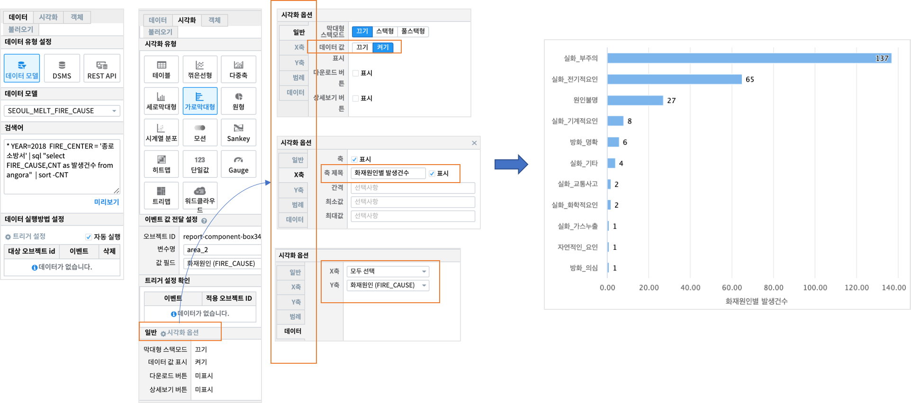
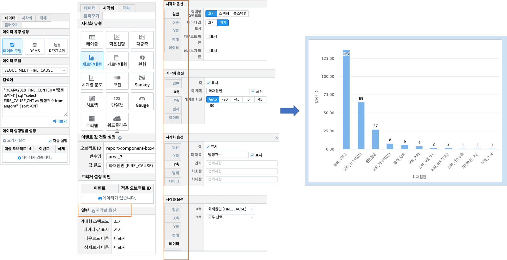

Studio예제: 챠트 - 세로 / 가로 막대 그래프(1)
========================================================================

| 막대그래프(bar chart) 는 연속형 변수가 아닌 이산형 변수에 대해 범주(category), 계급(class)별로 빈도나 합계 등을 막대로 그려셔 비교할 때 유용합니다.

데이터 모델
------------------------------

| 데이터 모델 : SEOUL_MELT_FIRE_CAUSE
| 기간 : 2011 ~ 2018년 연간 통계
| 내용 : 서울시 소방서, 화재원인별 화재 발생 건수 통계

.. image:: images/table_1_01.png
    :scale: 60%
    :alt: table_1_01

가로 막대 그래프
-------------------------------------------

| 검색어 

.. code::

   * YEAR=2018  FIRE_CENTER = '종로소방서' | 
     sql "select  FIRE_CAUSE,CNT as 발생건수 from angora"  | sort -CNT

| 데이터 및 시각화 설정

| 범주형 변수 소방서(FIRE_CENTER) 별로 2018년의 화재 발생 건수가 큰 순서대로 가로 막대 그래프를 그린 것입니다.
| 시각화옵션에서 데이터 값을 bar 에 표시하고, X축 제목을 입력합니다.

세로 막대 그래프
--------------------------------------------

| 검색어

.. code::

   * YEAR=2018  FIRE_CENTER = '종로소방서' | 
     sql "select  FIRE_CAUSE,CNT as 발생건수 from angora"  | sort -CNT

| 데이터 및 시각화 설정

