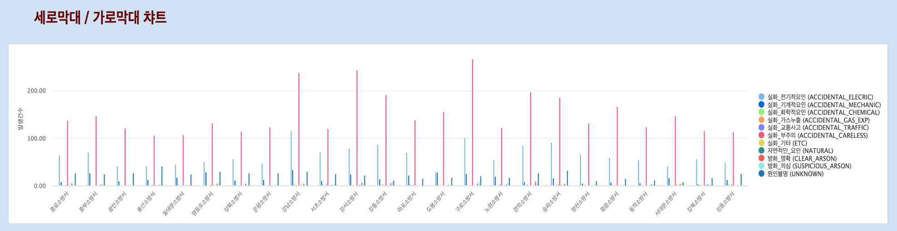
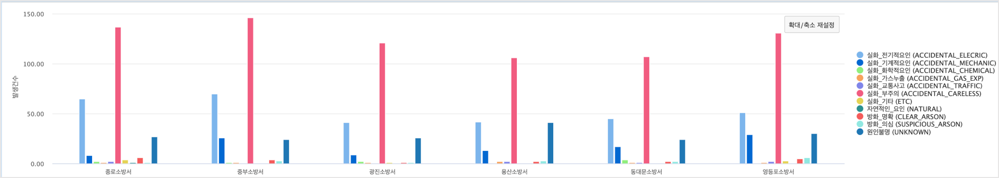

Studio예제: 챠트 - 세로 / 가로 막대 그래프(2) Multi-bar chart
============================================================================

| 막대그래프(bar chart) 는 연속형 변수가 아닌 이산형 변수에 대해 범주(category), 계급(class)별로 빈도나 합계 등을 막대로 그려서 비교할 때 유용합니다.
| multi-bar chart 는 1개 범주나 class 에 2개 이상의 빈도나 합계 등을 막대로 그린 것입니다.

데이터 모델
------------------------------

| 데이터 모델 : SEOUL_FIRE_CAUSE
| 기간 : 2018년 연간 통계
| 내용 : 서울시 소방서, 화재원인별 화재 발생 건수 통계

.. image:: images/chart_bar_21.png
    :alt: chart_bar_21

Multi - 세로 막대 그래프
-------------------------------------------

.. code::

  * YEAR=2018 |  fields -TOTAL

| 2018년 데이터 중에서 TOTAL 컬럼을 제외한 데이터를 대상으로 챠트를 그립니다.

| 데이터 및 시각화 설정

.. image:: images/chart_bar_19.png
    :scale: 80%
    :alt: chart_bar_19

| X축인 소방서별로 화재원인 별로 발생건수의 합을 여러 개의 막대(bar) 로 그린 결과입니다.
| 일부 소방서를 확대해서 보면 막대들이 어떤 값을 의미하는지 더 명확하게 보입니다.

