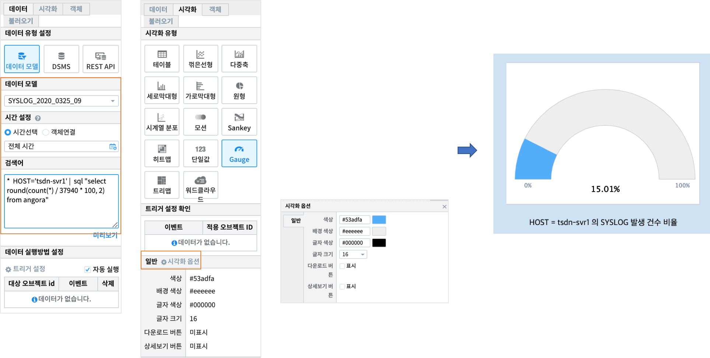

Studio예제: 챠트 - Gauge chart
============================================================================

| 백분율 데이터를  Gauge 형태로 보여 줍니다. 

데이터 모델
------------------------------

| 데이터 모델 : SYSLOG_2020_0325_09
| 기간 : 2020/03/25 09:00 ~ 10:00
| 내용 : 서버(HOST) 에서 출력되는 SYSLOG 원시 데이터

.. image:: images/chart_num_24.png
    :scale: 70%
    :alt: chart_num_24

Gauge 챠트
-------------------------------------------

.. code::

  *  HOST='tsdn-svr1' |  
  sql "select round(count(*) / 37940 * 100, 2)  from angora"

| SYSLOG 데이터중 HOST = 'tsdn-svr1'  를 대상으로
| 전체 SYSLOG row count 인  37940 대비 HOST = 'tsdn-svr1' 의 row count 의 비율을 구합니다.

| 시각화옵션에서 글꼴과 글자크기, 색상, 스타일, 정렬 등을 지정할 수 있습니다.

