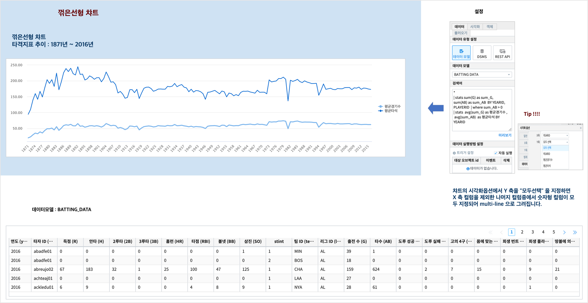
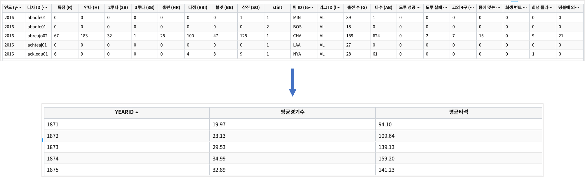
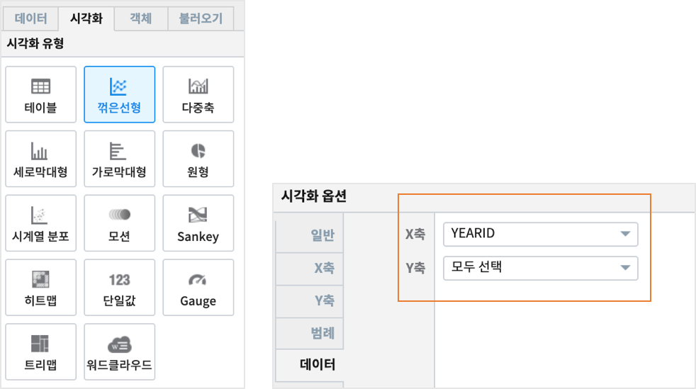

Studio예제: 챠트 - 꺾은선형
========================================================================

| 꺾은선형 챠트는 순차적인 값을 간단하게 시각화할 때 유용한 차트로 X축에 따른 Y축의 값을 연결된 라인으로 보여줍니다.
| 주로 시간에 따른 데이터의 트랜드를 볼 때 많이 사용됩니다. 

데이터 모델
------------------------------

| 데이터 모델 : BATTING_DATA
| 기간 :  1871년 ~ 2016년
| 내용 :  1871년 ~ 2016년 동안 미국 야구의 선수별 타격(Batting) 지표 데이터

챠트 - 꺾은 선형
-------------------------------------------

| 검색어

.. code::

    * |
    stats sum(G) as sum_G, sum(AB) as sum_AB BY YEARID, PLAYERID  | 
    where sum_AB > 0 | 
    stats avg(sum_G) as 평균경기수, avg(sum_AB) as 평균타석 BY YEARID

| 연간 평균 경기수, 평균 타석수를 구하는 검색어입니다.

| 챠트에서 Y 축으로 1개의 변수로 챠트를 그릴 수 도 있지만,  여러 개의 변수를 다른 색의 라인으로 그릴 수 있습니다.
| 이 때는 시각화옵션에서 Y축 데이터를 "모두선택" 으로 지정하면, X축 변수 외에 남아 있는 변수 중에서 숫자형 변수가 모두 설정되어 동시에 여러 라인으로 챠트를 그릴 수 있습니다.

