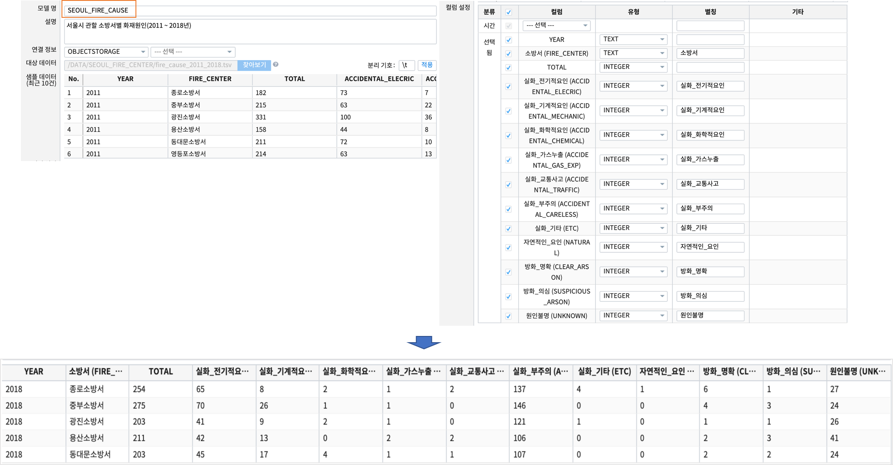
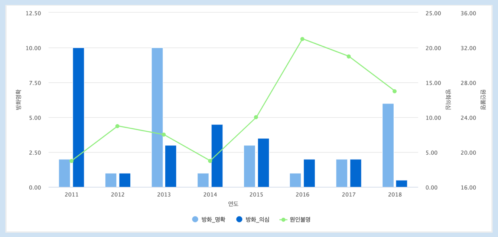
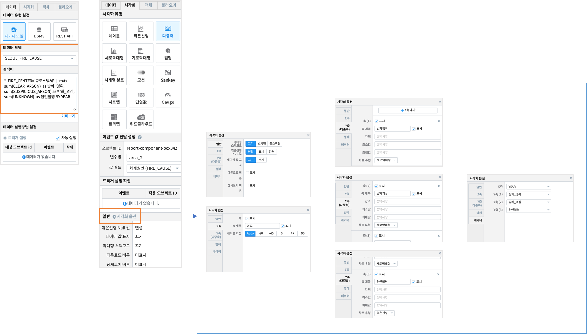

Studio예제: 챠트 - 다중축 챠트
============================================================================

| 다중축챠트는 챠트로 그리려는 여러 항목들 중 특정 항목의 값이 다른 값들과 차이가 많이 나서 가독성이 떨어질 때 사용됩니다.
| 오른쪽에 보조축을 새로 생성하여 챠트에 표시되는 값들을 비슷하게 맞추어 줄 수 있습니다.  
| IRIS Studio 에서는 데이터를 다중축 혼합형(세로막대형, 꺾은선형) 차트 형태로 제공합니다.

데이터 모델
------------------------------

| 데이터 모델 : SEOUL_FIRE_CAUSE
| 기간 : 2011 ~ 2018년
| 내용 : 서울시 소방서, 화재원인별 화재 발생 건수 통계

다중축 챠트
-------------------------------------------

| 검색어

.. code::

    *  FIRE_CENTER='종로소방서'  | 
    stats sum(CLEAR_ARSON) as 방화_명확, sum(SUSPICIOUS_ARSON) as 방화_의심, sum(UNKNOWN)  as 원인불명 BY YEAR

| 전체 데이터에서 FIRE_CENTER='종로소방서' 로 필터링한 후
| 화재원인 중 CLEAR_ARSON, SUSPICIOUS_ARSON, UNKNOWN  의 연도별 합계를 구합니다. 그리고 한글명  alias 를 만드는 코드입니다.
| 검색 명령어 `stats <http://docs.iris.tools/manual/IRIS-Manual/IRIS-Discovery-Middleware/command/commands/stats.html>`__ 를 참조하세요.
|
| 예제는 2개의 세로막대그래프와 1개의 꺾은선형 그래프로 총 3개 Y축을 설정했습니다.
| 그리고 방화_명확, 방화_의심, 원인불명 발생 건수의 합은 개별 축에 적절한 간격과 최소, 최대값이 자동 설정되었습니다.
| 하지만 시각화옵션에서 각 축의 간격, 최소, 최대값 등을 수동으로도 설정 할 수 있습니다.

