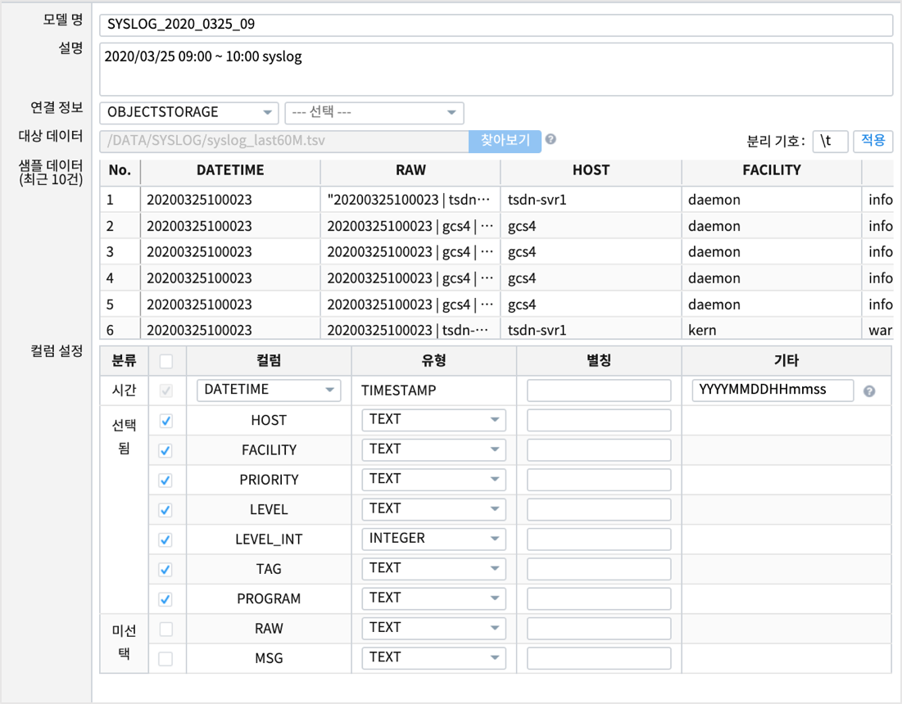
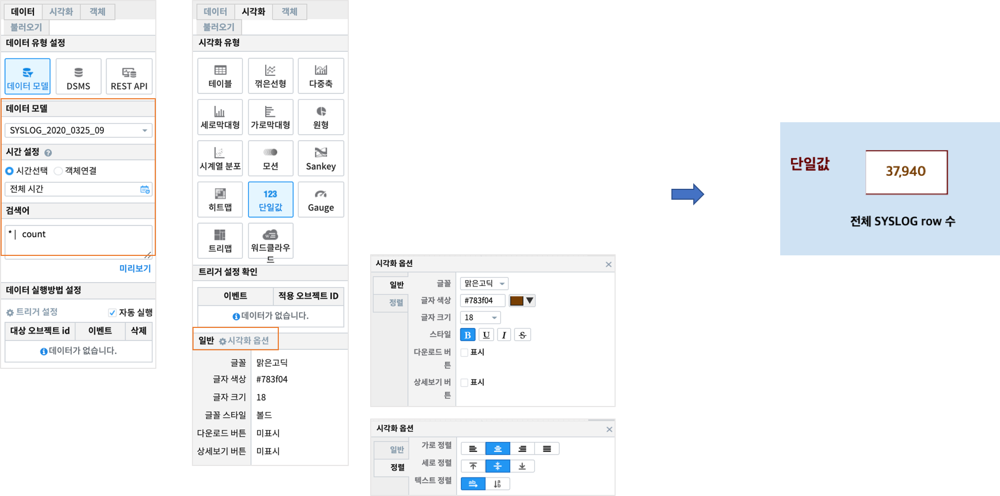

Studio예제: 챠트 - 단일값
============================================================================

| 데이터를 값 하나의 형태로 보여 줍니다.

데이터 모델
------------------------------

| 데이터 모델 : SYSLOG_2020_0325_09
| 기간 : 2020/03/25 09:00 ~ 10:00
| 내용 : 서버(HOST) 에서 출력되는 SYSLOG 원시 데이터

단일값 챠트
-------------------------------------------

| 검색어

.. code::

  * | count

| 전체 데이터의 레코드(row) 수 
| 검색 명령어 `count <http://docs.iris.tools/manual/IRIS-Manual/IRIS-Discovery-Middleware/command/commands/count#count>`__ 참고하세요.

| 시각화옵션에서 글꼴과 글자크기, 색상, 스타일, 정렬 등을 지정할 수 있습니다.

