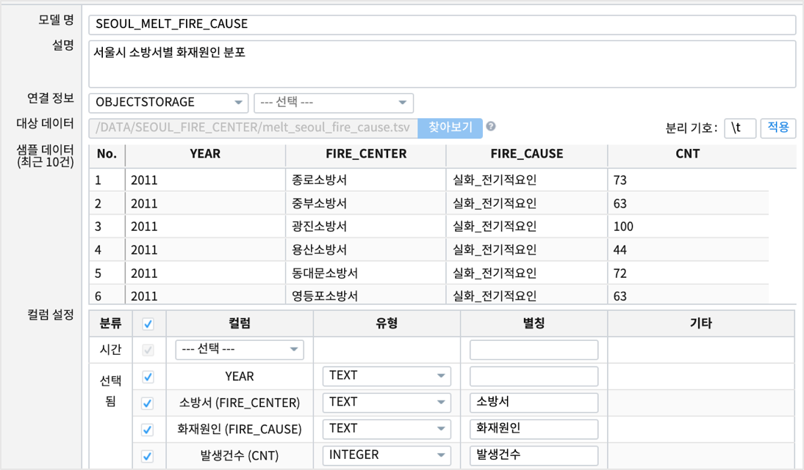
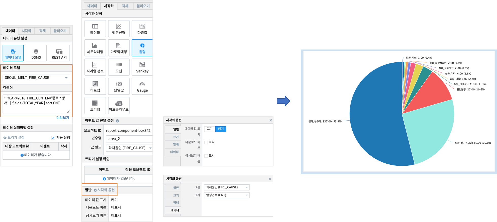

Studio예제: 챠트 - 원형 챠트
============================================================================

| 데이터의 각 범주의 합계 또는 평균 등을 원(pie) 에서 차지하는 비율로 보여주는 챠트입니다.
| 전체에 대한 각 범주 값의 상대적 비율을 데이터의 범주별 합계, 평균 등과 함께 표시합니다.
| 원형챠트는 데이터의 단일값이 아닌 해당 범주 별 비율이 집계되어야 하며, 데이터의 범주의 전체적인 비율을 쉽게 파악할 수 있는 장점이 있습니다.

데이터 모델
------------------------------

| 데이터 모델 : SEOUL_MELT_FIRE_CAUSE
| 기간 : 2011 ~ 2018년 연간 통계
| 내용 : 서울시 소방서, 화재원인별 화재 발생 건수 통계

원형 챠트
-------------------------------------------

| 검색어

.. code::

    *  YEAR=2018  FIRE_CENTER='종로소방서'  |  fields -TOTAL,YEAR | sort CNT

| 종로소방서의 2018년 데이터로 필터링한 후 TOTAL, YEAR 컬럼을 뺀 데이터 입니다.
| 검색 명령어 `fields <http://docs.iris.tools/manual/IRIS-Manual/IRIS-Discovery-Middleware/command/commands/fields.html>`__ 를 참조하세요.
|
| 2018년 종로소방서의 화재원인별 발생건수 비율을 원형 챠트로 쉽게 확인할 수 있습니다.

