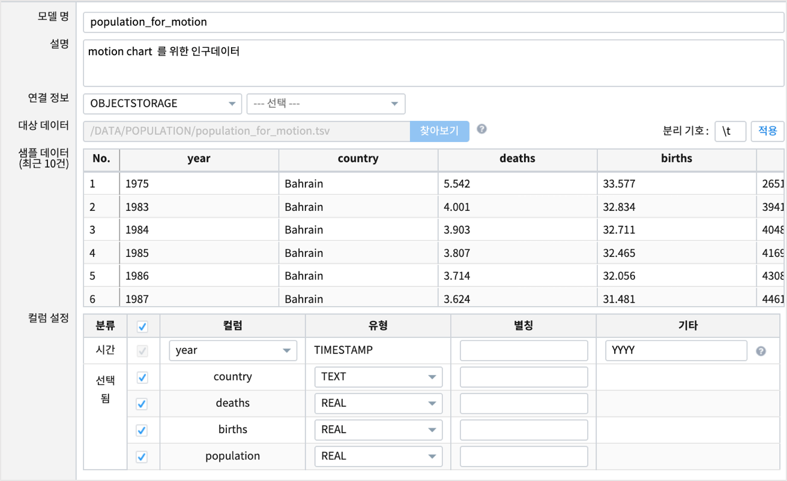
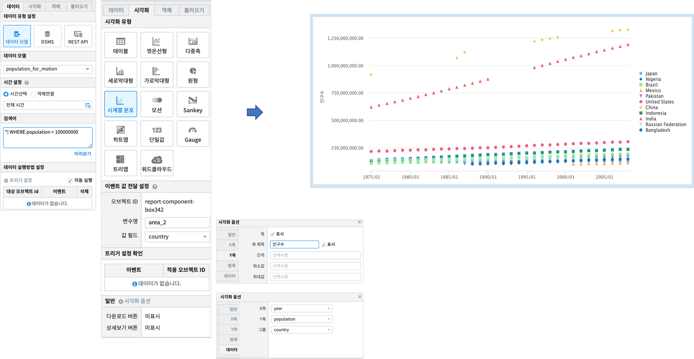

Studio예제: 챠트 - 시계열분포
========================================================================

| 시간 필드가 포함된 데이터를 시간에 따른 Scatter 차트 형태로 보여 줍니다.

데이터 모델
------------------------------

| 데이터 모델 : population_for_motion
| 기간 :  1975 ~ 2008년
| 내용 :  1975 ~ 2008년 까지 국가별 출생율, 사망율, 인구수 추이
|

챠트 - 시계열 분포
-------------------------------------------

|

.. code::

    *| WHERE population > 100000000

| 챠트에 보여지는 국가수를 줄이기 위해 인구 1억명 이상인 경우에만 한정하여 필터링 합니다.
| 그룹의 수가 너무 많으면 scatter plot 에서 색상으로 인한 구별이 어려울 수 있기 때문입니다.

