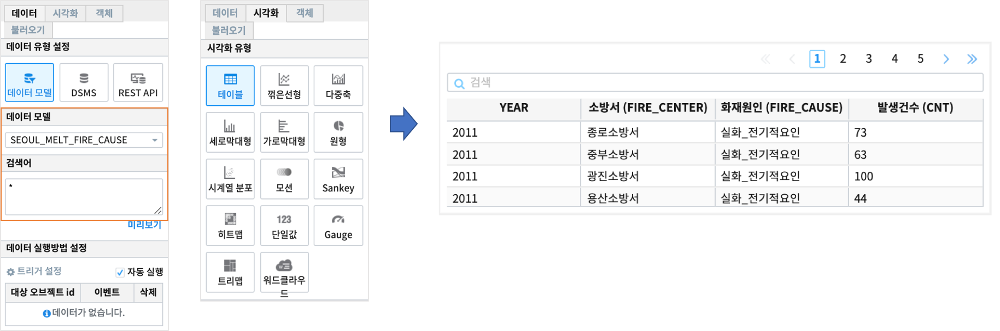
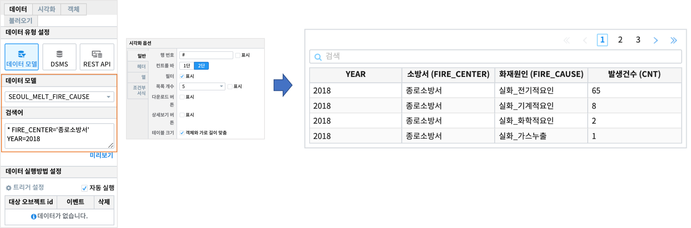
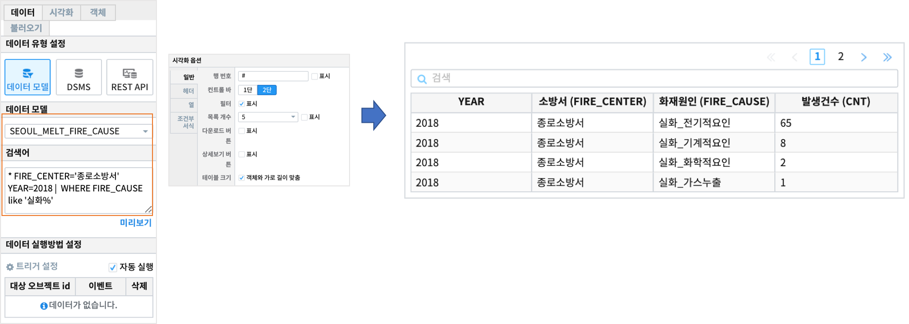

Studio예제: 테이블과 검색어 1 (필터/where/sql case when)
========================================================================

| IRIS Studio 의 **챠트-테이블** 유형에서 

- 필터링 ( 검색에 추가/제외하기 )
- where
- sql 문에서 CASE WHEN 구문

| 을 검색어로 사용한 결과를 테이블에서 확인해 봅니다.

데이터 모델
------------------------------

| 데이터 모델 : SEOUL_MELT_FIRE_CAUSE
| 기간 : 2011 ~ 2018년 연간 통계
| 내용 : 서울시 소방서, 화재원인별 화재 발생 건수 통계

|

.. image:: images/table_1_01.png
    :scale: 60%
    :alt: table_1_01

- 팁 
    - 챠트를 테이블 유형으로 출력할 때의 시각화 옵션은 `IRIS Studio 보고서 시각화옵션 <http://docs.iris.tools/manual/IRIS-Manual/IRIS-Studio/studio/index.html#id35>`__ 을 참조하세요.

|

테이블 : 검색어 "*"
-------------------------------------------

|

테이블 : 필터링 검색
-------------------------------------------

.. code::

   *  FIRE_CENTER='종로소방서' YEAR=2018

| FIRE_CENTER 가 '종로소방서' && YEAR=2018 인 데이터만 검색합니다.

|

|

테이블 : WHERE 구문으로 필터링하기
-------------------------------------------

.. code::

   *  FIRE_CENTER='종로소방서'  YEAR=2018 | WHERE FIRE_CAUSE like '실화%'

| FIRE_CENTER 가 '종로소방서' && YEAR=2018 인 데이터 중에서( 파이프로 전달함 ) FIRE_CAUSE 가 "실화" 로 시작하는 데이터를 검색합니다.
| 자세한 설명 - 검색어 `WHERE <http://docs.iris.tools/manual/IRIS-Manual/IRIS-Discovery-Middleware/command/commands/where.html#where>`__ 

|

|

테이블 : SQL 문 - CASE WHEN 예제
---------------------------------------------

.. code::

  * FIRE_CENTER='종로소방서'  YEAR=2018 | 
  sql "select *, 
       CASE WHEN FIRE_CAUSE like '실화%' 
            THEN '실화' 
            WHEN FIRE_CAUSE like '방화%'
            THEN '방화'
            ELSE  FIRE_CAUSE 
       END CAUSE_KIND
  from angora"

|

| FIRE_CENTER 가 '종로소방서' && YEAR=2018 인 데이터 중에서( 파이프로 전달함 ) **CASE WHEN** 문으로
| FIRE_CAUSE(화재원인) 이 "실화"로 시작하는 데이터는 CAUSE_KIND = '실화'
| FIRE_CAUSE(화재원인) 이 "방화"로 시작하는 데이터는 CAUSE_KIND = '방화'
| 그 외는 CAUSE_KIND = FIRE_CAUSE ( 나머지 "자연적인_요인" )

|

.. image:: images/table_1_05.png
    :alt: table_1_05

