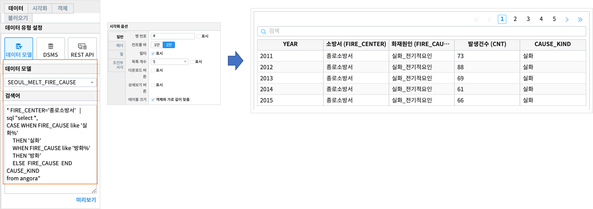
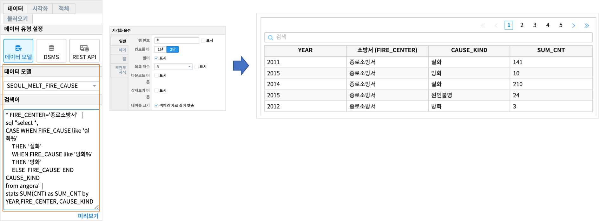
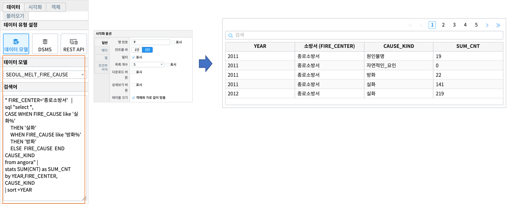

Studio예제: 테이블과 검색어 2 (stats/sort)
========================================================================

| Studio예제: 테이블과 검색어 1 에 이어서 IRIS Studio 의 **챠트-테이블** 유형에서 

- stats 구문
- sort 

| 을 검색어로 사용한 결과를 테이블에서 확인해 봅니다.

데이터 모델
------------------------------

| 데이터 모델 : SEOUL_MELT_FIRE_CAUSE
| 기간 : 2011 ~ 2018년 연간 통계
| 내용 : 서울시 소방서, 화재원인별 화재 발생 건수 통계

|

.. image:: images/table_1_01.png
    :scale: 60%
    :alt: table_1_01

- 팁 
    - 챠트를 테이블 유형으로 출력할 때의 시각화 옵션은 `IRIS Studio 보고서 시각화옵션 <http://docs.iris.tools/manual/IRIS-Manual/IRIS-Studio/studio/index.html#id35>`__ 을 참조하세요.

|

테이블 : SQL 문 - CASE WHEN 예제
-------------------------------------------

.. code::

    * FIRE_CENTER='종로소방서'   | 
    sql "select *, 
                CASE WHEN FIRE_CAUSE like '실화%' 
                     THEN '실화' 
                     WHEN FIRE_CAUSE like '방화%'
                     THEN '방화'
                     ELSE  FIRE_CAUSE  
                END CAUSE_KIND
    from angora

| FIRE_CENTER 가 '종로소방서' 인 데이터 중에서( 파이프로 전달함 ) **CASE WHEN** 문으로
| FIRE_CAUSE(화재원인) 이 "실화"로 시작하는 데이터는 CAUSE_KIND = '실화'
| FIRE_CAUSE(화재원인) 이 "방화"로 시작하는 데이터는 CAUSE_KIND = '방화'
| 그 외는 CAUSE_KIND = FIRE_CAUSE ( 나머지 "자연적인_요인" )

|

|

테이블 : STATS 문
-------------------------------------------

.. code::

     * FIRE_CENTER='종로소방서'   | 
    sql "select *, 
                CASE WHEN FIRE_CAUSE like '실화%' 
                     THEN '실화' 
                     WHEN FIRE_CAUSE like '방화%'
                     THEN '방화'
                     ELSE  FIRE_CAUSE  
                END CAUSE_KIND
         from angora |
    stats SUM(CNT) as SUM_CNT by YEAR,FIRE_CENTER, CAUSE_KIND

| SQL 의 CASE WHEN 구문으로 새로 만든 CAUSE_KIND 컬럼으로 CNT(발생건수) 를 집계 하기 위해 STATS 를 사용합니다.
| 자세한 설명 - 검색어 `STATS <http://docs.iris.tools/manual/IRIS-Manual/IRIS-Discovery-Middleware/command/commands/stats.html>`__ 를 참조하세요.

|

|

테이블 : SORT 
---------------------------------------------

.. code::

     * FIRE_CENTER='종로소방서'   | 
    sql "select *, 
                CASE WHEN FIRE_CAUSE like '실화%' 
                     THEN '실화' 
                     WHEN FIRE_CAUSE like '방화%'
                     THEN '방화'
                     ELSE  FIRE_CAUSE  
                END CAUSE_KIND
         from angora |
    stats SUM(CNT) as SUM_CNT by YEAR,FIRE_CENTER, CAUSE_KIND |
    sort +YEAR

| stats 로 나온 결과를 YEAR 변수의 값을 오름차순(점점 커지는 순서)로 출력합니다.
| 자세한 설명 - 검색어 `SORT <http://docs.iris.tools/manual/IRIS-Manual/IRIS-Discovery-Middleware/command/commands/sort.html>`__ 를 참조하세요.

