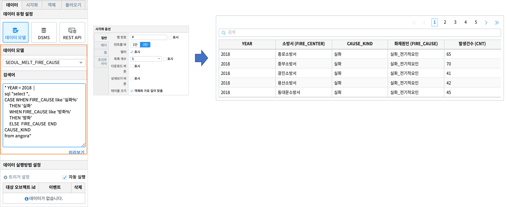
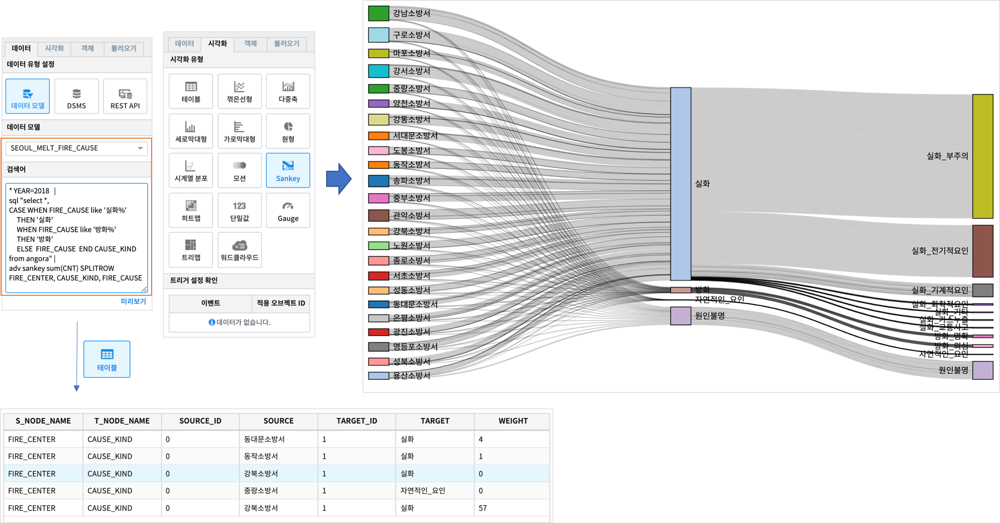

Studio예제: 테이블과 검색어 3 (adv sankey)
========================================================================

| IRIS Studio 의 **챠트-테이블** 의 sql 검색어 결과로 나온 데이터를 **adv** 명령어로 시각화 챠트로 바로 그릴 수 있습니다.
| 데이터를 sankey 챠트를 바로 그릴 수 있는 형식의 데이터로 변환합니다.

데이터 모델
------------------------------

| 데이터 모델 : SEOUL_MELT_FIRE_CAUSE
| 기간 : 2011 ~ 2018년 연간 통계
| 내용 : 서울시 소방서, 화재원인별 화재 발생 건수 통계

|

.. image:: images/table_1_01.png
    :scale: 60%
    :alt: table_1_01

- 팁 
    - 챠트를 테이블 유형으로 출력할 때의 시각화 옵션은 `IRIS Studio 보고서 시각화옵션 <http://docs.iris.tools/manual/IRIS-Manual/IRIS-Studio/studio/index.html#id35>`__ 을 참조하세요.

|

테이블 : sql 문 - CASE WHEN 예제
-------------------------------------------

.. code::

    * YEAR = 2018  |  
    sql "select *, 
                CASE WHEN FIRE_CAUSE like '실화%' 
                     THEN '실화' 
                     WHEN FIRE_CAUSE like '방화%'
                     THEN '방화'
                     ELSE  FIRE_CAUSE  
                END CAUSE_KIND
    from angora"

| YEAR= 2018 인 데이터 중에서( 파이프로 전달함 ) **CASE WHEN** 문으로
| FIRE_CAUSE(화재원인) 이 "실화"로 시작하는 데이터는 CAUSE_KIND = '실화'
| FIRE_CAUSE(화재원인) 이 "방화"로 시작하는 데이터는 CAUSE_KIND = '방화'
| 그 외는 CAUSE_KIND = FIRE_CAUSE ( 나머지 "자연적인_요인" )

|

|

테이블 : adv sankey
-------------------------------------------

.. code::

    * YEAR=2018   | 
    sql "select *, 
               CASE WHEN FIRE_CAUSE like '실화%' 
                    THEN '실화' 
                    WHEN FIRE_CAUSE like '방화%'
                    THEN '방화'
                    ELSE  FIRE_CAUSE  
               END CAUSE_KIND  
        from angora" |
    adv sankey sum(CNT) SPLITROW FIRE_CENTER, FIRE_CAUSE, CAUSE_KIND

| adv sankey 는 입력으로 받은 데이터(파이프로 전달받은) 를 sankey chart 를 그릴 수 있는 데이터로 변환합니다.
| 시각화유형을 테이블로 하면 SOURCE, TARGET 필드가 있는 데이터로 변환되며, sankey 를 선택하면 바로 sankey chart 를 그립니다. 
| 자세한 설명 - 검색어 `adv <http://docs.iris.tools/manual/IRIS-Manual/IRIS-Discovery-Middleware/command/commands/adv.html>`__ 를 참조하세요.

|

| SPLITROW 뒤에 나오는 필드가 sankey챠트의 각 NODE이며, FIRE_CENTER -> FIRE_CAUSE -> CAUSE_KIND  로 flow 가 정해집니다.
| 선의 굵기는 각 NODE -> NODE 일 때의 값을 의미하며, 여기서는 CNT의 합계입니다.

