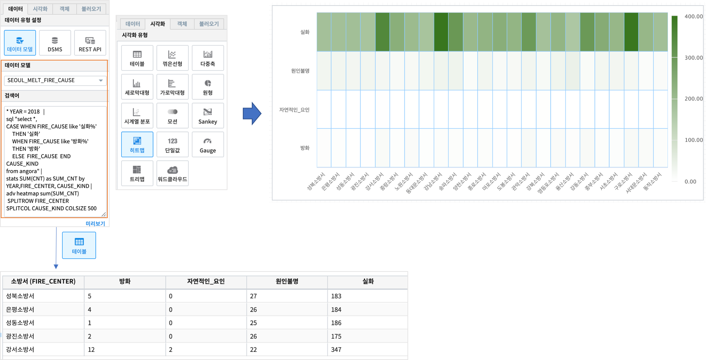

Studio예제: 테이블과 검색어 4 (adv heatmap)
========================================================================

| IRIS Studio 의 **챠트-테이블** 의 sql 검색어 결과로 나온 데이터를 **adv heatmap** 명령어로 바로 그릴 수 있습니다.
| heatmap 챠트를 그릴 수 있는 형태로 데이터를 변환하여 시각화 유형을 heatmap 으로 선택하면 바로 그려집니다.

데이터 모델
------------------------------

| 데이터 모델 : SEOUL_MELT_FIRE_CAUSE
| 기간 : 2011 ~ 2018년 연간 통계
| 내용 : 서울시 소방서, 화재원인별 화재 발생 건수 통계

.. image:: images/table_1_01.png
    :scale: 60%
    :alt: table_1_01

- 팁 
    - 챠트를 테이블 유형으로 출력할 때의 시각화 옵션은 `IRIS Studio 보고서 시각화옵션 <http://docs.iris.tools/manual/IRIS-Manual/IRIS-Studio/studio/index.html#id35>`__ 을 참조하세요.

테이블 : sql 문 - CASE WHEN 예제
-------------------------------------------

.. code::

    * YEAR = 2018  |  
    sql "select *, 
                CASE WHEN FIRE_CAUSE like '실화%' 
                     THEN '실화' 
                     WHEN FIRE_CAUSE like '방화%'
                     THEN '방화'
                     ELSE  FIRE_CAUSE  
                END CAUSE_KIND
    from angora"

| YEAR= 2018 인 데이터 중에서( 파이프로 전달함 ) **CASE WHEN** 문으로
| FIRE_CAUSE(화재원인) 이 "실화"로 시작하는 데이터는 CAUSE_KIND = '실화'
| FIRE_CAUSE(화재원인) 이 "방화"로 시작하는 데이터는 CAUSE_KIND = '방화'
| 그 외는 CAUSE_KIND = FIRE_CAUSE ( 나머지 "자연적인_요인" )

.. image:: images/table_3_09.png
    :alt: table_3_09

테이블 : adv heatmap
-------------------------------------------

.. code::

    * YEAR = 2018   | 
    sql "select *, 
                CASE WHEN FIRE_CAUSE like '실화%' 
                     THEN '실화' 
                     WHEN FIRE_CAUSE like '방화%'
                     THEN '방화'
                     ELSE  FIRE_CAUSE  
                END CAUSE_KIND
    from angora" |
    stats SUM(CNT) as SUM_CNT by YEAR,FIRE_CENTER, CAUSE_KIND | 
    adv heatmap sum(SUM_CNT)
                SPLITROW FIRE_CENTER
                SPLITCOL CAUSE_KIND COLSIZE 500

| adv heatmap 은 입력으로 받은 데이터(파이프로 전달받은) 를 heatmap 을 그릴 수 있는 데이터로 변환합니다.
| 시각화유형을 테이블로 하면 CAUSE_KIND 컬럼의 값 자체가 컬럼이름으로 변환되는 테이블을 보여 줍니다.
| 자세한 설명 - 검색어 `adv <http://docs.iris.tools/manual/IRIS-Manual/IRIS-Discovery-Middleware/command/commands/adv.html>`__ 를 참조하세요.

| X축은 FIRE_CENTER, Y 축은 CAUSE_KIND 의 개별 값으로 heatmap 으로 표현됩니다.

