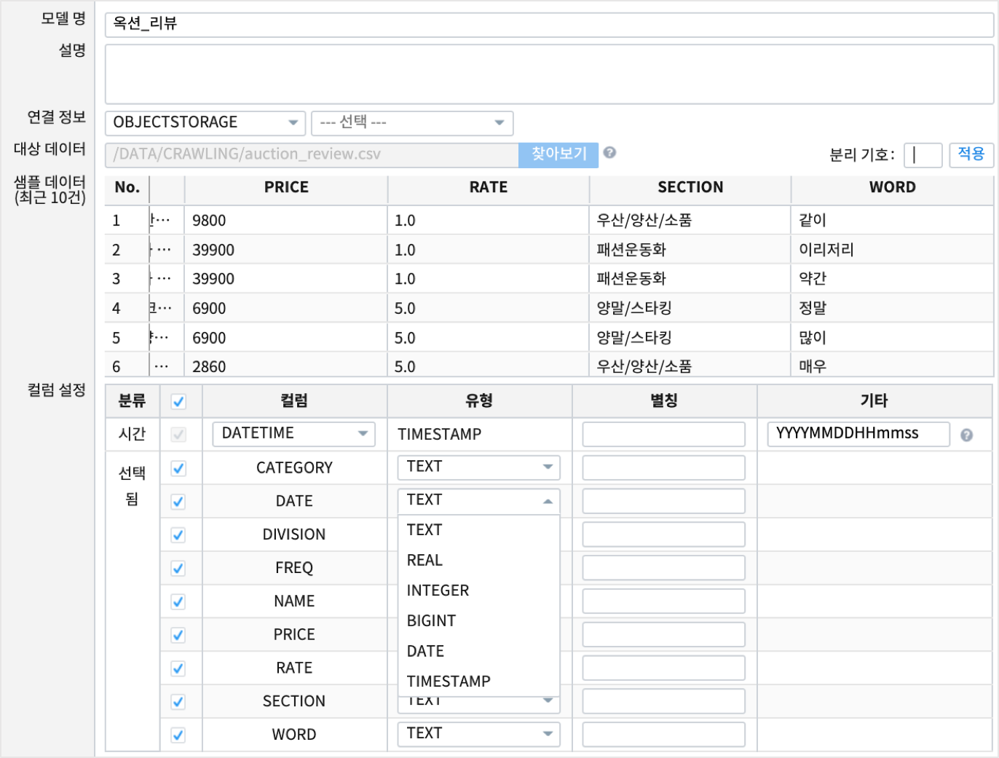
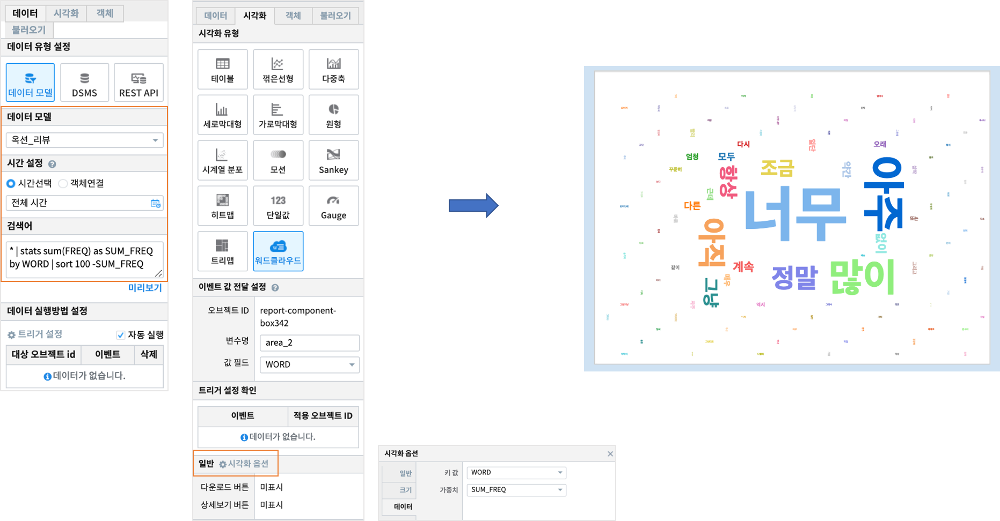

Studio예제: 챠트 - 워드클라우드
============================================================================

| 워드클라우드는 단어의 출현빈도 또는 가중치에 따라 단어의 크기를 다르게 하여 그리는 챠트입니다.

데이터 모델
------------------------------

| 데이터 모델 : 옥션_리뷰
| 내용 : 홈쇼핑의 고객 리뷰를 파싱하여 특정 단어와 빈도를 저장한 데이터

워드클라우드 챠트
-------------------------------------------

.. code::

    * | stats sum(FREQ) as SUM_FREQ by WORD | sort 100 -SUM_FREQ

| 옥션_리뷰 데이터모델에서 WORD 컬럼별로 FREQ 컬럼 값의 합계를 구한 후 내림차순으로 정렬합니다.
| 검색 명령어 `stats <http://docs.iris.tools/manual/IRIS-Manual/IRIS-Discovery-Middleware/command/commands/stats>`__ 를 참조하세요.

| 시각화옵션에서 글꼴과 글자크기, 색상, 스타일, 정렬 등을 지정할 수 있습니다.
