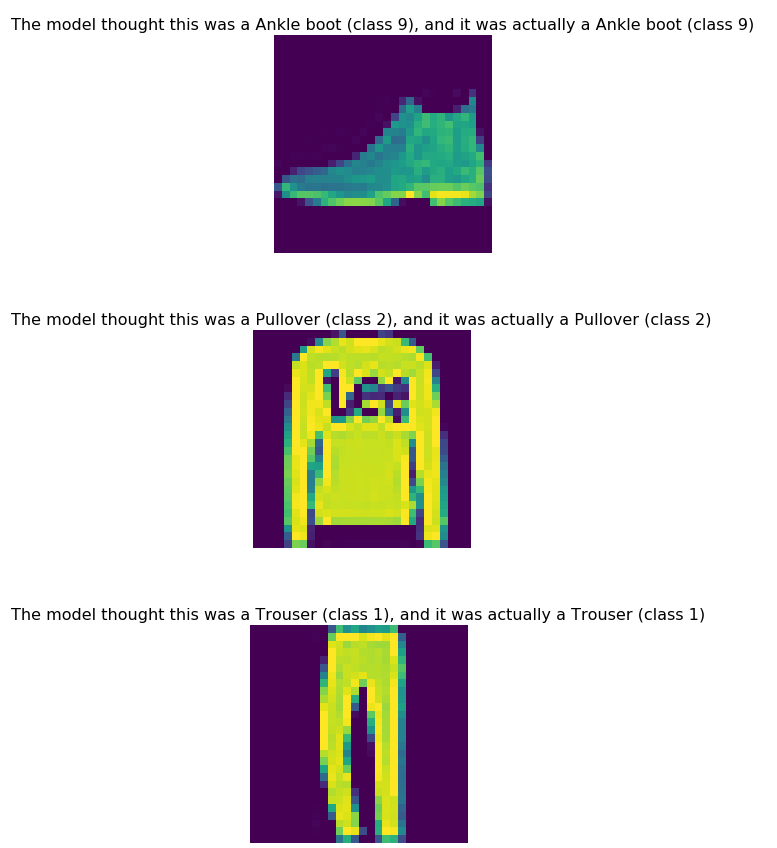

ML 명령어 - mnist clothes 예제
====================================================================================================

tensorflow의 옷 데이터로 학습을 진행하고, 개인 객체 저장소에 업로드하여 IRIS Discovery Service 적재, 서빙하는 시나리오입니다.

학습
----------------------------------------------------------------------------------------------------

| 10개의 옷 카테고리로 이루어진 7만장의 흑백 옷이미지를 다운로드, 전처리, 학습합니다.
| `여기 <https://www.tensorflow.org/tfx/tutorials/serving/rest_simple>`_ 를 참조하였습니다.

tensorflow 2.1.0 패키지가 필요합니다.

``pip install tensorflow==2.1.0``

.. code-block:: none

   import tensorflow as tf
   from tensorflow import keras
   
   fashion_mnist = keras.datasets.fashion_mnist
   (train_images, train_labels), (test_images, test_labels) = fashion_mnist.load_data()

   # scale the values to 0.0 to 1.0
   train_images = train_images / 255.0
   test_images = test_images / 255.0

   # reshape for feeding into the model
   train_images = train_images.reshape(train_images.shape[0], 28, 28, 1)
   test_images = test_images.reshape(test_images.shape[0], 28, 28, 1)

   class_names = ['T-shirt/top', 'Trouser', 'Pullover', 'Dress', 'Coat',
                  'Sandal', 'Shirt', 'Sneaker', 'Bag', 'Ankle boot']

   print('\ntrain_images.shape: {}, of {}'.format(train_images.shape, train_images.dtype))
   print('test_images.shape: {}, of {}'.format(test_images.shape, test_images.dtype))
   print('\ntrain_labels.shape: {}, of {}'.format(train_labels.shape, train_labels.dtype))
   print('test_labels.shape: {}, of {}'.format(test_labels.shape, test_labels.dtype))
   
   model = keras.Sequential([
       keras.layers.Conv2D(input_shape=(28,28,1), filters=8, kernel_size=3, 
                           strides=2, activation='relu', name='Conv1'),
       keras.layers.Flatten(),
       keras.layers.Dense(10, activation=tf.nn.softmax, name='Softmax')
   ])
   model.summary()
   
   testing = False
   epochs = 5

   model.compile(optimizer='adam', 
                 loss='sparse_categorical_crossentropy',
                 metrics=['accuracy'])
   model.fit(train_images, train_labels, epochs=epochs)

   test_loss, test_acc = model.evaluate(test_images, test_labels)
   print('\nTest accuracy: {}'.format(test_acc))

개인 객체저장소에 모델 업로드
----------------------------------------------------------------------------------------------------

| IRIS Discovery Service에 적재하기 위해, tar 파일로 압축하여 개인 객체저장소에 업로드합니다.
| boto3 패키지가 필요합니다.

``pip install boto3``

- 아래 인자를 입력해주세요.

 - bucket : 개인 객체 저장소의 bucket
 - key : 개인 객체 저장소의 key
 - endpoint_url : 개인 객체 저장소의 url
 - aws_access_key_id : 개인 객체 저장소의 access_key
 - aws_secret_access_key : 개인 객체 저장소의 secret_access_key

.. code-block:: none

   import tempfile
   import tarfile
   import os
   import boto3
   import tensorflow as tf
   
   # 개인 객체저장소 설정
   bucket = 'iris'
   key = 'clothes/model.tar'
   setting = {
       'endpoint_url': "http://192.168.102.138:9003",
       'verify': False,
       'aws_access_key_id': 'minio',
       'aws_secret_access_key': 'minio123'
   }

   # 모델 생성
   export_path = tempfile.mkdtemp()
   tf.keras.models.save_model(
       model,
       export_path,
       overwrite=True,
       include_optimizer=True,
       save_format=None,
       signatures=None,
       options=None
   )

   # 모델 압축
   tar_name = export_path + '/model.tar'
   with tarfile.open(tar_name, "w:tar") as tar:
       tar.add(export_path, arcname='./')

   # 모델 업로드
   cli = boto3.client('s3', **setting)
   cli.upload_file(tar_name, bucket, key)

적재
----------------------------------------------------------------------------------------------------   

| IRIS Discovery Service에 모델을 적재합니다.
| 적재는 IRIS Discovery Service의 `mlmodel import  <http://docs.iris.tools/manual/IRIS-Manual/IRIS-Discovery-Middleware/command/commands/mlmodel.html#mlmodel-import>`_ 를 사용합니다.

IRIS Discovery Service의 검색창에 아래 명령어를 입력합니다. path 옵션에 개인 객체저장소 정보, tar로 압축한 모델 경로를 입력합니다.

``mlmodel import name=mnist_clothes type=tf category=classification algorithm=deep format=saved_model path=OBJECTSTORAGE.{CONNECTOR NAME}:clothes/model.tar``

결과

.. list-table::
   :header-rows: 1

   * - result
   * - ok

배포
----------------------------------------------------------------------------------------------------   

| IRIS Discovery Service가 관리하는 tensorflow serving에 모델을 배포합니다.
| 배포는 IRIS Discovery Service의 `mlmodel deploy  <http://docs.iris.tools/manual/IRIS-Manual/IRIS-Discovery-Middleware/command/commands/mlmodel.html#mlmodel-deploy>`_ 를 사용합니다.

IRIS Discovery Service의 검색창에 아래 명령어를 입력합니다.

``mlmodel deploy mnist_clothes label='first'``

결과

- mnist_clothes이 root_mnist_clothes 이름으로 배포되었습니다.

.. list-table::
   :header-rows: 1

   * - result
     - latest_version
     - serving_name
   * - ok
     - 1
     - root_mnist_clothes

서빙 상태 확인
----------------------------------------------------------------------------------------------------        

| 배포한 mnist_clothes모델의 서빙 상태를 확인합니다.
| 서빙 상태 확인은 IRIS Discovery Service의 `serving status  <http://docs.iris.tools/manual/IRIS-Manual/IRIS-Discovery-Middleware/command/commands/serving.html#serving-status>`_ 를 사용합니다.

IRIS Discovery Service의 검색창에 아래 명령어를 입력합니다.

``serving status mnist_clothes``

결과

- mnist_clothes모델로 생성한 version 1이 사용 가능한 상태로 배포되었습니다.

.. list-table::
   :header-rows: 1

   * - version
     - state
     - label
   * - 1
     - AVAILABLE
     - first

예측
----------------------------------------------------------------------------------------------------        

배포된 모델에 대해 4가지 유형의 예측 방법이 있습니다.

- python 스크립트 방식
- DSL 설정파일 방식
- DSL 데이터 소스 입력 방식
- curl 방식

| 이중 python 스크립트 방식, DSL 설정파일 방식, curl 방식에 대해 진행합니다. 
| DSL 데이터 소스 입력 방식은 테스트 데이터가 IRIS에 업로드 되어있어야 합니다. 이에 관한 유즈케이스는 
`범용명령어  <http://docs.iris.tools/manual/IRIS-Usecase/ml/general-purpose.html>`_ , `mnist 숫자 모델 적재, 예측  <http://docs.iris.tools/manual/IRIS-Usecase/ml-serving/mnist_number.html>`_ 을 참조해주세요.

python 스크립트 방식
''''''''''''''''''''''''''''''''''''''''''''''''''''''''''''''''''''''''''''''''''''''''''''''''''''

시각화를 위해 matplotlib 패키지가 필요합니다.

``pip install matplotlib``

주의할점은 서빙에 직접 요청을 하기 때문에, url에 model_name(mnist_clothes) 대신 serving_name(root_mnist_clothes)을 입력해야 합니다.

.. code-block:: none

   import json, requests
   import matplotlib.pyplot as plt
   from tensorflow import keras
   import numpy as np

   url = 'http://192.168.100.180:8501/v1/models/root_mnist_clothes/versions/1:predict'

   def show(idx, title):
       plt.figure()
       plt.imshow(test_images[idx].reshape(28,28))
       plt.axis('off')
       plt.title('\n\n{}'.format(title), fontdict={'size': 16})
   
   def preprocessing():
       fashion_mnist = keras.datasets.fashion_mnist
       (train_images, train_labels), (test_images, test_labels) = fashion_mnist.load_data()    
       # scale the values to 0.0 to 1.0
       test_images = test_images / 255.0
       # reshape for feeding into the model
       test_images = test_images.reshape(test_images.shape[0], 28, 28, 1)
       return test_images, test_labels
   
   test_images, test_labels = preprocessing()
   class_names = ['T-shirt/top', 'Trouser', 'Pullover', 'Dress', 'Coat',
                      'Sandal', 'Shirt', 'Sneaker', 'Bag', 'Ankle boot']
   
   data = json.dumps({"signature_name": "serving_default", "instances": test_images[0:3].tolist()})
   headers = {"content-type": "application/json"}
   json_response = requests.post(url, data=data, headers=headers)
   predictions = json.loads(json_response.text)['predictions']
   for i in range(3):
       show(i, 'The model thought this was a {} (class {}), and it was actually a {} (class {})'.format(
           class_names[np.argmax(predictions[i])], test_labels[i], class_names[np.argmax(predictions[i])], test_labels[i]))

결과

DSL 설정파일 방식
''''''''''''''''''''''''''''''''''''''''''''''''''''''''''''''''''''''''''''''''''''''''''''''''''''

| 앞서 python 스크립트 방식에서 서빙에 전달한 json 포맷을 개인 객체저장소에 업로드하고, DSL에 설정 경로를 입력하여 예측합니다.
| 개인 객체저장소에 설정을 업로드 합니다. 아래 인자를 입력해주세요.

- bucket : 개인 객체 저장소의 bucket
- key : 개인 객체 저장소의 key
- endpoint_url : 개인 객체 저장소의 url
- aws_access_key_id : 개인 객체 저장소의 access_key
- aws_secret_access_key : 개인 객체 저장소의 secret_access_key

.. code-block:: none

   import json
   import boto3
   from tensorflow import keras
   
   bucket = 'b-iris'
   key = 'test/clothes.json'
   setting = {
       'endpoint_url': "http://192.168.102.138:9003",
       'verify': False,
       'aws_access_key_id': 'minio',
       'aws_secret_access_key': 'minio123'
   }
   
   def preprocessing():
       fashion_mnist = keras.datasets.fashion_mnist
       (train_images, train_labels), (test_images, test_labels) = fashion_mnist.load_data()    
       test_images = test_images / 255.0
       test_images = test_images.reshape(test_images.shape[0], 28, 28, 1)
       return test_images, test_labels
   
   test_images, test_labels = preprocessing()
   
   file_name = 'clothes.json'
   contents = '{"signature_name": "serving_default", "instances": '+ str(test_images[0:3].tolist()) +'}'

   with open(file_name, 'w') as f:
       json.dump(contents, f)
   
   cli = boto3.client('s3', **setting)
   cli.upload_file(file_name, bucket, key)

| 설정 파일의 경로를 입력하여 예측합니다.
| 예측(서빙)은 IRIS Discovery Service의 `serving predict  <http://docs.iris.tools/manual/IRIS-Manual/IRIS-Discovery-Middleware/command/commands/serving.html#serving-predict>`_ 를 사용합니다.

IRIS Discovery Service의 검색창에 아래 명령어를 입력합니다. conf 옵션에 개인 객체저장소의 CONNECTOR NAME을 입력합니다.

``serving predict mnist_clothes1 conf=OBJECTSTORAGE.{CONNECTOR NAME}:test/clothes.json tag=(T-shirt/top, Trouser, Pullover, Dress, Coat, Sandal, Shirt, Sneaker, Bag, Ankle boot) version=1``

결과

.. list-table::
   :header-rows: 1

   * - predictions
     - probability
     - interpreted
   * - [0.0, 0.0, 0.0, 0.0, 0.0, 0.05, 0.0, 0.27, 0.0...
     - 0.67
     - Ankle boot
   * - [0.0, 0.0, 0.8, 0.0, 0.0, 0.0, 0.2, 0.0, 0.0, ...
     - 0.8
     - Pullover   
   * - [0.0, 1.0, 0.0, 0.0, 0.0, 0.0, 0.0, 0.0, 0.0, ...
     - 1.0
     - Trouser

curl 방식
''''''''''''''''''''''''''''''''''''''''''''''''''''''''''''''''''''''''''''''''''''''''''''''''''''

예측할 데이터를 x * 28 * 28 * 1 의 모양(shape)으로 가공하여, curl로 서빙에 요청합니다. x는 입력 데이터 개수.

``curl -d '{"signature_name": "serving_default", "instances": [[[[0.0], [0.0], [0.0], [0.0], [0.0], [0.0], [0.0], [0.0], [0.0], [0.0], [0.0], [0.0], [0.0], [0.0], [0.0], [0.0], [0.0], [0.0], [0.0], [0.0], [0.0], [0.0], [0.0], [0.0], [0.0], [0.0], [0.0], [0.0]], [[0.0], [0.0], [0.0], [0.0], [0.0], [0.0], [0.0], [0.0], [0.0], [0.0], [0.0], [0.0], [0.0], [0.0], [0.0], [0.0], [0.0], [0.0], [0.0], [0.0], [0.0], [0.0], [0.0], [0.0], [0.0], [0.0], [0.0], [0.0]], [[0.0], [0.0], [0.0], [0.0], [0.0], [0.0], [0.0], [0.0], [0.0], [0.0], [0.0], [0.0], [0.0], [0.0], [0.0], [0.0], [0.0], [0.0], [0.0], [0.0], [0.0], [0.0], [0.0], [0.0], [0.0], [0.0], [0.0], [0.0]], [[0.0], [0.0], [0.0], [0.0], [0.0], [0.0], [0.0], [0.0], [0.0], [0.0], [0.0], [0.0], [0.0], [0.0], [0.0], [0.0], [0.0], [0.0], [0.0], [0.0], [0.0], [0.0], [0.0], [0.0], [0.0], [0.0], [0.0], [0.0]], [[0.0], [0.0], [0.0], [0.0], [0.0], [0.0], [0.0], [0.0], [0.0], [0.0], [0.0], [0.0], [0.0], [0.0], [0.0], [0.0], [0.0], [0.0], [0.0], [0.0], [0.0], [0.0], [0.0], [0.0], [0.0], [0.0], [0.0], [0.0]], [[0.0], [0.0], [0.0], [0.0], [0.0], [0.0], [0.0], [0.0], [0.0], [0.0], [0.0], [0.0], [0.0], [0.0], [0.0], [0.0], [0.0], [0.0], [0.0], [0.0], [0.0], [0.0], [0.0], [0.0], [0.0], [0.0], [0.0], [0.0]], [[0.0], [0.0], [0.0], [0.0], [0.0], [0.0], [0.0], [0.0], [0.0], [0.0], [0.0], [0.0], [0.0], [0.0], [0.0], [0.0], [0.0], [0.0], [0.0], [0.0], [0.0], [0.0], [0.0], [0.0], [0.0], [0.0], [0.0], [0.0]], [[0.0], [0.0], [0.0], [0.0], [0.0], [0.0], [0.0], [0.0], [0.0], [0.0], [0.0], [0.0], [0.0], [0.0], [0.0], [0.0], [0.0], [0.0], [0.0], [0.011764705882352941], [0.00392156862745098], [0.0], [0.0], [0.027450980392156862], [0.0], [0.1450980392156863], [0.0], [0.0]], [[0.0], [0.0], [0.0], [0.0], [0.0], [0.0], [0.0], [0.0], [0.0], [0.0], [0.0], [0.0], [0.0], [0.00392156862745098], [0.00784313725490196], [0.0], [0.10588235294117647], [0.32941176470588235], [0.043137254901960784], [0.0], [0.0], [0.0], [0.0], [0.0], [0.0], [0.4666666666666667], [0.0], [0.0]], [[0.0], [0.0], [0.0], [0.0], [0.0], [0.0], [0.0], [0.0], [0.0], [0.0], [0.0], [0.0], [0.0], [0.00392156862745098], [0.0], [0.0], [0.34509803921568627], [0.5607843137254902], [0.43137254901960786], [0.0], [0.0], [0.0], [0.0], [0.08627450980392157], [0.36470588235294116], [0.41568627450980394], [0.0], [0.0]], [[0.0], [0.0], [0.0], [0.0], [0.0], [0.0], [0.0], [0.0], [0.0], [0.0], [0.0], [0.0], [0.0], [0.01568627450980392], [0.0], [0.20784313725490197], [0.5058823529411764], [0.47058823529411764], [0.5764705882352941], [0.6862745098039216], [0.615686274509804], [0.6509803921568628], [0.5294117647058824], [0.6039215686274509], [0.6588235294117647], [0.5490196078431373], [0.0], [0.0]], [[0.0], [0.0], [0.0], [0.0], [0.0], [0.0], [0.0], [0.0], [0.0], [0.0], [0.0], [0.0], [0.00784313725490196], [0.0], [0.043137254901960784], [0.5372549019607843], [0.5098039215686274], [0.5019607843137255], [0.6274509803921569], [0.6901960784313725], [0.6235294117647059], [0.6549019607843137], [0.6980392156862745], [0.5843137254901961], [0.592156862745098], [0.5647058823529412], [0.0], [0.0]], [[0.0], [0.0], [0.0], [0.0], [0.0], [0.0], [0.00392156862745098], [0.0], [0.00784313725490196], [0.00392156862745098], [0.0], [0.011764705882352941], [0.0], [0.0], [0.45098039215686275], [0.4470588235294118], [0.41568627450980394], [0.5372549019607843], [0.6588235294117647], [0.6], [0.611764705882353], [0.6470588235294118], [0.6549019607843137], [0.5607843137254902], [0.615686274509804], [0.6196078431372549], [0.043137254901960784], [0.0]], [[0.0], [0.0], [0.0], [0.0], [0.00392156862745098], [0.0], [0.0], [0.0], [0.0], [0.0], [0.011764705882352941], [0.0], [0.0], [0.34901960784313724], [0.5450980392156862], [0.35294117647058826], [0.3686274509803922], [0.6], [0.5843137254901961], [0.5137254901960784], [0.592156862745098], [0.6627450980392157], [0.6745098039215687], [0.5607843137254902], [0.6235294117647059], [0.6627450980392157], [0.18823529411764706], [0.0]], [[0.0], [0.0], [0.0], [0.0], [0.0], [0.0], [0.00784313725490196], [0.01568627450980392], [0.00392156862745098], [0.0], [0.0], [0.0], [0.3843137254901961], [0.5333333333333333], [0.43137254901960786], [0.42745098039215684], [0.43137254901960786], [0.6352941176470588], [0.5294117647058824], [0.5647058823529412], [0.5843137254901961], [0.6235294117647059], [0.6549019607843137], [0.5647058823529412], [0.6196078431372549], [0.6627450980392157], [0.4666666666666667], [0.0]], [[0.0], [0.0], [0.00784313725490196], [0.00784313725490196], [0.00392156862745098], [0.00784313725490196], [0.0], [0.0], [0.0], [0.0], [0.10196078431372549], [0.4235294117647059], [0.4588235294117647], [0.38823529411764707], [0.43529411764705883], [0.4588235294117647], [0.5333333333333333], [0.611764705882353], [0.5254901960784314], [0.6039215686274509], [0.6039215686274509], [0.611764705882353], [0.6274509803921569], [0.5529411764705883], [0.5764705882352941], [0.611764705882353], [0.6980392156862745], [0.0]], [[0.011764705882352941], [0.0], [0.0], [0.0], [0.0], [0.0], [0.0], [0.08235294117647059], [0.20784313725490197], [0.3607843137254902], [0.4588235294117647], [0.43529411764705883], [0.403921568627451], [0.45098039215686275], [0.5058823529411764], [0.5254901960784314], [0.5607843137254902], [0.6039215686274509], [0.6470588235294118], [0.6666666666666666], [0.6039215686274509], [0.592156862745098], [0.6039215686274509], [0.5607843137254902], [0.5411764705882353], [0.5882352941176471], [0.6470588235294118], [0.16862745098039217]], [[0.0], [0.0], [0.09019607843137255], [0.21176470588235294], [0.2549019607843137], [0.2980392156862745], [0.3333333333333333], [0.4627450980392157], [0.5019607843137255], [0.4823529411764706], [0.43529411764705883], [0.44313725490196076], [0.4627450980392157], [0.4980392156862745], [0.49019607843137253], [0.5450980392156862], [0.5215686274509804], [0.5333333333333333], [0.6274509803921569], [0.5490196078431373], [0.6078431372549019], [0.6313725490196078], [0.5647058823529412], [0.6078431372549019], [0.6745098039215687], [0.6313725490196078], [0.7411764705882353], [0.24313725490196078]], [[0.0], [0.26666666666666666], [0.3686274509803922], [0.35294117647058826], [0.43529411764705883], [0.4470588235294118], [0.43529411764705883], [0.4470588235294118], [0.45098039215686275], [0.4980392156862745], [0.5294117647058824], [0.5333333333333333], [0.5607843137254902], [0.49411764705882355], [0.4980392156862745], [0.592156862745098], [0.6039215686274509], [0.5607843137254902], [0.5803921568627451], [0.49019607843137253], [0.6352941176470588], [0.6352941176470588], [0.5647058823529412], [0.5411764705882353], [0.6], [0.6352941176470588], [0.7686274509803922], [0.22745098039215686]], [[0.27450980392156865], [0.6627450980392157], [0.5058823529411764], [0.40784313725490196], [0.3843137254901961], [0.39215686274509803], [0.3686274509803922], [0.3803921568627451], [0.3843137254901961], [0.4], [0.4235294117647059], [0.41568627450980394], [0.4666666666666667], [0.47058823529411764], [0.5058823529411764], [0.5843137254901961], [0.611764705882353], [0.6549019607843137], [0.7450980392156863], [0.7450980392156863], [0.7686274509803922], [0.7764705882352941], [0.7764705882352941], [0.7333333333333333], [0.7725490196078432], [0.7411764705882353], [0.7215686274509804], [0.1411764705882353]], [[0.06274509803921569], [0.49411764705882355], [0.6705882352941176], [0.7372549019607844], [0.7372549019607844], [0.7215686274509804], [0.6705882352941176], [0.6], [0.5294117647058824], [0.47058823529411764], [0.49411764705882355], [0.4980392156862745], [0.5725490196078431], [0.7254901960784313], [0.7647058823529411], [0.8196078431372549], [0.8156862745098039], [1.0], [0.8196078431372549], [0.6941176470588235], [0.9607843137254902], [0.9882352941176471], [0.984313725490196], [0.984313725490196], [0.9686274509803922], [0.8627450980392157], [0.807843137254902], [0.19215686274509805]], [[0.0], [0.0], [0.0], [0.047058823529411764], [0.2627450980392157], [0.41568627450980394], [0.6431372549019608], [0.7254901960784313], [0.7803921568627451], [0.8235294117647058], [0.8274509803921568], [0.8235294117647058], [0.8156862745098039], [0.7450980392156863], [0.5882352941176471], [0.3215686274509804], [0.03137254901960784], [0.0], [0.0], [0.0], [0.6980392156862745], [0.8156862745098039], [0.7372549019607844], [0.6862745098039216], [0.6352941176470588], [0.6196078431372549], [0.592156862745098], [0.043137254901960784]], [[0.0], [0.0], [0.0], [0.0], [0.0], [0.0], [0.0], [0.0], [0.0], [0.0], [0.0], [0.0], [0.0], [0.0], [0.0], [0.0], [0.0], [0.0], [0.0], [0.0], [0.0], [0.0], [0.0], [0.0], [0.0], [0.0], [0.0], [0.0]], [[0.0], [0.0], [0.0], [0.0], [0.0], [0.0], [0.0], [0.0], [0.0], [0.0], [0.0], [0.0], [0.0], [0.0], [0.0], [0.0], [0.0], [0.0], [0.0], [0.0], [0.0], [0.0], [0.0], [0.0], [0.0], [0.0], [0.0], [0.0]], [[0.0], [0.0], [0.0], [0.0], [0.0], [0.0], [0.0], [0.0], [0.0], [0.0], [0.0], [0.0], [0.0], [0.0], [0.0], [0.0], [0.0], [0.0], [0.0], [0.0], [0.0], [0.0], [0.0], [0.0], [0.0], [0.0], [0.0], [0.0]], [[0.0], [0.0], [0.0], [0.0], [0.0], [0.0], [0.0], [0.0], [0.0], [0.0], [0.0], [0.0], [0.0], [0.0], [0.0], [0.0], [0.0], [0.0], [0.0], [0.0], [0.0], [0.0], [0.0], [0.0], [0.0], [0.0], [0.0], [0.0]], [[0.0], [0.0], [0.0], [0.0], [0.0], [0.0], [0.0], [0.0], [0.0], [0.0], [0.0], [0.0], [0.0], [0.0], [0.0], [0.0], [0.0], [0.0], [0.0], [0.0], [0.0], [0.0], [0.0], [0.0], [0.0], [0.0], [0.0], [0.0]], [[0.0], [0.0], [0.0], [0.0], [0.0], [0.0], [0.0], [0.0], [0.0], [0.0], [0.0], [0.0], [0.0], [0.0], [0.0], [0.0], [0.0], [0.0], [0.0], [0.0], [0.0], [0.0], [0.0], [0.0], [0.0], [0.0], [0.0], [0.0]]]]}' 
-X POST http://192.168.100.180:8501/v1/models/mnist_clothes/versions/1:predict``

결과

- x * 10의 모양으로 예측 결과를 반환. x는 입력 데이터 개수, 10은 카테고리 개수.

.. code-block:: none

   {
       "predictions": [[1.34083416e-06, 6.62974609e-09, 4.16653876e-08, 6.56875301e-08, 1.06879767e-07, 0.00958874, 7.81568906e-06, 0.354254484, 0.00198251382, 0.634164929]
       ]
   }

