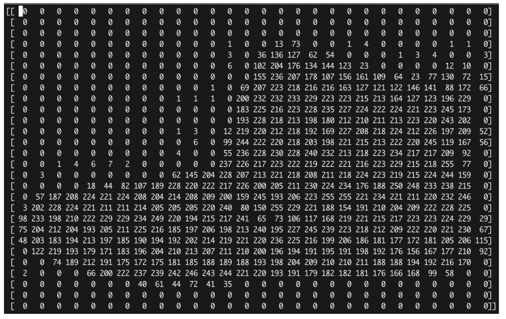
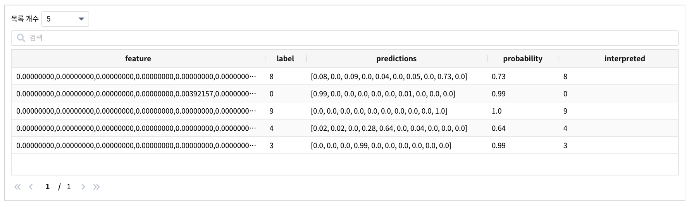

ML 명령어 - mnist clothes 예제
====================================================================================================

mnist clothes  예제는 

IRIS 외부에서 fashon_mnist 데이터셋으로 10개의 clothes 를 분류하는 이미지 분류 모델(tf.keras 기반)을 생성한 후, 분류 모델을 import / 서빙 적재 /  예측 / 검증 까지 진행해보는 예제입니다. 

fashion_mnist 데이터셋
-------------------------------------------------------------------

tf.keras.datasets 모듈은 Neural Network의 훈련에 사용할 수 있는 여러 데이터셋을 포함하고 있습니다.

.. code-block:: none

   - boston_housing
   - cifar10
   - cifar100
   - fashion_mnist
   - imdb
   - mnist
   - reuters

그 중 fashion_mnist 데이터셋은 운동화, 셔츠, 샌들과 같은 작은 이미지들의 모음이며, 기본 mnist 데이터셋과 같이 열 가지로 분류될 수 있는 28×28 픽셀의 이미지 70,000개로 이루어져 있습니다.

.. code-block:: none

   import tensorflow as tf
   from tensorflow import keras

   fashion_mnist = tf.keras.datasets.fashion_mnist
   (train_images, train_labels), (test_images, test_labels) = fashion_mnist.load_data()

   print(train_images[0])

- label 데이터  : one-hot vector 가 아니라 0 ~ 9 까지의 정수로 처리합니다.

.. list-table::
   :header-rows: 1

   * - label
     - description
   * - 0
     - T-Shirt/Top
   * - 1
     - Trouser
   * - 2
     - Pullover
   * - 3
     - Dress
   * - 4
     - Coat
   * - 5
     - Sandal
   * - 6
     - Shirt
   * - 7
     - Sneaker
   * - 8
     - Bag
   * - 9
     - Ankle boot

외부 모델 생성
----------------------------------------------------------------------------------------------------

``Python 3.7 / tensorFlow 2.4.1``

- 모델 생성 스크립트(일부)

.. code-block:: none
 
   fashion_mnist = tf.keras.datasets.fashion_mnist
   (train_images, train_labels), (test_images, test_labels) = fashion_mnist.load_data()

   #X_train.shape, y_train.shape
   # ((60000, 28, 28), (60000,))

   train_images, test_images = train_images / 255.0, test_images / 255.0

   # model
   model = tf.keras.models.Sequential([
       tf.keras.layers.Flatten(input_shape=(28, 28)),
       tf.keras.layers.Dense(512, activation='relu'),
       tf.keras.layers.Dense(10, activation='softmax')
       ])

   # model compile
   model.compile(optimizer='adam',
                 loss='sparse_categorical_crossentropy',
                 metrics=['accuracy'])

   # model fit
   model.fit(train_images, train_labels, epochs=10, callbacks=[callbacks])

   # model save : h5 포맷으로 저장 
   model.save('model_fashion_mnist.h5')

- 학습 모델을 H5 포맷 파일로 저장합니다.
- 저장된 모델 파일을 tar 파일로 생성합니다. ``model_fashion_mnist_h5.tar``

객체저장소에 모델 tar 파일 업로드
----------------------------------------------------------------------------------------------------

| IRIS Discovery Serviced 에 적재하기 위해 tar 파일로 압축하여 객체저장소에 업로드합니다.

| IRIS Discovery  >>  파일 브라우저 의 MINIO 선택 후 `파일브라우저 메뉴를 통한 업로드 방법 <http://docs.iris.tools/manual/IRIS-Manual/IRIS-Discovery/file_browser.html#id1>`_  을 참조합니다.

적재 ( mlmodel import )
----------------------------------------------------------------------------------------------------   

| IRIS Discovery Service 의 ML 모델 저장소에 모델을 적재합니다.
| `mlmodel import  <http://docs.iris.tools/manual/IRIS-Manual/IRIS-Discovery-Middleware/command/commands/mlmodel.html#mlmodel-import>`_ 를 사용합니다.

.. code-block:: none
              
    * | mlmodel import name=fashion_mnist_h5 
                       analysis_tool=tf 
                       kind=classification 
                       algorithm=deep 
                       format=h5 
                       connector_id=179 
                       path=seoryjj/model_fashion_mnist.h5.tar

- 결과

.. list-table::
   :header-rows: 1

   * - result
   * - ok

- ``mlmodel list``  나 ``mlmodel summary`` 명령어로 적재한 학습 모델을 확인할 수 있습니다. `mlmodel 명령어 <http://docs.iris.tools/manual/IRIS-Manual/IRIS-Discovery-Middleware/command/commands/mlmodel.html?#mlmodel>`_  를 참조하세요.

배포 ( mlmodel deploy )
----------------------------------------------------------------------------------------------------   

| IRIS Discovery Service가 관리하는 tensorflow serving에 모델을 배포합니다.
| 배포는 IRIS Discovery Service의 `mlmodel deploy  <http://docs.iris.tools/manual/IRIS-Manual/IRIS-Discovery-Middleware/command/commands/mlmodel.html#mlmodel-deploy>`_ 를 사용합니다.

.. code-block:: none

   * | mlmodel deploy user=demo name=fashion_mnist_h5  label='stable version'

- 결과

.. list-table::
   :header-rows: 1

   * - result
     - latest_version
     - serving_name
   * - ok
     - 1
     - demo_fashion_mnist_h5

서빙 상태 확인
----------------------------------------------------------------------------------------------------        

| 배포한 fashion_mnist_h5 모델의 서빙 상태를 확인합니다.
| 서빙 상태 확인은 IRIS Discovery Service의 `serving status  <http://docs.iris.tools/manual/IRIS-Manual/IRIS-Discovery-Middleware/command/commands/serving.html#serving-status>`_ 를 사용합니다.

IRIS Discovery Service의 검색창에 아래 명령어를 입력합니다.

.. code-block:: none

   * | serving status user=demo name= fashion_mnist_h5

- 결과

.. list-table::
   :header-rows: 1

   * - version
     - state
     - label
   * - 1
     - AVAILABLE
     - stable version

테스트 데이터 / 신규 데이터로 예측 ( serving predict )
----------------------------------------------------------------------------------------------------        

테스트 데이터, 신규 데이터가 IRIS `연결 정보 <http://docs.iris.tools/manual/IRIS-Manual/IRIS-Common/inquiry_management/connect_info/index.html#id1>`_ 를 통해 `데이터 모델 <http://docs.iris.tools/manual/IRIS-Manual/IRIS-Discovery/datamodel.html#id1>`_ 로 생성된 경우에는
학습한 모델을 적재한 후 ``serving predict`` 로 예측을 할 수 있습니다.

- features 컬럼 데이터를 입력받아 서빙된 학습모델을 통해 예측하는 검색어

.. code-block:: none

   * | serving predict user=demo 
                       name= fashion_mnist_h5 
                       col=feature 
                       shape=[(28,28,1)]  
                       tag=(0,1,2,3,4,5,6,7,8,9)

모델의 분류 정확도 계산 ( serving predict .. | eval )
----------------------------------------------------------------------------------------------------

테스트 데이터를 serving predict 로 예측한 예측 결과값을 eval  명령어로 예측 정확도(accuracy) 를 구할 수 있습니다.

.. code-block:: none

   .. | serving predict ... | eval classification label컬럼 prediction결과컬럼

   ex )

   *  | serving predict user=demo 
                        name= fashion_mnist_h5 
                        col=feature 
                        shape=[(28,28,1)] 
                        tag=(0,1,2,3,4,5,6,7,8,9)
      | eval classification label interpreted

- eval 결과

.. list-table::
   :header-rows: 1

   * - all_count
     - correct_count
     - wrong_count
     - accuracy
   * - 10,000
     - 8,793
     - 1,207
     - 87.930
