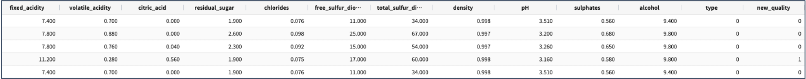
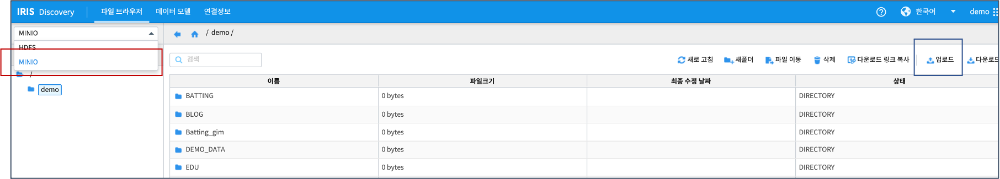
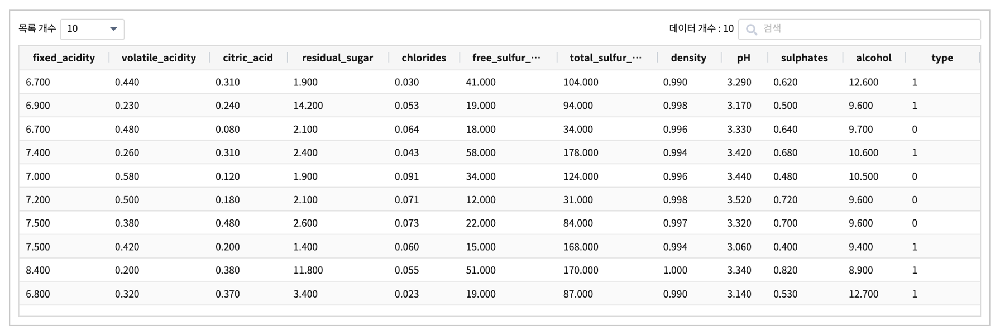
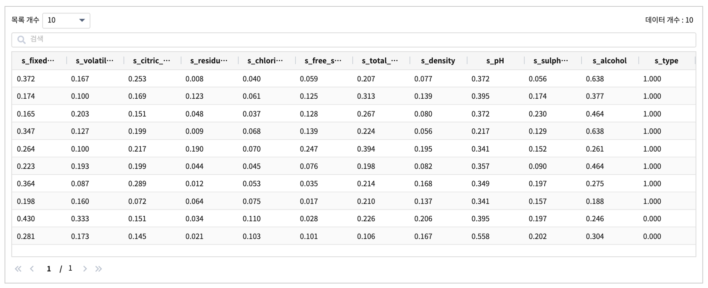
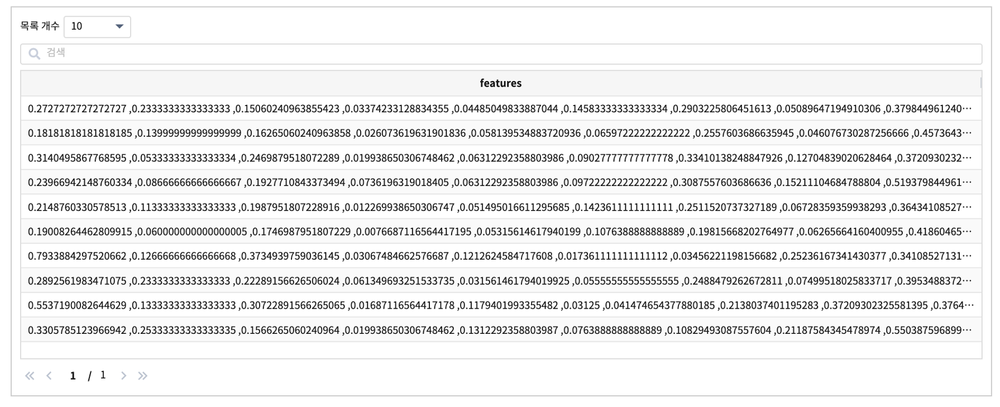
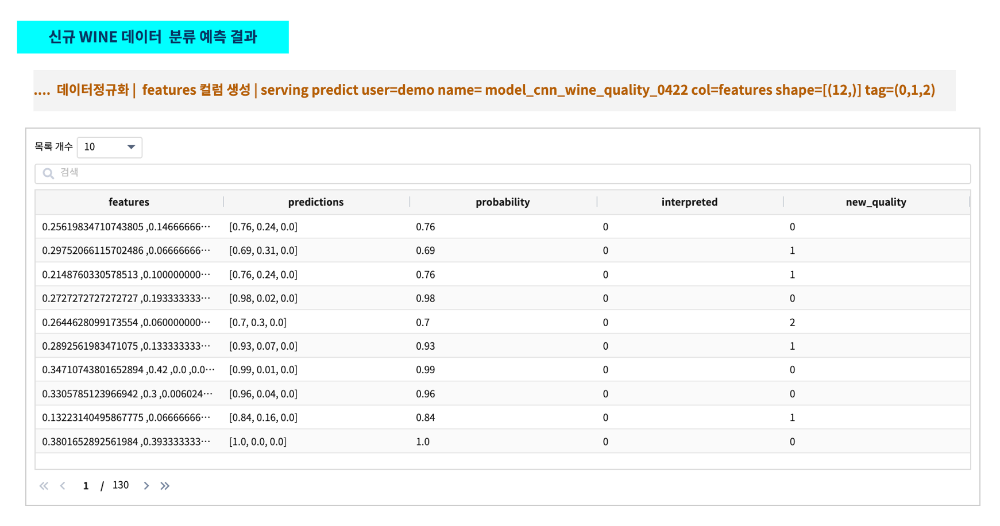

ML 명령어 - multi input multi output 예제
====================================================================================================

학습 데이터의 input 데이터의 컬럼이 여러 개 && 분류 class 가 3개 이상인 예제입니다.

예제 데이터는 UCI Machine Learning Repository 의 wine 품질 데이터로 wine 품질 등급을 3개로 분류하는 예시입니다.

12개의 wine 의 특성에 대한 측정값이 학습 모델의 feature 가 되며, LSTM 알고리즘의 분류기를 생성하여 3개 등급(=label)으로 분류합니다.

- 데이터 출처 : http://archive.ics.uci.edu/ml/index.php  Dua, D. and Graff, C. (2019). UCI Machine Learning Repository [http://archive.ics.uci.edu/ml]. Irvine, CA: University of California, School of Information and Computer Science

데이터 예시
----------------------------------------------------------------------------------------------------

- 변수 설명

  For more information, read [Cortez et al., 2009].

.. code-block:: none
  
    ** Input variables (based on physicochemical tests):

    1 - fixed acidity
    2 - volatile acidity
    3 - citric acid
    4 - residual sugar
    5 - chlorides
    6 - free sulfur dioxide
    7 - total sulfur dioxide
    8 - density
    9 - pH
   10 - sulphates
   11 - alcohol

    ** Output variable (based on sensory data):
   12 - quality (score between 0 and 10)

원래 결과 변수인 quality 의 값이 0 ~ 10 사이의 점수이지만, 점수에 따라 3개의 등급(0,1,2)으로 나누고 new_quality 라는 label 변수로 만듭니다.

외부 모델 생성
----------------------------------------------------------------------------------------------------

``Python 3.7 / tensorFlow 2.4.1``

- 모델 생성 스크립트(일부)

.. code-block:: none

   wine.loc[wine['quality'] <= 5, "new_quality"] = 0
   wine.loc[wine['quality'] == 6, "new_quality"] = 1
   wine.loc[wine['quality'] >=7, "new_quality"] = 2

   del wine['quality']
   wine_norm = (wine - wine.min()) / (wine.max() - wine.min())
   wine_shuffle = wine_norm.sample(frac=1)
   wine_np = wine_shuffle.to_numpy()

   train_idx = int(len(wine_np) * 0.8)
   train_X, train_Y = wine_np[:train_idx, :-1], wine_np[:train_idx, -1]
   test_X, test_Y = wine_np[train_idx:, :-1], wine_np[train_idx:, -1]

   train_Y = tf.keras.utils.to_categorical(train_Y, num_classes=3)
   test_Y = tf.keras.utils.to_categorical(test_Y, num_classes=3)

   model = tf.keras.Sequential([
           tf.keras.layers.Dense(units=48, activation="relu", input_shape=(12, )),
           tf.keras.layers.Dense(units=24, activation="relu"),
           tf.keras.layers.Dense(units=12, activation="relu"),
           tf.keras.layers.Dense(units=3, activation="softmax") ])

   model.compile(optimizer=tf.keras.optimizers.Adam(lr=0.07), loss='categorical_crossentropy', metrics=['accuracy'])
     history=model.fit(train_X, train_Y, epochs=50, batch_size=32, validation_split=0.25)

   model.evaluate(test_X, test_Y)

   model.save('cnn_wine_quality_0422')   # model save

- saved-model 포맷으로 학습 모델 저장 
- cnn_wine_quality_0422.tar 로 tar 파일로 학습 모델 묶기

.. code-block:: none

   ~ $ cd cnn_wine_quality_0422
   ~ cnn_wine_quality_0422 $ ls 
   assets saved_model.pb variables

   ~ cnn_wine_quality_0422 $ tar cvf cnn_wine_quality_0422.tar *
   ~ cnn_wine_quality_0422 $ ls
   assets				saved_model.pb
   cnn_wine_quality_0422.tar	variables

   

객체저장소에 모델 tar 파일 업로드
----------------------------------------------------------------------------------------------------

| IRIS Discovery Serviced 에 적재하기 위해, tar 파일로 압축하여 객체저장소에 업로드합니다.

| IRIS Discovery >> 파일 브라우저 의 MINIO 선택 후 `파일브라우저 메뉴를 통한 업로드 방법 <http://docs.iris.tools/manual/IRIS-Manual/IRIS-Discovery/file_browser.html#id1>`_ 을 참조합니다.

적재 ( mlmodel import )
----------------------------------------------------------------------------------------------------   

| IRIS Discovery Service 의 ML 모델 저장소에 모델을 적재합니다.
| `mlmodel import  <http://docs.iris.tools/manual/IRIS-Manual/IRIS-Discovery-Middleware/command/commands/mlmodel.html#mlmodel-import>`_ 를 사용합니다.

.. code-block:: none
              
   * | mlmodel import name= model_cnn_wine_quality_0422
       analysis_tool=tf kind=classification algorithm=deep format= saved_model connector_id = 179 path=seoryjj/cnn_wine_quality_0422.tar

- 결과

.. list-table::
   :header-rows: 1

   * - result
   * - ok

- ``mlmodel list``  나 ``mlmodel summary``명령어로 적재한 학습 모델을 확인할 수 있습니다. `mlmodel 명령어 <http://docs.iris.tools/manual/IRIS-Manual/IRIS-Discovery-Middleware/command/commands/mlmodel.html?#mlmodel>`_  를 참조하세요.

배포 ( mlmodel deploy )
----------------------------------------------------------------------------------------------------   

| IRIS Discovery Service가 관리하는 tensorflow serving에 모델을 배포합니다.
| 배포는 IRIS Discovery Service의 `mlmodel deploy  <http://docs.iris.tools/manual/IRIS-Manual/IRIS-Discovery-Middleware/command/commands/mlmodel.html#mlmodel-deploy>`_ 를 사용합니다.

IRIS Discovery Service의 검색창에 아래 명령어를 입력합니다.

.. code-block:: none

   * | mlmodel deploy name=model_cnn_wine_quality_0422  label='CNN wineQ model'

- 결과

- model_cnn_wine_quality_0422 이름으로 배포되었습니다.

.. list-table::
   :header-rows: 1

   * - result
     - latest_version
     - serving_name
   * - ok
     - 1
     - demo_model_cnn_wine_quality_0422

서빙 상태 확인 ( serving status )
----------------------------------------------------------------------------------------------------        

| 배포한 model_cnn_wine_quality_0422  의 서빙 상태를 확인합니다.
| 서빙 상태 확인은 IRIS Discovery Service의 `serving status  <http://docs.iris.tools/manual/IRIS-Manual/IRIS-Discovery-Middleware/command/commands/serving.html#serving-status>`_ 를 사용합니다.

- 학습 모델의 서빙 상태를 확인합니다.

.. code-block:: none

   * | serving status user=demo name= model_cnn_wine_quality_0422

- 결과의 내용 : model_cnn_wine_quality_0422 모델로 생성한 version 1이 사용 가능한 상태로 배포되었습니다.

.. list-table::
   :header-rows: 1

   * - version
     - state
     - label
   * - 1
     - AVAILABLE
     - CNN wineQ model

테스트 데이터 / 신규 데이터로 예측
----------------------------------------------------------------------------------------------------        

테스트 데이터, 신규 데이터가 IRIS `연결 정보 <http://docs.iris.tools/manual/IRIS-Manual/IRIS-Common/inquiry_management/connect_info/index.html#id1>`_ 를 통해 `데이터 모델 <http://docs.iris.tools/manual/IRIS-Manual/IRIS-Discovery/datamodel.html#id1>`_ 로 생성된 경우에는
학습한 모델을 적재한 후 ``serving predict`` 로 예측을 할 수 있습니다.

테스트 데이터, 신규 데이터는 학습 모델 생성시에 training data 에 사용한 scaler 객체를 그대로 사용하여 데이터를 정규화 합니다.
그리고 정규화한 데이터는 학습 모델에 사용한 training data 의 shape 그대로 1개 컬럼으로 변환합니다.
이 데이터를 ``serving predict`` 의 input 으로 입력하여 분류 결과를 예측합니다. 

- 데이터 정규화

- 정규화한 데이터 결과 예시

- 12개의 컬럼을 features 컬럼 1개로 생성하기

- features 컬럼 데이터를 입력받아 서빙된 학습모델을 통해 예측하는 검색어

.. code-block:: none

   .. | 데이터정규화 | features 컬럼 생성 
      | serving predict user=demo name= model_cnn_wine_quality_0422 col=features shape=[(12,)] tag=(0,1,2)

- 예측 결과 예시

학습 모델 model_cnn_wine_quality_0422 의 예측 결과값은 ``predictions`` 컬럼에 분류 class 수만큼의 데이터를 갖는 array 형식으로 출력됩니다.
array 값 3개는 입력 데이터가 첫번째, 두번째, 세번째 class 일 확률 값을 의미하며, ``probability`` 는 predictions의 값 3개 중 가장 큰 확률값입니다. 

``intepreted`` 는  serving predict 명령어의 parameter 에서  `tag` 가 설정되어 있을 때 출력되는 결과 컬럼입니다.
``tag=(0,1,2)`` 는 와인 품질 등급을 '0', '1', '2' 로 분류한다는 의미입니다. 학습을 위해서는 label에 해당하는 class 값을 0,1,2,, 의 숫자, 또는 one-hot vector로 변환해야 하며, ``interpreted`` 는 변환 전의 label 값으로 역변환해서 분류 결과를 쉽게 알아 볼 수 있게 합니다.
만약 tag = (excellent, good, regular) 로 parameter 를 입력하면 interpreted 에 excellent, good, regular 로 출력될 것입니다.

