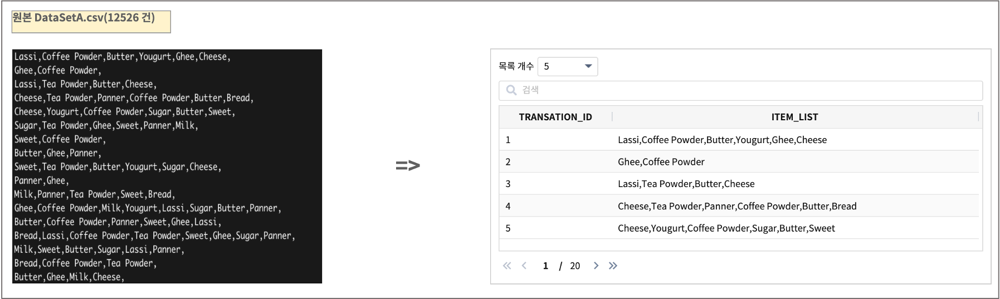
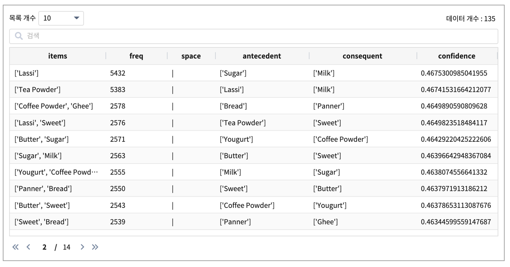
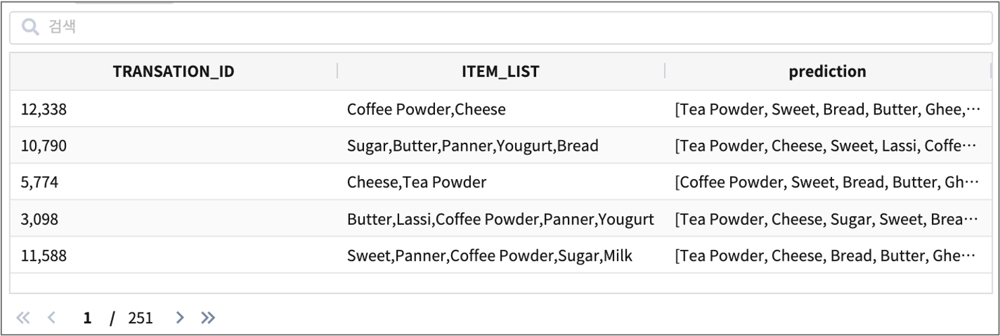

FPGrowth : 빈발 패턴 분석
====================================================================================================

FP(Frequent-Pattern) Growth 알고리즘은 데이터 그룹간에 빈번하게 발생하는 패턴을 찾는 알고리즘으로 연관규칙분석(Apriori) 분야에서 사용됩니다. 
(연관규칙분석은  "장바구니 분석" 이라는 별칭이 있습니다)

``FP-Growth`` 는 데이터로부터 자주 발생하는 패턴(빈발 패턴)을 찾는 알고리즘으로, 소비자가 구매하려는 아이템 옆에 빈발 패턴으로 묶인 아이템들을 같이 노출하여 구매확률을 높이는 마케팅 전략에 이용합니다.

참고 : FP-Growth 알고리즘 https://www.geeksforgeeks.org/ml-frequent-pattern-growth-algorithm/

데이터
------------------------------------------------------------------------------------------

예제 데이터는  Kaggle 에서 제공하는 "Dataset for Apriori and FP growth Algorithm"  입니다.(DataSetA.csv)

특정 마켓에서 각각의 결재(transaction) 당 구매한 아이템목록입니다. (=> transaction 단위로 구매한 목록) 
구매한 아이템 목록의 빈발 패턴을 분석하면, 구매 목록과 함께 많이 구매하는 다른 아이템 목록을 같이 출력할 수 있습니다.

데이터 출처 : https://www.kaggle.com/newshuntkannada/dataset-for-apriori-and-fp-growth-algorithm

IRIS 내에 데이터모델 ``EDU_MODEL_FPGrowth_01``  로 생성합니다.

학습 모델 생성 (fit)
----------------------------------------------------------------------------------------------------

데이터모델 ``EDU_MODEL_FPGrowth_01``  

- 검색어
  
.. code-block:: none

  * | fit fpgrowth FEATURES ITEM_LIST minSupport=0.1 minConfidence=0.1  INTO EDU_MODEL_FPGrowth_01

- 명령어 parameter
    - minSupport : 최소 지지도. 전체 구매 목록에서 마이닝된 연관 패턴의 결과 정보 중 아이템 A,B를 동시에 구매한 비율. P(A U B)
    - minConfidence : 최소 신뢰도. 아이템 A 를 구매한 목록 중 B 도 같이 구매한 확률. 즉 조건부확률 P(B|A)

- 결과

- 결과 항목
    - antecedent : 마이닝된 연관 규칙의 선행 item
    - consequent : 마이닝 된 연관 규칙의 결과 item 정보
    - confidence : 마이닝된 연관규칙의 신뢰도

테스트 데이터로 예측 (predict)
---------------------------------------------------------------------------------------------------

fit 에서 저장한 학습 모델 ``EDU_MODEL_FPGrowth_01`` 로 predict 를 실행합니다.

.. code-block:: none

   * | predict demo.EDU_MODEL_FPGrowth_01 ITEM_LIST

- 결과 예시

ITEM_LIST 즉 구매목록에 Sugar,Butter,Milk 가 있을 때
[Lassi, Coffee Powder, Sweet, Bread, Ghee, Yougurt, Cheese, Tea Powder, Panner] 아이템이 같이 있는 패턴이 많았다고 예측한 결과입니다.