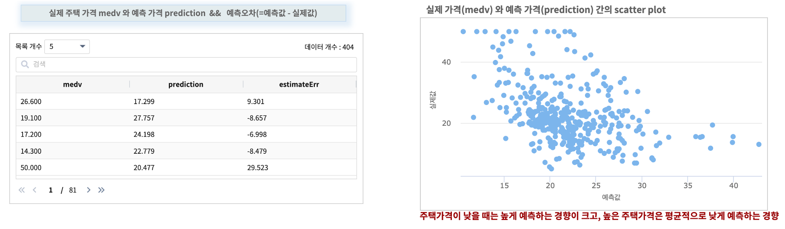

일반화선형회귀 : boston housing 집값 예측하기
====================================================================================================

| keras 의 dataset 중 하나인 boston housing 데이터는 보스턴 시의 주택 가격에 대한 데이터로 여러 개의 측정지표들 (예를 들어, 범죄율, 학생/교사 비율 등) 13개를 독립변수로 포함하고, 보스턴 인근의 주택 가격의 중앙값(median value) 1개를 종속변수로 하여 총 14개의 변수로 구성 되어 있습니다.
| 일반화선형회귀(Generalized Linear Regression) 알고리즘으로 주택 가격을 예측하는 학습 모델을 생성하여 주택 가격을 예측해 봅니다.

일반화선형회귀(Generalized Linear Regression) 
----------------------------------------------------------------------------------------------------

| 선형회귀 모델은 종속변수의 분포가 정규분포라고 가정합니다. 
| 일반화 선형 모델(generalized linear regression)은 선형회귀 모델을 확장하여 종속변수의 분포를 정규 분포외에 다른 확률분포(이항분포, 포아송 분포 등)도 고려하여 만든 모델입니다.  
| 종속변수의 family 분포(gaussian, binomial, poisson, gamma and tweedie) 는 데이터의 특성을 파악한 사용자가 결정하여 파라미터로 모델링에 적용합니다. 

데이터 전처리(preprocessing)
----------------------------------------------------------------------------------------------------

데이터 출처 `keras data set <https://keras.io/api/datasets/#usage_6>`_ 

- IRIS 에 데이터모델 ``EDU_ML_boston_house`` 로 생성합니다.

- 필드 설명

.. list-table::
   :header-rows: 1

   * - crim
     - zn
     - indus
     - chas
     - nox
     - rm
     - age
     - dis 
     - rad
     - tax 
     - ptratio
     - b 
     - lstat
     - medv
   * - 자치시(town)별 1인당 범죄율
     - 25,000 평방 피트를 초과하는 거주지역의 비율
     - 비소매상업지역이 차지하고 있는 토지의 비율
     - 찰스강의 경계에 위치한 경우는 1, 아니면 0
     - 10ppm 당 농축 일산화질소
     - 주택 1가구당 평균 방의 수
     - 1940년 이전에 건축한 소유주택 비율
     - 보스톤 직업센터까지의 접근성 지수
     - 방사형 도로까지의 접근성 지수
     - 10,000 달러당 재산세율
     - 자치시(town)별 학생/교사 비율
     - 자치시(town)별 흑인의 비율
     - 모집단의 하위 계층의 비율
     - 본인 소유의 주택가격 중앙값(단위 $1000)

| 13개 변수중 범주형변수 chas ( 강의 경계일 때는 1, 아닐 때는 0) 를 제외하고, 각각의 변수들은 측정값의 단위가 다르기 때문에 스케일링이 필요합니다.

- chas 를 제외한 feature 변수 12개에 standard scaling 을 적용하고 ``s_기존변수``  이름으로 생성합니다.

.. code-block:: none

   * | scaler standard crim to s_crim, zn to s_zn, indus to s_indus, nox to s_nox, rm to s_rm, age to s_age, dis to s_dis, rad to s_rad, tax to s_tax, ptratio to s_ptratio, b to s_b, lstat to s_lstat

1차 학습 모델 생성 (fit)
----------------------------------------------------------------------------------------------------

| 1차 모델은 scaling한 변수12개, 범주형 변수 chas 
| 즉 설명 변수(X) 13개 전체로  GeneralizedLinearRegression 알고리즘의 예측모델을 생성합니다.  
| 데이터모델 ``EDU_ML_boston_house``  의 80% 를 random sampling 하여 training data 로 삼아 학습을 진행합니다.

.. code-block:: none

   * | scaler standard crim to s_crim, zn to s_zn, indus to s_indus, nox to s_nox, rm to s_rm, age to s_age, dis to s_dis, rad to s_rad, tax to s_tax, ptratio to s_ptratio, b to s_b, lstat to s_lstat 
     | sampling RATIO 0.8

     | fit GeneralizedLinearRegression FEATURES s_crim, s_zn, s_indus, chas, s_nox, s_rm, s_age, s_dis, s_rad, s_tax, s_ptratio, s_b, s_lstat
                                       LABEL medv maxIter=30 regParam=0.1 fitIntercept=True solver=irls 

- 첫번째 fit 결과

.. image:: ../images/ml/usecase05.png
  :scale: 60%
  :alt: usecase 05

2차 학습 모델 생성 (fit)
----------------------------------------------------------------------------------------------------

| 두번째 학습 모델에서는 첫번째 fit 결과에서 pValues 가 0.05 보다 큰 s_age, s_indus 를 빼고 11개 설명변수로 예측모델을 생성합니다.  

.. code-block:: none

   .. | fit generalizedlinearregression FEATURES s_crim, s_zn, chas, s_nox, s_rm, s_dis, s_rad, s_tax, s_ptratio, s_b, s_lstat
                                        LABEL medv maxIter=30 regParam=0.1 fitIntercept=True solver=irls INTO GLM_house_model_02

- 두번째 fit 결과

| 13개 변수 전체로 만든 1차 모델보다 11개 변수로 만든  두번째 모델의 RMSE(RootMeanSquaredError) 가 더 작습니다. (4.7499 -> 4.6192)
| 따라서 두번째 모델 "GLM_house_model_02"  으로 예측값을 구해 봅니다.

테스트 데이터로 예측하기 (predict)
-------------------------------------------------------------------------------------------

| 11개 설명변수로 생성한 두번째 학습 모델 "GLM_house_model_02" 로 test 데이터를 대상으로 주택가격(medv)을 예측합니다.
| 테스트 데이터 역시 training 데이터에서 사용한 standard scaling 을 그대로 사용하여 정규화 한 후 예측에 사용합니다.
| 아래 검색어는 전체 데이터에 스케일링 적용 후 20% 의 데이터를 random sampling 하여 테스트데이터로 삼아서 예측할 때의 검색어입니다.
| 예측값 prediction 과 실제값 medv 의 차이를 계산하여 ``예측오차`` 까지 구해 봅니다.

.. code-block:: none

   * | scaler standard crim to s_crim, zn to s_zn, indus to s_indus, nox to s_nox, rm to s_rm, age to s_age, dis to s_dis, rad to s_rad, tax to s_tax, ptratio to s_ptratio, b to s_b, lstat to s_lstat
     | sampling RATIO 0.2

     | fields s_crim, s_zn, chas, s_nox, s_rm, s_dis, s_rad, s_tax, s_ptratio, s_b, s_lstat,medv

     | predict demo.GLM_house_model_02  s_crim, s_zn, chas, s_nox, s_rm, s_dis, s_rad, s_tax, s_ptratio, s_b, s_lstat

     | fields medv, prediction
     | calculate medv - prediction as estimateErr

- 실행 결과

- 실제 가격(medv) 와 예측오차(prediction) 의 scatter plot

| 예측오차는 주택가격이 고가일수록 예측 오차가 증가하는 것으로 보입니다.
| 즉 종속변수(Y)인 주택가격(medv) 역시 변환이 필요합니다.!!!  => 로그변환필요

데이터 전처리 프로세스에 주택가격 로그변환 추가
----------------------------------------------------------------------------------------------------   

| 기존 13개 feature 변수를 standard scaling 변환 + medv 변수의 로그 변환(log10_medv)

.. code-block:: none

   * | scaler standard crim to s_crim, zn to s_zn, indus to s_indus, nox to s_nox, rm to s_rm, age to s_age, dis to s_dis, rad to s_rad, tax to s_tax, ptratio to s_ptratio, b to s_b, lstat to s_lstat 
     | sampling RATIO 0.8

     | sql "select *, log(10, medv) as log10_medv from angora"

- 결과 

3차 학습 모델 생성(fit)
-------------------------------------------------------------------------

| 3차 학습 모델 생성은 정규화 변환한 13개 feature 변수와 로그변환한 medv 변수를 대상으로 학습을 실행합니다.

.. code-block:: none
 
   * | scaler standard crim to s_crim, zn to s_zn, indus to s_indus, nox to s_nox, rm to s_rm, age to s_age, dis to s_dis, rad to s_rad, tax to s_tax, ptratio to s_ptratio, b to s_b, lstat to s_lstat 
     | sampling RATIO 0.8

     | sql "select *, log(10, medv) as log10_medv from angora"

     | fit GeneralizedLinearRegression FEATURES s_crim, s_zn, s_indus, chas, s_nox, s_rm, s_age, s_dis, s_rad, s_tax, s_ptratio, s_b, s_lstat
                                       LABEL log10_medv maxIter=30 regParam=0.1 fitIntercept=True solver=irls  

- 결과

| pValues 가 0.05 보다 작은 s_zn, s_indus, s_age, s_rad 를 FEATURE에서 제외해서 다시 모델링을 해봅니다.

4차 학습 모델 생성(fit)
-------------------------------------------------------------------------

| 4차 학습 모델 생성은 s_zn, s_indus, s_age, s_rad 를 제외한 9개 feature 변수와 로그변환한 medv 변수를 대상으로 학습을 실행합니다.

.. code-block:: none

   * | scaler standard crim to s_crim, zn to s_zn, indus to s_indus, nox to s_nox, rm to s_rm, age to s_age, dis to s_dis, rad to s_rad, tax to s_tax, ptratio to s_ptratio, b to s_b, lstat to s_lstat 
     | sampling RATIO 0.8

     | sql "select *, log(10, medv) as log10_medv from angora"

     | fit GeneralizedLinearRegression FEATURES s_crim, chas, s_nox, s_rm, s_dis, s_tax, s_ptratio, s_b, s_lstat
                                       LABEL log10_medv maxIter=30 regParam=0.1 fitIntercept=True solver=irls INTO GLM_house_model_log_03

- 결과

| 모든 변수를 포함하여 생성한 세번째 모델의 R-square = 0.7167 보다 높은 0.7201 로 나옵니다. 
| 그래서 네번째 fit 으로 생성한 ``GLM_house_model_log_03``  을 에측 모델로 선택합니다.

테스트 데이터로 예측하기 (predict GLM_house_model_log_03) 
------------------------------------------------------------------------------------

| 9개 feature 설명변수, 로그 변환한 medv 로 생성한 네번째 학습 모델 "GLM_house_model_03" 로  주택가격(medv)을 예측합니다.
| 테스트 데이터 역시 training 데이터에서 사용한 standard scaling 을 그대로 사용하여 정규화 한 후 예측에 사용합니다.

.. code-block:: none

    * | scaler standard crim to s_crim, zn to s_zn, indus to s_indus, nox to s_nox, rm to s_rm, age to s_age, dis to s_dis, rad to s_rad, tax to s_tax, ptratio to s_ptratio, b to s_b, lstat to s_lstat 
      | sampling RATIO 0.2

      | sql "select *, log(10, medv) as log10_medv from angora"

      | predict demo.GLM_house_model_log_03 s_crim, chas, s_nox, s_rm, s_dis, s_tax, s_ptratio, s_b, s_lstat

      | fields log10_medv, prediction

      | sql "select *, (log10_medv - prediction ) as estimateErr, sqrt(log10_medv - prediction ) as sqrt_estimateErr from angora"

- 결과

| 예측하고자 하는 주택가격(medv) 은 고가 주택일 수록 가격차가 커지므로 로그변환이 필요하고, feature 변수는 정규화 변환을 해야 합니다.
| 

