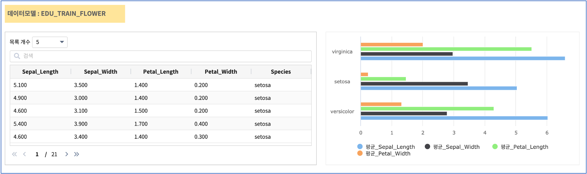
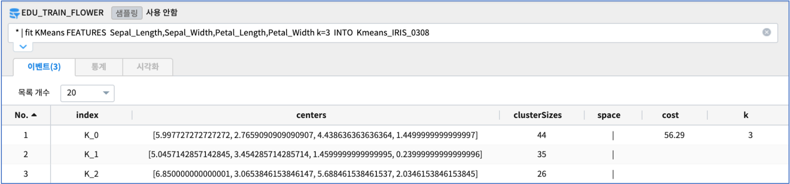
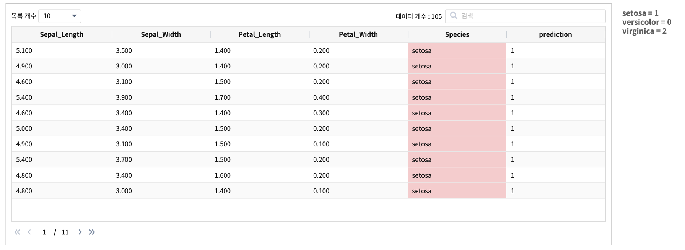
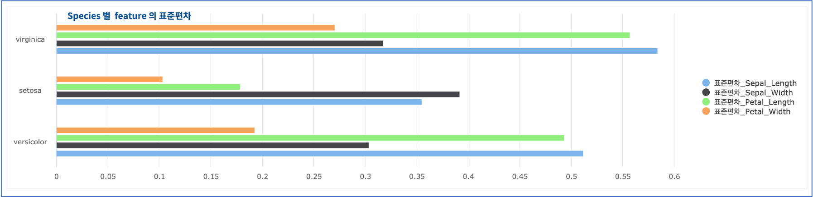
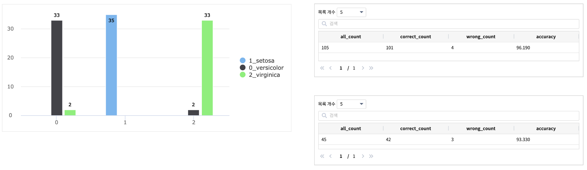

KMeans : K-means clustering
====================================================================================================

K-means clustering 은 기계 학습 분야의 알고리즘 중 대표적인 비지도학습 알고리즘입니다.
데이터 포인트를 미리 정의 된 수의 클러스터(=k)로 만드는 가장 일반적인 클러스터링(군집화) 알고리즘 중 하나입니다.

IRIS 에서는 ``K-means clustering``  을 하는 명령어가 ``kmeans`` , `fit KMeans` 로 2개가 있습니다.

- kmeans 
    - 군집화 학습 모델을 따로 저장하지 않습니다.
    - 예시

.. code-block:: none

    * | kmeans latitude,longitude k=3

- fit KMeans
    - fit 명령어와 같이 사용되며 군집화 학습 모델을 저장할 수 있습니다.
    - 예시
  
.. code-block:: none

   * | fit KMeans FEATURES Sepal_Length,Sepal_Width,Petal_Length,Petal_Width k= 3 INTO Kmeans_iris_model

아래 예제는  ML 모델을 학습하고 저장하는 `fit KMeans` 로 붓꽃(iris) 데이터를 3개의 종으로 clustering 하는 예제입니다.

데이터
------------------------------------------------------------------------------------------

분석예제로 많이 사용하는 iris(붓꽃) 데이터는 versicolor, setosa, virginica  3개의 Species(종) 별로 4개의 features(Sepa_Length, Sepal_Width, Petal_Length, Petal_Width) 를 측정한 값으로 구성된 데이터입니다.

3개 종별로 50개씩 전체 150개의 데이터중 70% 를 train, 30%를 test 데이터로 분리하고, 그 중 train 데이터를 ``EDU_TRAIN_FLOWER`` 라는 이름으로 IRIS 데이터모델로 생성하였습니다.

- K-means Clustering 을 이용하여 4개의 features 컬럼으로 3개의 종을 clustering 하는 모델을 만들고 ( fit ... into )
- 4개의 feature 로 Species 를 예측하고 ( predict )
- k-means 모델의 정확도를 계산합니다. ( eval )  

학습 모델 생성 (fit)
----------------------------------------------------------------------------------------------------

데이터모델 ``EDU_MODEL_FPGrowth_01``  

- 검색어
  
.. code-block:: none

  * | fit KMeans FEATURES Sepal_Length,Sepal_Width,Petal_Length,Petal_Width k= 3 INTO Kmeans_IRIS_0308

학습 데이터(EDU_TRAIN_FLOWER) 로 fit KMeans 명령어를 통해  clustering model 을 학습하여 생성합니다. 
생성한 모델은 ``Kmeans_IRIS_0308`` 이라는 이름으로 저장합니다.

테스트 데이터로 예측 (predict)
---------------------------------------------------------------------------------------------------

fit 에서 저장한 학습 모델 ``Kmeans_IRIS_0308`` 로 predict 를 실행합니다.

.. code-block:: none

   * | predict Kmeans_IRIS_0308 Sepal_Length,Sepal_Width,Petal_Length,Petal_Width

predict 명령어로 Sepal_Length,Sepal_Width,Petal_Length,Petal_Width 필드만으로  3개의 cluster(Species) 로 구분할 수 있는지 예측합니다.

- 결과 예시

모델 정확도 검증 (eval)
-----------------------------------------------------------------------------------------

train 데이터를 대상으로  ``Kmeans_IRIS_0308``  clustering 학습 모델을 ``eval``  로 검증한 결과
105개 데이터 중에서  13 개가 다른 결과로 clustering 되어 약 87.62%  의 정확도를 보였습니다.

.. code-block:: none

   * | predict Kmeans_IRIS_0308 Sepal_Length,Sepal_Width,Petal_Length,Petal_Width 
     | case when Species = 'setosa'     then 1 
            when Species = 'versicolor' then 0  otherwise 2 as Species_s

     | eval classification Species_s prediction

- 결과
  
.. list-table::
     :header-rows: 1
  
     * - all_count
       - correct_count
       - wrong_count
       - accuracy
     * - 105
       - 92
       - 13
       - 87.620

정확도를 높이기 위해 feature 선별하기
---------------------------------------------------------------------------------------------------------

정확도를 더 높이기 위해 4개의 feature 중에서 cluster  내  분산이  큰 feature(= 종 간에 차이가 뚜렷하지 않은) 인  "Sepal_Length"  를 모델링 feature 에서 제외하여 3개의 feature  로 clustering 을 진행합니다.

- 3개 종간의 feature 별 표준편차 구하기

.. code-block:: none

   * | stats stdev(Sepal_Length) as 표준편차_Sepal_Length,  stdev(Sepal_Width) as 표준편차_Sepal_Width, 
             stdev(Petal_Length) as 표준편차_Petal_Length,  stdev(Petal_Width) as 표준편차_Petal_Width
       by Species

- Studio 에서 가로막대형 챠트 객체로 시각화
  

Sepal_Length 제외하고 다시 학습 모델 생성(fit) 
----------------------------------------------------------------------------------------------------

feature 3개로 군집화 모델 학습하고, ``kmeans_iris_0309``  라는 이름으로 저장합니다.

.. code-block:: none

   * |  fit KMeans FEATURES   Sepal_Width,Petal_Length,Petal_Width  k= 3  INTO  kmeans_iris_0309

predict
----------------------------------

Sepal_Width,Petal_Length,Petal_Width 3개의 feature 로 clustering 한 모델로 clustering 실행 후 예측 결과를 세로막대 챠트로 그려봅니다.

.. code-block:: none

   * | predict kmeans_iris_0309   Sepal_Width,Petal_Length,Petal_Width 
   
     |  case when Species = 'setosa'  then 1
             when Species = 'versicolor'   then 0
             otherwise 2 as Species_s
 
     | stats count(*) as CNT by Species_s, prediction
     | sort Species_s

     | pivot sum(CNT) as 개수 splitrow Species_s splitcol prediction
     | rename `0` `0_versicolor`
     | rename `1` `1_setosa`
     | rename `2` `2_virginica` 

   
- 챠트와 eval 결과

.. code-block:: none

   0 - versicolor 는 35개중 2개 오류 : virginical 로 오분류

   1 - setosa  는 100% 분류
  
   2 - virginica 는 35개중 2개 오류 : versicolor 로 오분류

  

Sepal_Length 필드를 제외하고 학습한 모델 "kmeans_iris_0309" 의 정확도가 더  높게 나옵니다.
정확한 모델 생성의 조건은 무조건 많은 feature 필드를 확보하는 것이 아니라, 모델링에 적절한 feature 필드를 선별하여 확보하는 것임을 알 수 있습니다.  
