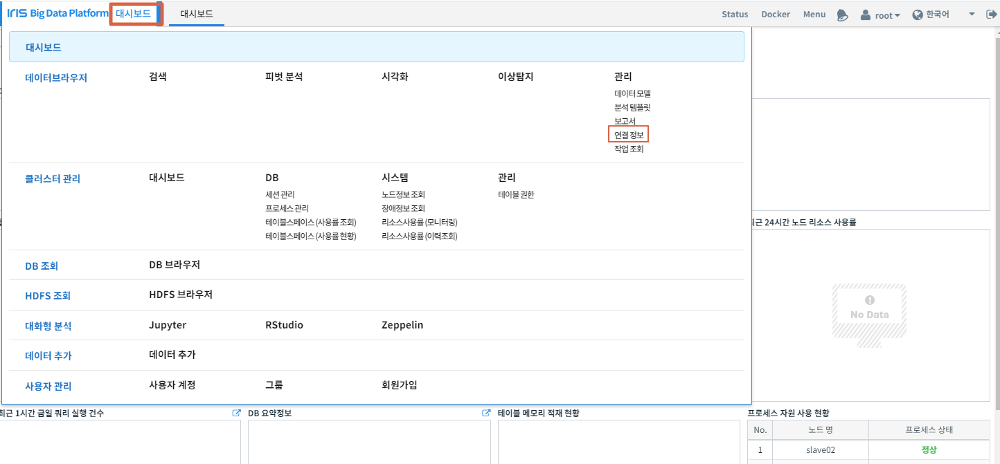
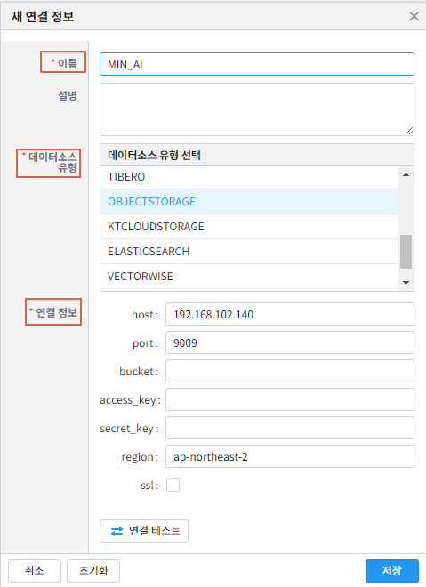
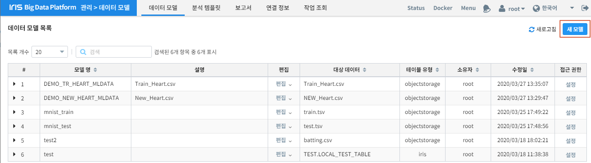
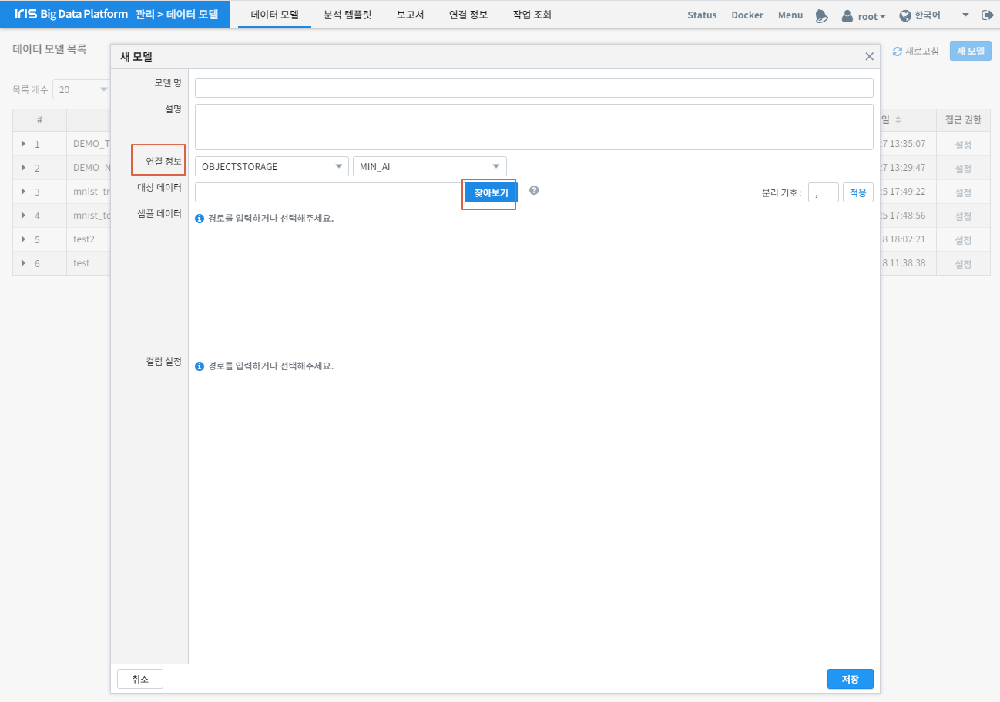
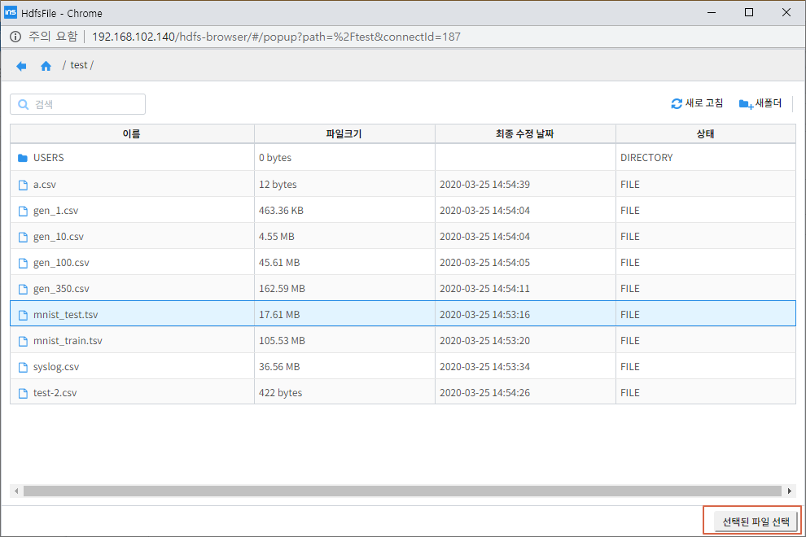
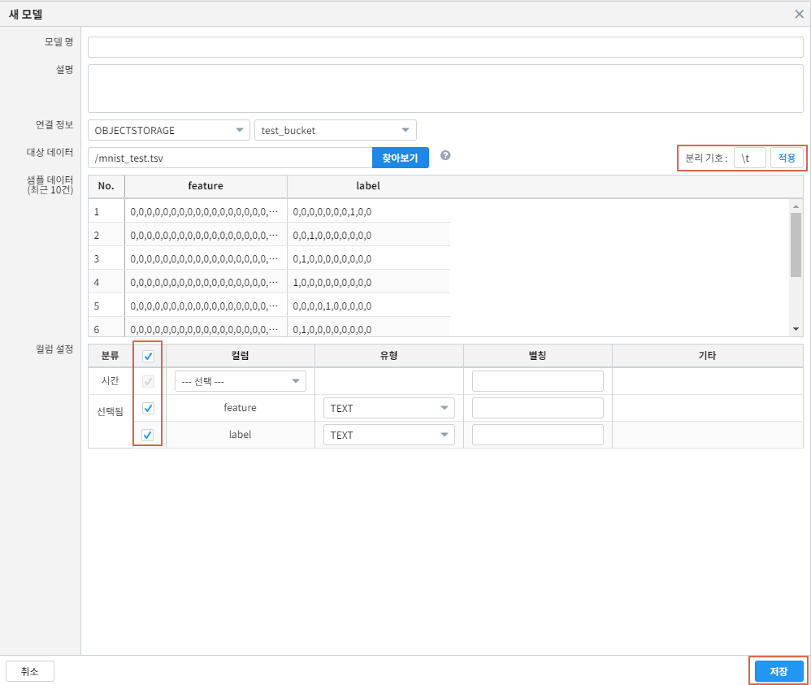

ML 범용 명령어 - mnist 예제
====================================================================================================

IRIS Discovery Service의 DSL 명령어를 활용하여, mnist 숫자 이미지 다운로드부터 전처리, 학습, 예측, 평가, 서빙하는 시나리오입니다.

mnist 이미지 다운로드
----------------------------------------------------------------------------------------------------

mnist 숫자 이미지를 아래 사이트에서 다운로드 및 압축을 해제합니다.

https://github.com/myleott/mnist_png/blob/master/mnist_png.tar.gz

개인 객체 저장소에 업로드
----------------------------------------------------------------------------------------------------

| 다운로드 받은 이미지 파일을 개인 객체 저장소에 업로드합니다. 수동으로 업로드하거나 아래 스크립트를 실행합니다.
| 아래는 업로드하는 python 스크립트 예제 입니다. 모두 업로드하는데 1~2시간정도 소요됩니다.

- boto3 패키지가 필요합니다. ``pip install boto3``
- 아래 인자를 입력해주세요.

 - testing :  test 이미지 로컬 디렉토리 경로
 - training : train 이미지 로컬 디렉토리 경로
 - bucket : 개인 객체 저장소의 bucket
 - prefix : 개인 객체 저장소의 key (상위 키)
 - endpoint_url : 개인 객체 저장소의 url
 - aws_access_key_id : 개인 객체 저장소의 access_key
 - aws_secret_access_key : 개인 객체 저장소의 secret_access_key

.. code-block:: none

   import boto3
   import os

   local = {
   'testing': '/home/oss/tensorflow/mnist_img/mnist_png/mnist_png/testing',
   'training': '/home/oss/tensorflow/mnist_img/mnist_png/mnist_png/training'
   }
   obj_storage = {
       'bucket': 'user1',
       'prefix': 'mnist',
   }
   obj_setting = {
       'endpoint_url': 'http://192.168.102.140:9015',
       'verify': False,
       'aws_access_key_id': 'minio',
       'aws_secret_access_key': '??'
   }
   
   def upload_obj(cli, files, bucket, keys):
       if isinstance(files, str):
           files = [files]
       if isinstance(keys, str):
           keys = [keys]
   
       for i, (file, key) in enumerate(zip(files, keys), 1):
           try:
               cli.upload_file(file, bucket, key)
               if i % 100==0:
                   print('{}개 완료'.format(i))
           except ClientError as e:
               raise Exception('upload key[{}, {}] fail. {}'.format(bucket, key, e))
   
   def make_path(root_path, obj_storage_prefix):       
       local_path_list = []
       obj_path_list = []
       
       for path, dirs, files in os.walk(root_path):
           for file in files:
               full_path = os.path.join(path, file)
               obj_path=full_path.replace(root_path, obj_storage_prefix)
               obj_path_list.append(obj_path)
               local_path_list.append(full_path)    
       return local_path_list, obj_path_list

   mc = boto3.client('s3', **obj_setting)
   
   local_path, obj_path = make_path(local['testing'], obj_storage['prefix'])
   upload_obj(mc, local_path, obj_storage['bucket'], obj_path)
   
   local_path, obj_path = make_path(local['training'], obj_storage['prefix'])
   upload_obj(mc, local_path, obj_storage['bucket'], obj_path)

연결정보 등록
----------------------------------------------------------------------------------------------------
| 개인 객체저장소를 활용하기 위해 연결정보를 등록합니다.
| IRIS UI에서 아래와 같이 ``대시보드`` , ``연결정보`` 를 차례로 클릭합니다.

새 연결 정보를 클릭합니다.

.. image:: ../images/ml/general2.png
    :alt: 새 연결정보 클릭

연결 이름, 데이터소스 유형, 연결정보를 입력하고 ``저장``버튼을 클릭합니다.

전처리
----------------------------------------------------------------------------------------------------

전처리는 IRIS Discovery Service의 `img2tsv <http://docs.iris.tools/manual/IRIS-Manual/IRIS-Discovery-Middleware/command/commands/img2tsv.html>`_ , `splitter <http://docs.iris.tools/manual/IRIS-Manual/IRIS-Discovery-Middleware/command/commands/splitter.html>`_ 를 사용합니다.

이미지 벡터화
''''''''''''''''''''''''''''''''''''''''''''''''''''''''''''''''''''''''''''''''''''''''''''''''''''

| mnist 숫자 이미지를 벡터 형태로 변환하여 tsv파일로 개인 객체 저장소에 저장합니다.
| 검색창에 아래 명령어를 각각 입력합니다.

- 객체저장소의 mnist/0 폴더는 one-hot 백터 형식으로 라벨을 [1,0,0,0,0,0,0,0,0,0]로 할당하며, tag는 zero라고 줍니다.
- 같은 방식으로 나머지 1~9 숫자 이미지도 벡터화합니다.

``img2tsv src=OBJECTSTORAGE.MIN_AI:mnist/0 dst=tsv/0.tsv column_name=feature label=(label, [int32], [1,0,0,0,0,0,0,0,0,0]) tag=zero``

결과

.. list-table::
   :header-rows: 1

   * - total
   * - 6796

``img2tsv src=OBJECTSTORAGE.MIN_AI:mnist/1 dst=tsv/1.tsv column_name=feature label=(label, [int32], [0,1,0,0,0,0,0,0,0,0]) tag=one``
``img2tsv src=OBJECTSTORAGE.MIN_AI:mnist/2 dst=tsv/2.tsv column_name=feature label=(label, [int32], [0,0,1,0,0,0,0,0,0,0]) tag=two``
``img2tsv src=OBJECTSTORAGE.MIN_AI:mnist/3 dst=tsv/3.tsv column_name=feature label=(label, [int32], [0,0,0,1,0,0,0,0,0,0]) tag=three``
``img2tsv src=OBJECTSTORAGE.MIN_AI:mnist/4 dst=tsv/4.tsv column_name=feature label=(label, [int32], [0,0,0,0,1,0,0,0,0,0]) tag=four``
``img2tsv src=OBJECTSTORAGE.MIN_AI:mnist/5 dst=tsv/5.tsv column_name=feature label=(label, [int32], [0,0,0,0,0,1,0,0,0,0]) tag=five``
``img2tsv src=OBJECTSTORAGE.MIN_AI:mnist/6 dst=tsv/6.tsv column_name=feature label=(label, [int32], [0,0,0,0,0,0,1,0,0,0]) tag=six``
``img2tsv src=OBJECTSTORAGE.MIN_AI:mnist/7 dst=tsv/7.tsv column_name=feature label=(label, [int32], [0,0,0,0,0,0,0,1,0,0]) tag=seven``
``img2tsv src=OBJECTSTORAGE.MIN_AI:mnist/8 dst=tsv/8.tsv column_name=feature label=(label, [int32], [0,0,0,0,0,0,0,0,1,0]) tag=eight``
``img2tsv src=OBJECTSTORAGE.MIN_AI:mnist/9 dst=tsv/9.tsv column_name=feature label=(label, [int32], [0,0,0,0,0,0,0,0,0,1]) tag=nine``

train/test 분리
''''''''''''''''''''''''''''''''''''''''''''''''''''''''''''''''''''''''''''''''''''''''''''''''''''
| img2tsv에서 생성한 tsv 파일을 train/test, 80 대 20 비율로 분리하여 개인 객체 저장소에 저장합니다. 추가적으로 label과 tag 컬럼으로 사전데이터(dict.tsv)를 생성합니다.
| 검색창에 아래 명령어를 입력합니다.

``splitter src=OBJECTSTORAGE.MIN_AI:tsv train=(train.tsv, 0.8) test=(test.tsv, 0.2) dictionary=(dict.tsv, label, tag)``

결과

.. list-table::
   :header-rows: 1

   * - train
     - test
   * - 54687
     - 13793

test 데이터 등록
----------------------------------------------------------------------------------------------------

| 추후 예측에 활용하기 위해 splitter 명령어로 분리한 test데이터를 IRIS UI에 데이터 모델로 등록합니다.
| 데이터모델 생성을 위해 ``대시보드`` - ``데이터모델`` 을 클릭합니다.

.. image:: ../images/ml/general4.png
    :alt: 데이터모델 클릭

``새 모델`` 을 클릭합니다.

``연결 정보`` 를 선택하고 테스트 데이터 선택을 위해 ``찾아보기`` 를 클릭합니다.

팝업되는 창에서 TEST데이터를 찾아 ``선택된 파일 선택`` 을 클릭합니다.

분리기호를 ``\t`` 수정 후, ``적용`` - ``분류 체크`` 를 클릭합니다. 모델 명을 ``mnist_test`` 로 입력 후 ``저장`` 버튼을 클릭합니다.

학습
----------------------------------------------------------------------------------------------------

학습은 IRIS Discovery Service의 `fit <http://docs.iris.tools/manual/IRIS-Manual/IRIS-Discovery-Middleware/command/commands/fit.html>`_ 를 사용합니다.

설정 업로드
''''''''''''''''''''''''''''''''''''''''''''''''''''''''''''''''''''''''''''''''''''''''''''''''''''

아래 python 스크립트를 활용하여 학습을 위한 설정을 개인 객체저장소에 업로드합니다.

- boto3 패키지가 필요합니다. ``pip install boto3``
- 아래 인자를 입력해주세요.

 - bucket : 개인 객체 저장소의 bucket
 - key : 개인 객체 저장소의 key
 - endpoint_url : 개인 객체 저장소의 url
 - aws_access_key_id : 개인 객체 저장소의 access_key
 - aws_secret_access_key : 개인 객체 저장소의 secret_access_key
 - config : `TFDeep 명령어 문서 <http://docs.iris.tools/manual/IRIS-Manual/IRIS-Discovery-Middleware/command/commands/ml_algorithms/TFDeep.html>`_ 를 참조하여 입력

.. code-block:: none
   
   import boto3
   import json

   bucket = 'user1'
   key = 'angora_mnist_config.json'

   obj_setting = {
       'endpoint_url': 'http://192.168.102.140:9015',
       'verify': False,
       'aws_access_key_id': 'minio',
       'aws_secret_access_key': '??'
   }

   config = """
   {
     "env": {
       "num_executors": 1,
       "num_ps": 0
     },
     "model": {
       "network": {
         "backend": "tensorflow",
         "class_name": "Sequential",
         "config": {
           "layers": [
             {
               "class_name": "Conv2D",
               "config": {
                 "activation": "relu",
                 "batch_input_shape": [
                   null,
                   28,
                   28,
                   1
                 ],
                 "filters": 32,
                 "kernel_size": [
                   3,
                   3
                 ]
               }
             },
             {
               "class_name": "MaxPooling2D",
               "config": {
                 "data_format": "channels_last",
                 "dtype": "float32",
                 "name": "max_pooling2d",
                 "padding": "valid",
                 "pool_size": [
                   2,
                   2
                 ],
                 "strides": [
                   2,
                   2
                 ],
                 "trainable": true
               }
             },
             {
               "class_name": "Flatten",
               "config": {
                 "data_format": "channels_last",
                 "dtype": "float32",
                 "name": "flatten",
                 "trainable": true
               }
             },
             {
               "class_name": "Dense",
             "config": {
                 "activation": "relu",
                 "activity_regularizer": null,
                 "bias_constraint": null,
                 "bias_initializer": {
                   "class_name": "Zeros",
                   "config": {
                     "dtype": "float32"
                   }
                 },
                 "bias_regularizer": null,
                 "dtype": "float32",
                 "kernel_constraint": null,
                 "kernel_initializer": {
                   "class_name": "GlorotUniform",
                   "config": {
                     "dtype": "float32",
                     "seed": null
                   }
                 },
                 "kernel_regularizer": null,
                 "name": "dense",
                 "trainable": true,
                 "units": 64,
                 "use_bias": true
               }
             },
             {
               "class_name": "Dense",
               "config": {
                 "activation": "softmax",
                 "activity_regularizer": null,
                 "bias_constraint": null,
                 "bias_initializer": {
                   "class_name": "Zeros",
                   "config": {
                     "dtype": "float32"
                   }
                 },
                 "bias_regularizer": null,
                 "dtype": "float32",
                 "kernel_constraint": null,
                 "kernel_initializer": {
                   "class_name": "GlorotUniform",
                   "config": {
                     "dtype": "float32",
                     "seed": null
                   }
                 },
                 "kernel_regularizer": null,
                 "name": "dense_1",
                 "trainable": true,
                 "units": 10,
                 "use_bias": true
               }
             }
           ],
           "name": "sequential"
         },
         "keras_version": "2.2.4-tf"
       },
       "loss": "categorical_crossentropy",
       "metrics": "accuracy",
       "optimizer": {
         "SGD": {
           "learning_rate": 0.001
         }
       },
       "format": "h5"
     },
     "dataset": {
       "train": {
         "type": "minio",
         "endpoint": "192.168.102.140:9015",
         "access_key": "minio",
         "secret_key": "minio123",
         "bucket": "user1",
         "path": "train.tsv",
         "format": "tsv",
         "header": true
       },
       "dictionary": {
         "type": "minio",
         "endpoint": "192.168.102.140:9015",
         "access_key": "minio",
         "secret_key": "minio123",
         "bucket": "user1",
         "path": "dict.tsv",
         "format": "tsv",
         "header": true
       }
     },
     "tensor": {
       "feature": {
         "shape": "(28, 28, 1)",
         "type": "float32"
       },
       "label": {
         "shape": "(10, )",
         "type": "float32"
       },
       "interpret": {
         "shape": "()",
         "type": "int32"
       }
     },
     "fit": {
       "input": {
         "dataset": "train",
         "feature": "feature",
         "label": "label"
       },
       "checkpoint": {
         "save_weights_only": true
       }
     },
     "interpret": {
       "dataset": "dictionary",
       "key": "label",
       "value": "tag"
     }
   }
   
   """
   
   conn = boto3.resource('s3', **obj_setting)
   obj = conn.Object(bucket, key)
   obj.put(Body=config)

학습
''''''''''''''''''''''''''''''''''''''''''''''''''''''''''''''''''''''''''''''''''''''''''''''''''''

| config에 앞서 업로드한 설정파일을 넣어 모델명을 tf_minist로하여 학습합니다.
| 검색창에 아래 명령어를 입력합니다.

``fit deep batch_size=128 epochs=2 config=OBJECTSTORAGE.MIN_AI:angora_mnist_config.json into tf_mnist``

결과

.. list-table::
   :header-rows: 1

   * - losses
     - metrics
   * - {'loss': 2.2735725229548427}
     - {'accuracy': 0.20473583}
   * - {'loss': 2.150804412119167}
     - {'accuracy': 0.41432425}

| accuracy가 41% 입니다. 높이기 위해 epochs을 3번 더 주어 이어서 학습합니다.
| 검색창에 아래 명령어를 입력합니다.

``fit deep batch_size=128 epochs=3 retrain=True config=OBJECTSTORAGE.MIN_AI:angora_mnist_config.json into tf_mnist``

결과

.. list-table::
   :header-rows: 1

   * - losses
     - metrics
   * - {'loss': 1.9149726856615126}
     - {'accuracy': 0.5695675}
   * - {'loss': 1.5214702637539697}
     - {'accuracy': 0.67936534}
   * - {'loss': 1.1004468156504876}	
     - {'accuracy': 0.76993394}

평가
----------------------------------------------------------------------------------------------------

| 평가는 IRIS Discovery Service의 `eval <http://docs.iris.tools/manual/IRIS-Manual/IRIS-Discovery-Middleware/command/commands/eval.html>`_ 를 사용합니다.
| 학습된 모델을 평가하기 위해 검색창에 아래 명령어를 입력합니다(평가 데이터는 앞서 생성한 ``mnist_test`` 를 사용합니다).

``model name = 'mnist_test' model_owner = root | eval deep tf_mnist feature=feature label=label rate=0.8 repeat=3``

결과

.. list-table::
   :header-rows: 1

   * - no
     - losses
     - metrics
   * - 1
     - {'loss': 0.8852438026895889}
     - {'acc': 0.8077567}
   * - 2
     - {'loss': 0.8139687060163571}
     - {'acc': 0.84133184}
   * - 3
     - {'loss': 0.818142257630825}	
     - {'acc': 0.8341704}

예측
----------------------------------------------------------------------------------------------------

| 예측은 IRIS Discovery Service의 `predict <http://docs.iris.tools/manual/IRIS-Manual/IRIS-Discovery-Middleware/command/commands/predict.html>`_ 를 사용합니다.
| 학습된 모델로 예측을 위해 검색창에 아래 명령어를 입력합니다(예측 데이터는 앞서 생성한 ``mnist_test`` 를 사용합니다).

``model name = 'mnist_test' model_owner = root | predict tf_mnist feature``

결과

.. list-table::
   :header-rows: 1

   * - label
     - tag
     - feature
     - prediction
     - interpreted
   * - 1,0,0,0,0,0,0,0,0,0
     - zero
     - 0.0,0.0,0.0,0.0,0.0,0.0,0.0,0.0,0.0,0.0,0.0,0....
     - 1,0,0,0,0,0,0,0,0,0	
     - zero
   * - ...
     - ...
     - ...
     - ...
     - ...

배포
----------------------------------------------------------------------------------------------------

| 배포는 IRIS Discovery Service의 `mlmodel deploy  <http://docs.iris.tools/manual/IRIS-Manual/IRIS-Discovery-Middleware/command/commands/mlmodel.html#mlmodel-deploy>`_ 를 사용합니다.
| 학습 모델을 버저닝하여 서빙합니다.
| 검색창에 아래 명령어를 입력합니다.

``mlmodel deploy tf_mnist label='test'``

결과

.. list-table::
   :header-rows: 1

   * - result
     - latest_version
     - serving_name
   * - on
     - 1
     - root_tf_mnist

예측 (서빙)
----------------------------------------------------------------------------------------------------

| 예측 (서빙)은 IRIS Discovery Service의 `serving predict <http://docs.iris.tools/manual/IRIS-Manual/IRIS-Discovery-Middleware/command/commands/serving.html#serving-predict>`_ 를 사용합니다.
| 앞서 배포한 모델을 테스트데이터로 예측합니다(예측 데이터는 앞서 생성한 ``mnist_test`` 를 사용합니다).
| 검색창에 아래 명령어를 입력합니다.

``model name = 'mnist_test' | top 30 feature | serving predict tf_mnist col=feature shape=[(28,28,1)] layer_name=Conv1_input tag=(zero, one, two, three, four, five, six, seven, egiht, nine, ten)``

결과

.. list-table::
   :header-rows: 1

   * - label
     - tag
     - feature
     - predictions
     - probability
     - interpreted
   * - 0,0,0,0,0,1,0,0,0,0
     - five
     - 0.0,0.0,0.0,0.0,0.0,0.0,0.0,0.0,0.0,0.0,0.0,0...
     - [0.62, 0.01, 0.04...]
     - 0.62
     - five
   * - 1,0,0,0,0,0,0,0,0,0
     - zero
     - 0.0,0.0,0.0,0.0,0.0,0.0,0.0,0.0,0.0,0.0,0.0,0...
     - [0.14, 0.03, 0.03...]
     - 0.38
     - zero
   * - ...
     - ...
     - ...
     - ...
     - ...
     - ...

조회
----------------------------------------------------------------------------------------------------

| 조회는 IRIS Discovery Service의 `mlmodel <http://docs.iris.tools/manual/IRIS-Manual/IRIS-Discovery-Middleware/command/commands/mlmodel.html>`_ ,
`serving status <http://docs.iris.tools/manual/IRIS-Manual/IRIS-Discovery-Middleware/command/commands/serving.html#serving-status>`_ 
를 사용합니다.
| ml 모델 목록을 보기 위해 아래 명령어를 입력합니다. 배포한 모델은 ``serving`` 속성이 ``on`` 으로 됩니다.

``mlmodel list``

결과

.. list-table::
   :header-rows: 1

   * - id
     - user
     - name
     - type
     - category
     - algorithm
     - serving
     - create
     - modified
   * - 1
     - root
     - tf_mnist
     - tf
     - classification
     - deep
     - on
     - 2019/11/19 00:11:22
     - 2019/11/19 00:11:33
   * - ...
     - ...
     - ...
     - ...
     - ...
     - ...
     - ...
     - ...
     - ...

``tf_mnist`` 모델을 상세 조회하기 위해 아래 명령어를 입력합니다.

``mlmodel summary tf_mnist``

결과

.. list-table::
   :header-rows: 1

   * - name
     - value
   * - id
     - 1
   * - user
     - root
   * - name
     - tf_mnist
   * - filename
     - saved_model.pb
   * - format
     - saved_model
   * - type
     - tf
   * - category
     - deep
   * - algorithm
     - deep
   * - feature
     - feature
   * - label
     - label
   * - parameter
     - {'batch_size': 128, 'epochs': 5, 'continuous': 'True', 'config': 'objectstorage.MINIO_AI_SOURCE:USERS/pjh0347/mnist/angora_mnist_config.json'}
   * - evaluation
     - []
   * - cross_validation
     - {}
   * - grid_info
     - {}
   * - train_cnt
     - 55260
   * - elapsed
     - 569.0207872390747
   * - dictionary
     - dict.tsv
   * - cdate
     - 20200323171102
   * - mdate
     - 20200324100417
   * - serving
     - off
   * - serving_name
     - root_tf_mnist
   * - state
     - DONE

``tf_mnist`` 모델의 서빙 상태를 조회하기 위해 아래 명령어를 입력합니다.

``serving status tf_mnist``

.. list-table::
   :header-rows: 1

   * - version
     - state
     - label
   * - 1
     - AVAILABLE
     - test

