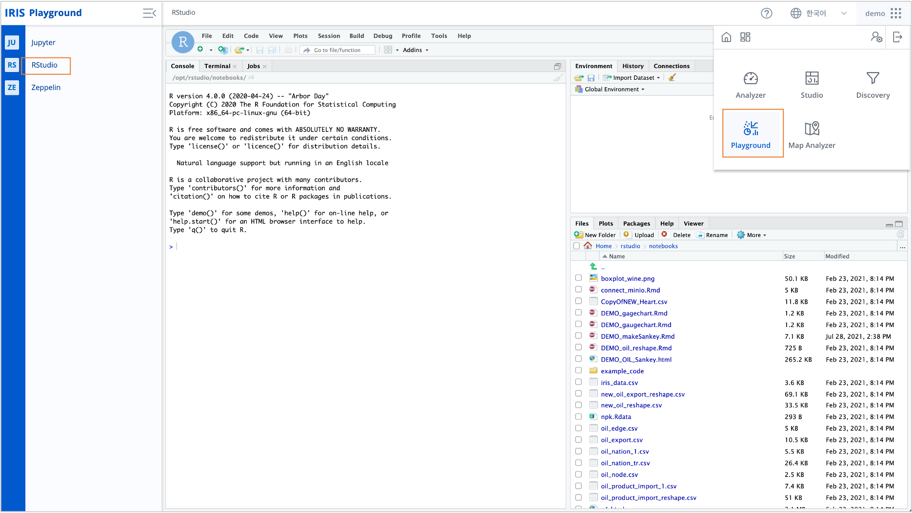
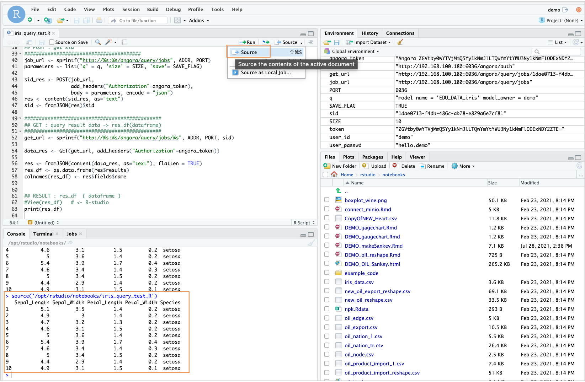
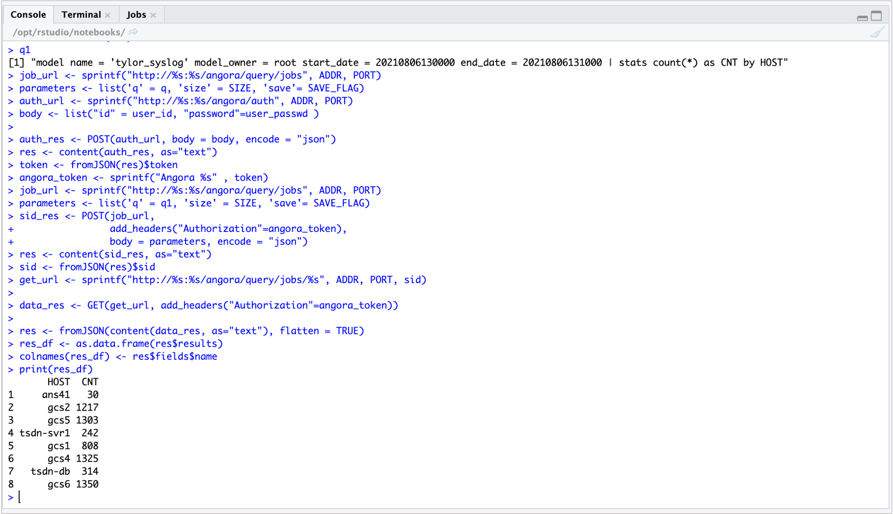

R 에서 IRIS 데이터모델 조회하기 (RestAPI)
=============================================================================

| ``IRIS Playground >> RStudio`` 에서 RestAPI 를 통해 IRIS의 데이터 모델을 DSL( `Domain-Specific Languag <http://docs.iris.tools/manual/IRIS-Manual/IRIS-Discovery-Middleware/index.html#iris-discovery-middleware-service>`__ ) 로 조회할 수 있습니다.
|
| 통계 분석에 많이 사용되는 붓꽃(iris) 데이터가 저장되어 있는 IRIS 데이터 모델 "EDU_DATA_iris"  를 예시로 설명하겠습니다.

----------------------------------------------
IRIS Playground - RStudio 
----------------------------------------------

| 메인메뉴에서 ``Playground`` 를 클릭한 후 ``Rstudio`` 를 선택합니다.
| 일반 RStudio 를 docker 에서 실행한 것 외에는 동일하므로 Rstudio 사용법은 `RStudio Documentation <https://docs.rstudio.com>`__ 을 참조하세요.
|

예제 스크립트 복사하기
..............................................
    
| 관련 예제 스크립트는 ``IRIS Analyzer >> 검색``  메뉴에서 데이터 모델 "EDU_DATA_iris" 을 조회 실행하면 **분석 코드 복사** 아이콘이 활성화됩니다.
| ``R 코드 복사하기`` 를 선택하면 스크립트가 클립보드에 복사됩니다.
| 이 코드를 RStudio 의 source 에 붙여넣기 합니다.

코드 설명
..............................................

- 관련 R package 
  
.. code::

    #!/usr/bin/Rscript --vanilla

    options(warn=-1)

    ## REST API PART : httr, jsonlite
    library(httr)
    library(jsonlite)

- 접속 정보 설정
  
.. code::

    #######################################
    ## paramerter assign
    #######################################
    ADDR <- "......." # hostname 이나 IP address 입력
    PORT <- 6036 # port number 입력
    SIZE <- 10   # 10개 레코드만 가져옵니다. 

| ``SIZE <- -1`` 은 조회 결과 전체를 가져옵니다.

.. code::

    SAVE_FLAG <- TRUE

    # ID / PASSWRD part
    user_id <- "demo"
    user_passwd <- '' # 계정 암호 입력

- 인증 절차
  
.. code::

    auth_url <- sprintf("http://%s:%s/angora/auth", ADDR, PORT)
    body <- list("id" = user_id, "password"=user_passwd )

    auth_res <- POST(auth_url, body = body, encode = "json")
    res <- content(auth_res, as="text")
    token <- fromJSON(res)$token
    angora_token <- sprintf("Angora %s" , token)

- 나의 조회 query 를 보내기 

.. code::

    ########################################
    ## POST : get sid
    ########################################
    # MY QUERY
    q <- "model name = 'EDU_DATA_iris' model_owner = demo"

    job_url <- sprintf("http://%s:%s/angora/query/jobs", ADDR, PORT)
    parameters <- list('q' = q, 'size' = SIZE, 'save'= SAVE_FLAG)

    sid_res <- POST(job_url,
                    add_headers("Authorization"=angora_token),
                    body = parameters, encode = "json")
    res <- content(sid_res, as="text")
    sid <- fromJSON(res)$sid

- 결과를 받아서 R dataframe 으로 저장하기

.. code::
      
    ###############################################
    ## GET : query result data -> res_df(dataframe)
    ###############################################
    get_url <- sprintf("http://%s:%s/angora/query/jobs/%s", ADDR, PORT, sid)

    data_res <- GET(get_url, add_headers("Authorization"=angora_token))

    res <- fromJSON(content(data_res, as="text"), flatten = TRUE)
    res_df <- as.data.frame(res$results)
    colnames(res_df) <- res$fields$name

- 결과(res_df) 출력

.. code::
    
    ## RESULT : res_df  ( dataframe )
    View(res_df)   # <- R-studio
    print(res_df)

- 스크립트 실행해보기 ( source ) :  ``SIZE <- 10``  으로 설정하여 10개 레코드만 조회됩니다.
  

시간 유형이 있는 데이터 모델과 DSL 사용하는 query
..........................................................................

- 데이터모델 "tylor_syslog" 은 시간 유형 컬럼으로 "DATETIME" 이라는 필드를 가지고 있는 데이터모델입니다.
- 시간 포맷 YYYYMMDDHHmmss
- query 
  
.. code::

    q1 <- "model name = 'tylor_syslog' model_owner = root start_date = 20210806130000 end_date = 20210806131000 | stats count(*) as CNT by HOST"
    

- 코드 예시 ( 인증절차는 앞 코드 참조 )

.. code::

    q1 <- "model name = 'tylor_syslog' model_owner = root start_date = 20210806130000 end_date = 20210806131000 | stats count(*) as CNT by HOST"
    parameters <- list('q' = q1, 'size' = SIZE, 'save'= SAVE_FLAG)
    sid_res <- POST(job_url,
                   add_headers("Authorization"=angora_token),
                   body = parameters, encode = "json")
    res <- content(sid_res, as="text")
    sid <- fromJSON(res)$sid
    get_url <- sprintf("http://%s:%s/angora/query/jobs/%s", ADDR, PORT, sid)

    data_res <- GET(get_url, add_headers("Authorization"=angora_token))
 
    res <- fromJSON(content(data_res, as="text"), flatten = TRUE)
    res_df <- as.data.frame(res$results)
    colnames(res_df) <- res$fields$name
  

-  조회스크립트 console 에서 실행한 결과

