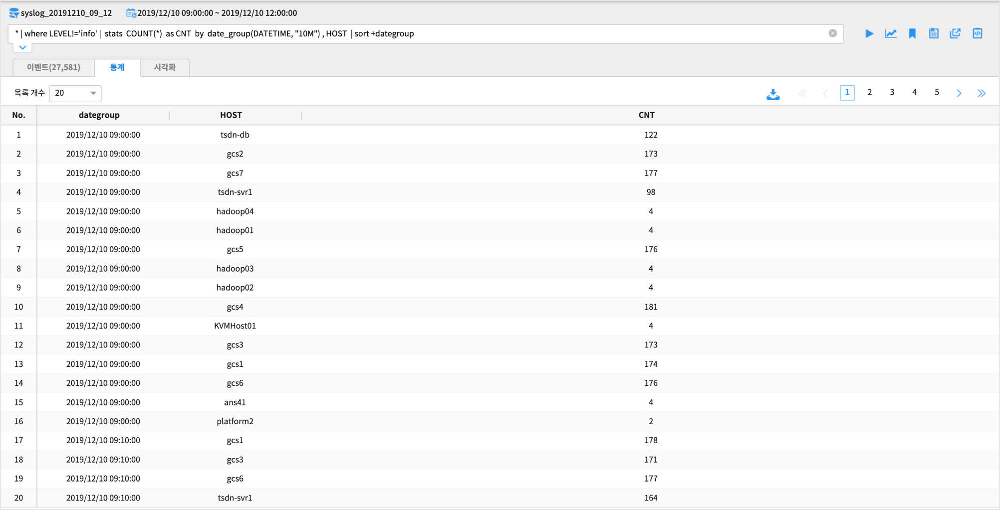
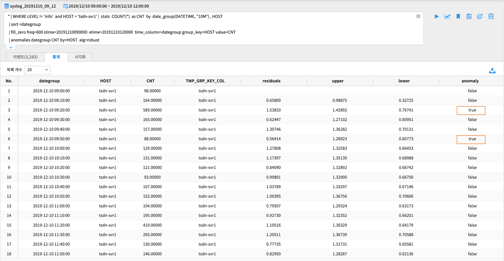

anomalies 
================================================================================
    
| IRIS 플랫폼에는 기계 학습 기반의 알고리즘을 활용한 "이상 탐지" 관련 명령어로 ``anomalies`` 와 ``outlier`` 가 있습니다.
| 기계 학습 기반의 이상 탐지 기법은 학습할 데이터(참조 데이터)로 최근 과거 시간의 데이터가 적절하게 다량 필요합니다.
| 그래서 대량의 학습 데이터로 미리 training 을 수행하여 모델을 생성해 두고, 이 모델에 새 입력 데이터를 fitting 하여 이상 탐지 결과를 구하는 과정으로 진행되고 있습니다.
| 
| IRIS `DSL <http://docs.iris.tools/manual/IRIS-Manual/IRIS-Discovery-Middleware/command/index.html#command-references>`__ 의 하나인 anomalies, outlier 명령어는 미리 모델을 생성하지 않고, 입력 데이터만을 대상으로 정상값 / 이상값을 판별합니다.
| 거리, 밀도 기반의 이상치 추출과 clustering 기반의 이상 탐지와 유사하며, 입력 데이터만으로 이상값 판정 기준을 만들기 때문에 빠르게 결과가 나올 수 있습니다.

| `anomalies <http://docs.iris.tools/manual/IRIS-Manual/IRIS-Discovery-Middleware/command/commands/anomalies.html>`__ 는 주어진 input 데이터에서 일반적인 범위를 벗어난 비정상적인 값을 찾아내는 명령어 입니다.
| `outlier <http://docs.iris.tools/manual/IRIS-Manual/IRIS-Discovery-Middleware/command/commands/outlier.html>`__ 는 여러 개의 그룹 데이터를 대상으로 클러스터링 기반의 이상값 추출 & 일정 비율 이상으로 이상값이 많이 나오는 그룹 추출 가능이 있습니다.
| 를 참조하시면 Analyzer 화면에서 수행하는 명령어에 대한 사용 방법을 알 수 있습니다.

-----------------
설명
-----------------

| anomalies 명령어는 입력 데이터로 시간 필드같은 sequence 데이터 필드를 index 로 지정하고, 판별할 value 필드가 필수적으로 포함되어 있습니다.
| 옵션으로 by 뒤에 그룹 key 필드를 지정하면 그룹별 value 를 대상으로 이상 탐지를 수행합니다.
| 
| anomalies 의 결과 데이터 포맷은 입력데이터에 이상값 판단 기준 임계치인 상한임계치(upper),  하한 임계치(lower), 이상값 판정 결과(anomaly) 필드가 추가하여 출력합니다.

| 이상값을 판정하는 방법으로 사용되는 알고리즘 옵션은 

**basic** 옵션 : 통계적 방법으로 normal 분포를 가정하여 z-score 절대값이 1.959964를 벗어난 값을 이상값으로 판단
**robust** 옵션 : Seasonal_Decomposition 기반 알고리즘. 계절성, 추세, 잔차 값을 분해하여 잔차 값으로 구한 임계치로 이상값을 판단

| 예제에 사용하는 데이터 ``SYSLOG`` 는 감시 대상 서버들에서 실시간으로 생성되고 있는 syslog 데이터를 IRIS DB 에 바로 저장하고 이를 데이터모델로 생성한 것입니다.
| syslog 는 이벤트 로그 데이터로 주기적인 측정값으로 나오는 데이터가 아니라 이벤트가 발생할 때 생성되는 로그입니다.
| 따라서 이상 탐지에 사용하기 위해서는 이상 탐지 대상 데이터를 필요한 기준으로 집계해서 사용해야 합니다.
| 시간은 1분, 10분, 1시간 등 적절한 단위 시간을 정해야 하며, 집계 기준 그룹 컬럼을 "HOST" 별로 할 지, "HOST, LEVEL"  로 할 지 정하는 과정이 필요합니다.
|
| syslog 같은 원시 로그 데이터를 이상 탐지하기 위한 기본 과정은

| - 10분 단위 시간, 그룹 필드, value 필드로 집계 데이터(레코드 수)를 생성합니다.
| - 빠진 단위 시간(10분)은 그룹 key 별로 0 으로 값을 채웁니다. ( 해당 시간, 그룹 필드로 syslog 레코드는 발생한 것이 없으므로 집계한 value 값을 "0" 으로 채웁니다.)
| - anomalies 명령어에 필요한 옵션을 추가하여 실행합니다.

---------------
데이터 탐색
---------------

| ``Analyzer`` 메뉴에서 "탐색적데이터 분석(EDA)" 로 입력 데이터의 적절한 조회 시간, 그룹 필드 조합 선정, 필터 조건, 특징 등 을 파악합니다.
| 데이터 모델과 조회 시간을 설정한 후 "컬럼" pane 에서 범주형 데이터 타입인 컬럼의 상위 10개의 분포를 확인할 수 있습니다.
    
* 데이터모델 : syslog_20191210_09_12
* 조회 시간 : 2019-12-10 09:00:00 ~  2019-12-10 12:00:00 

.. image:: ../images/anomalies/anomalies_data01.png
    :scale: 60%
    :alt: 검색 데이터 -1

| DSL 명령어의 필터 기능을 통해 SYSLOG 데이터 중에서 LEVEL 이 Info 인 경우는 검색에서 제외할 수 있습니다.
| 검색 명령어 창에서 바로 `!=`  또는 `` | WHERE `` 로 제외하거나 데이터를 클릭한 후 검색에서 **제외** 클릭으로 필터링이 가능합니다.
    

| 특정 시간 범위로 재검색 할 수 있습니다.
| 이벤트 건수 시계열 그래프(막대그래프) 에서 범위를 선택하여 재검색할 수 있습니다.

.. image:: ../images/anomalies/anomalies_data04.png
    :alt: 검색 데이터 -4

------------------------------
데이터 전처리
------------------------------

| 이벤트 로그 데이터인 SYSLOG를 단위 시간, 그룹 키로 집계합니다.
| SQL 에서는

.. code::

    select date_group(DATETIME, "10M") , A, B, COUNT(*) from .... GROUP BY dategroup, A, B  

* DSL -  10분 단위 / HOST 별 syslog(info 는 제외) 발생 건수 

| 해당 시간에 HOST 별로  SYSLOG 발생 건수가 이상 증가 또는 감소한 것이 있는지 파악하고자 합니다.
| syslog 로그 중 LEVEL 이 'info' 인 syslog 는 제외하고 발생 건수를 집계합니다. 
| 먼저 검색명령어 창에서 10분 집계 데이터를 HOST 별로 생성하는 명령어를 입력합니다.

| DSL 에서는 stats 명령어를 써서

.. code::

    * | where LEVEL!='info' |  stats  COUNT(*)  as CNT  by  date_group(DATETIME, "10M") , HOST  | sort +dategroup

| stats 명령어 구문이 검색명령어에 포함되면 결과는 ``통계`` 탭에 출력됩니다.

| syslog 의 초(sec) 단위 시간 필드 DATETIME 은 syslog 발생시간을 저장한 필드입니다. DATETIME 필드를 ``date_group`` 함수를 이용하여 10분 단위로 변환합니다.
| 10분 단위로 변환한 시간 필드는 ``dategroup`` 이라는 이름으로 생성되며, 조회 시작 시간 ~ 끝시간에서 10분 단위 시간에 HOST 키가 없는 것은  ``0`` 값으로 채워야 합니다.

| 이 때 사용되는 명령어는 fill_zero 입니다.

.. code::

    - 사용예) fill_zero freq=600 stime=20191210090000  etime=20191210120000  time_column=dategroup group_key=HOST value=CNT 
        - freq : 집계 시간 단위. 초.  freq=600  은 600초. 
        - stime : 집계시작시간
        - etime : 집계종료시간
        - time_column : 시간 컬럼
        - group_key : group 컬럼

검색 명령어 사용 예

.. code::

 * | where LEVEL!='info' |  stats  COUNT(*)  as CNT  by  date_group(DATETIME, "10M") , HOST  
 | sort +dategroup 
 | fill_zero freq=600 stime=20191210090000  etime=20191210120000  time_column=dategroup group_key=HOST value=CNT 

검색 실행 결과

------------------
실행 구문 
------------------

| 매 10분마다 빠진 값을 0 으로 채운 후 anomalies 를 실행합니다.
|
| anomalies 검색어 예시 : LEVEL  info 제외 / 10분 HOST 별 집계 / default 알고리즘인 basic 옵션 
| 결과에서 HOST = 'tsdn-svr1'  인 것만 출력해서 봅니다.

.. code::

  * | WHERE LEVEL != 'info' |  stats  COUNT(*)  as CNT  by  date_group(DATETIME, "10M") , HOST  
  | sort +dategroup 
  | fill_zero freq=600 stime=20191210090000  etime=20191210120000  time_column=dategroup group_key=HOST value=CNT  
  | anomalies dategroup CNT by=HOST  
  | typecast dategroup  'timestamp' |  where HOST = 'tsdn-svr1'

| 그리고 입력 데이터 전체를 대상으로 이상값을 판단합니다.

-------------------------------------------------
알고리즘 설명
-------------------------------------------------

| anomalies 의 default 알고리즘인 basic 을 적용합니다.

**적용 검색어**

.. code::

  anomalies dategroup CNT by=HOST

| ``alg = basic``   : basic 알고리즘 적용
| ``by = HOST``     : HOST 별로 그룹핑한 value 별로 anomalies 적용
| ``bound = 2``     : 임계치의 범위를 z 값의 2배수로 적용
| ``direct = both`` : 임계치 상한(upper) 보다 큰 값, 하안(lower) 보더 작은 값을 이상값으로 판정

**basic 에서 임계치 계산 방법**

.. code::

    window_size = 10 으로 moving average 로 변환합니다.
    confidence = 1.959964 * 이동평균값의 표준편차 * bound 값(=2)
    상한 임계치(upper limit) = 이동평균 + confidence
    하한 임계치(lower limit) = 이동평균 - confidence

| 상한 / 하한 임계치를 벗어난 값을 이상값 즉 anomaly = true 로 표시합니다.

------------------
실행 결과
------------------

.. code::

  * | WHERE LEVEL != 'info' |  stats  COUNT(*)  as CNT  by  date_group(DATETIME, "10M") , HOST  
  | sort +dategroup 
  | fill_zero freq=600 stime=20191210090000  etime=20191210120000  time_column=dategroup group_key=HOST value=CNT  
  | anomalies dategroup CNT by=HOST  
  | typecast dategroup   'timestamp' |  where HOST = 'tsdn-svr1'

| 결과

| 검색 결과는 stats 가 포함되어 있으므로 ``통계탭`` 에 결과가 보여집니다.
| 마지막 컬럼인 **anomaly**  의 값이 **true** 인 레코드가 **이상치** 에 해당합니다.

-------------------------
결과 해석
-------------------------

| anomalies 결과 데이터로 직접 챠트를 그려서 시각적으로 확인해봅니다.

| 통계탭에 나온 결과를 로컬 PC로 내보내기 후 
| IRIS 의 **대화형분석** 메뉴에서 Jupyter 노트북이나 R-studio 로 챠트를 그릴 수 있습니다.
| 그리고 간단하게 통계탭 옆의 ``시각화탭`` 에서 챠트를 바로 확인할 수도 있습니다.

| HOST tsdn-svr1 이 챠트 상으로도 이상치에 해당하는 급증한 것이 보입니다.
| UCL(관리 상한선), LCL(관리 하한선) 을 벗어난 포인트가 2개 있는 걸 확인할 수 있습니다.
| 이 상한선, 하한선은 이상치를 판정하는 기준선입니다.(알고리즘마다 약간씩 다른 기준선 계산방식이 있습니다)

--------------------------
다른 알고리즘 결과
--------------------------

| alg = robust

.. code::

   * | WHERE LEVEL != 'info'  and HOST = 'tsdn-svr1' 
  | stats  COUNT(*)  as CNT  by  date_group(DATETIME, "10M") , HOST  
  | sort +dategroup 
  | fill_zero freq=600 stime=20191210090000  etime=20191210120000  time_column=dategroup group_key=HOST value=CNT  
  | anomalies dategroup CNT by=HOST alg=robust  | typecast dategroup   'timestamp'

