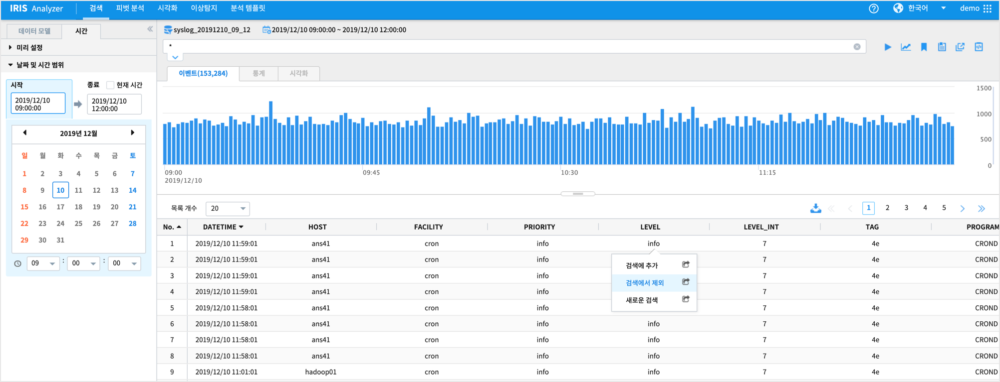

.. sectnum::

================================================================================
anomalies - 실시간 이상 탐지
================================================================================
    
|

-----------------
목차
-----------------

- 설명

- 데이터 탐색

- anomalies 를 위한 데이터 전처리 

- 실행 결과

- 결과 해석

|
|

-----------------
설명
-----------------

anomalies 명령어는 대상 데이터중에서 이상치에 해당하는 데이터를 판별해주는 명령어이다.
이상치를 판단하는 방법은 
- **basic** 옵션 : 단순 통계적 방법으로 normal분포 가정하여 z-score = 1.959964를 벗어난 값을 이상치로 판단
- **robust** 옵션 : Seasonal_Decomposition을 사용한 알고리즘. 계절성, 추세, 잔차 값을 구별하여 잔차 값으로 임계값을 구하여 이상치를 판단

|

SYSLOG는 수치 측정값이 없는 로그 데이터이므로 1분, 10분 등 단위 시간동안의 집계 count 를 대상으로 이상탐지를 판단한다.
- 10분 단위 집계 데이터 생성
- 빠진 단위 시간(10분)은 0 으로 값을 채우기
- anomalies 명령어 실행

|

---------------
데이터 탐색
---------------

- 데이터 현황
    - 각 컬럼 별 상위 10개의 분포를 확인할 수 있다.
    - 데이터 조회 시간 : 2020/01/30 08:00:00 ~ 2020/01/30 13:59:59

|

.. image:: ../images/anomalies/anomalies_data02.png
    :scale: 60%
    :alt: 검색 데이터 -2

|

- 데이터 필터링 
    - SYSLOG 데이터 중에서 LEVEL 이 Info, notice, debug 인 경우는 검색에서 제외한다.
    
.. image:: ../images/anomalies/anomalies_data03.png
    :alt: 검색 데이터 -3

------------------------------
데이터 전처리
------------------------------

- 
