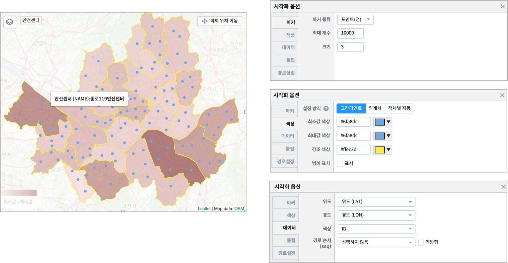

=======================================================================================================================
IRIS Studio - DEMO_서울시 안전센터_소방서 위치 및 화재 통계
=======================================================================================================================

IRIS Studio 를 이용하여 `서울시 열린 데이터 광장 <https://data.seoul.go.kr/dataList/datasetList.do>`__ 에 있는 서울시 안전센터 관할 위치 정보와 서울시 소방서 관할 위치 정보와 서울시 원인별 화재 통계 데이터를
지도와 챠트로 만들어 봅니다.

.. image:: ../images/demo/demo_fire_01.png
    :alt: 데이터 - 01 

.. contents::
    :backlinks: top

------------------------------
데이터 준비
------------------------------

''''''''''''''''''''''''''''''''
데이터 가져오기 
''''''''''''''''''''''''''''''''

- 출처 : `서울시 열린 데이터 광장 <https://data.seoul.go.kr/dataList/datasetList.do>`__ 
    - 보고서의 상단 오른쪽 라벨을 클릭하면 출처인 서울시 열린 데이터 광장으로 이동합니다.

- 출처
    - 서울시 안전센터, 소방서, 화재 원인 데이터 
        - 서울시 열린데이터 광장 `서울시 열린 데이터 광장 <https://data.seoul.go.kr/dataList/datasetList.do>`__ 
    - 서울시 구단위 행정 경계 데이터 ( SHP 파일 )
        - 국토교통부 행정구역도 `공공 데이터 포털 <https://www.data.go.kr/dataset/3046391/openapi.do>`__

- 서울시 구단위 행정 경계 데이터

.. image:: ../images/demo/demo_fire_02.png
    :alt: 데이터 - 02

- 서울시 관할 소방서 위치 정보

.. image:: ../images/demo/demo_fire_03.png
    :alt: 데이터 - 03

- 서울시 안전센터 위치 정보

.. image:: ../images/demo/demo_fire_04.png
    :alt: 데이터 - 04

- 서울시 소방서별 화재 원인 통계

.. image:: ../images/demo/demo_fire_05.png
    :alt: 데이터 - 05

'''''''''''''''''''''''''''''''''''
데이터 업로드
'''''''''''''''''''''''''''''''''''

- 로컬 PC 에 다운로드된 파일들을 IRIS 의 **HDFS브라우저** 를 이용하여 MinIO 에 업로드합니다.

`MinIO 에 데이터 업로드 <http://docs.iris.tools/manual/IRIS-Usecase/usecase4-batting_data/DEMO_batting.html#minio>`__

'''''''''''''''''''''''''''''''''''''''''''''''
데이터모델 만들기 - MinIO
'''''''''''''''''''''''''''''''''''''''''''''''

- **데이터모델** 메뉴에서 MinIO 에 저장된 파일들을 데이터모델로 생성합니다.
    - 참고 : `데이터모델 만들기 - MinIO <http://docs.iris.tools/manual/IRIS-Usecase/usecase4-batting_data/DEMO_batting.html#id3>`__

.. list-table::
    :header-rows: 1

    * - 모델 이름
      - 설 명  
    * - SEOUL_SAFETY_CENTER_COOR
      - 서울시 안전센터 위치
    * - SEOUL_MELT_FIRE_CAUSE
      - 서울시 소방서별 화재원인 분포
    * - SEOUL_GU_WGS84
      - 서울 행정구 경계 polygon WGS_84
    * - SEOUL_GU_FIRE_CAUSE
      - 서울시 구별 화재원인 통계
    * - SEOUL_GU_COORDINATES
      - 서울 구청 좌표 및 정보
    * - SEOUL_FIRE_STA_COOR
      - 서울시 소방서 좌표
    * - SEOUL_FIRE_CAUSE
      - 서울시 관할 소방서별 화재원인(2011 ~ 2018년)

----------------------------------
Studio 보고서 따라하기
----------------------------------

''''''''''''''''''''''''''''''''''''''''''''''''''''''''''''''''''''''
map 1 : 서울시 안전센터 및 관할 소방서 위치 정보
''''''''''''''''''''''''''''''''''''''''''''''''''''''''''''''''''''''

.. image:: ../images/demo/demo_fire_06.png
    :alt: map - 06

^^^^^^^^^^^^^^^^^^^^^^^^^^^^^^^^^^^^^^^^^^^^^^^^^^^^^^^^^^^^^^^^^
레이어별 데이터와 시각화옵션 설정
^^^^^^^^^^^^^^^^^^^^^^^^^^^^^^^^^^^^^^^^^^^^^^^^^^^^^^^^^^^^^^^^^

- 구경계 레이어

.. image:: ../images/demo/demo_fire_08.png
    :alt: map - 08  

- 안전센터 레이어

- 소방서 레이어

    
- 참고 : 지도 레이어의 시각화옵션 설정은  `IRIS Studio - 수원시 공공 데이터 예제 <http://docs.iris.tools/manual/IRIS-Usecase/usecase3-map/IRIS_Studio.map_layer_v01.html#>`__ 에서
 `주차장 레이어 만들기 <http://docs.iris.tools/manual/IRIS-Usecase/usecase3-map/IRIS_Studio.map_layer_v01.html#id8>`__  를 참고하세요.

'''''''''''''''''''''''''''''''''''''''''''''''''''''''''''
선택한 연도의 소방서별 화재 원인 통계 : 챠트 - 테이블
'''''''''''''''''''''''''''''''''''''''''''''''''''''''''''

.. image:: ../images/demo/demo_fire_11.png
    :alt: map - 11

- 조회할 연도를 선택하기 위해 **콤보박스**를 만듭니다.
    - `콤보 박스 생성 <http://docs.iris.tools/manual/IRIS-Usecase/usecase4-batting_data/DEMO_batting.html?highlight=%EC%BD%A4%EB%B3%B4%EB%B0%95%EC%8A%A4#id7>`__

- **데이터 출처**를 라벨로 표현합니다.
    - 참고 : `라벨 <http://docs.iris.tools/manual/IRIS-Manual/IRIS-WEB/data_browser/studio/index2.html?highlight=%EB%9D%BC%EB%B2%A8#label>`__  에서 라벨 링크 부분을 참조하세요.
    - `미국 야구 데이터를 활용한 Studio 보고서 만들기 <http://docs.iris.tools/manual/IRIS-Usecase/usecase4-batting_data/DEMO_batting.html>`__  에서 `캔버스 및 제목 라벨 만들기 <http://docs.iris.tools/manual/IRIS-Usecase/usecase4-batting_data/DEMO_batting.html#id5>`__ .

- 테이블에 출력되는 데이터는 콤보박스에 선택한 연도에 해당하는 데이터로만 필터링되어 출력됩니다.
    - `콤보박스를 활용하여 데이터 필터링하기 <http://docs.iris.tools/manual/IRIS-Tutorial/IRIS_Studio/combobox_report/combobox_report.html?highlight=%ED%8A%B8%EB%A6%AC%EA%B1%B0>`__

- 테이블에 출력되는 데이터는 다른 오브젝트의 트리거 설정 시에 **클릭** 이벤트 시 이벤트값으로 전달되도록 설정합니다. 
    - Manual `IRIS STUDIO - 보고서 작성 <http://docs.iris.tools/manual/IRIS-Manual/IRIS-Studio/studio/index2.html#id8>`__  에서 `이벤트값 전달 설정 <http://docs.iris.tools/manual/IRIS-Manual/IRIS-WEB/data_browser/studio/04.html?highlight=%EC%9D%B4%EB%B2%A4%ED%8A%B8#id13>`__  과 `트리거 설정 <http://docs.iris.tools/manual/IRIS-Manual/IRIS-WEB/data_browser/studio/04.html?highlight=%EC%9D%B4%EB%B2%A4%ED%8A%B8#id13>`__  을 참조하세요.
   

''''''''''''''''''''''''''''''''''''''''''''''''''''''''
map 2 :  구별 화재건수
''''''''''''''''''''''''''''''''''''''''''''''''''''''''

행정구 경계 geometry 정보가 있는 테이블(SEOUL_GU_WGS84),
행정구 정보 테이블(SEOUL_GU_COORDINATES )
관할소방서별 화재 테이블(SEOUL_FIRE_CAUSE ) 를 join 한 데이터 이용
