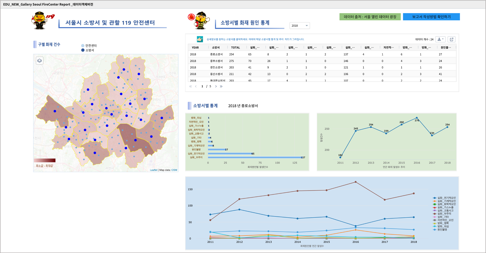

=======================================================================================================================
IRIS Studio - 서울시 안전센터와 소방서 위치 지도 / 화재 원인 통계
=======================================================================================================================

IRIS Studio 를 이용하여 `서울시 열린 데이터 광장 <https://data.seoul.go.kr/dataList/datasetList.do>`__ 에 있는 서울시 안전센터 및 소방서 관할 위치 정보와 화재 원인 통계 데이터를 이용하여 지도와 챠트로 만들어 봅니다.

.. contents::
    :backlinks: top

|
|

------------------------------
데이터 준비
------------------------------

''''''''''''''''''''''''''''''''
데이터 가져오기 
''''''''''''''''''''''''''''''''

- 출처 
    - 서울시 안전센터, 소방서, 화재 원인 데이터 : `서울시 열린 데이터 광장 <https://data.seoul.go.kr/dataList/datasetList.do>`__ 
    - 서울시 구단위 행정 경계 데이터 ( SHP 파일 ) : 국토교통부 행정구역도 `공공 데이터 포털 <https://www.data.go.kr/dataset/3046391/openapi.do>`__

- 서울시 구단위 행정 경계 데이터

.. image:: ../images/demo/demo_fire_02.png
    :alt: 데이터 - 02

- 서울시 관할 소방서 위치 정보

.. image:: ../images/demo/demo_fire_03.png
    :alt: 데이터 - 03

- 서울시 안전센터 위치 정보

.. image:: ../images/demo/demo_fire_04.png
    :alt: 데이터 - 04

- 서울시 소방서별 화재 원인 통계

.. image:: ../images/demo/demo_fire_05.png
    :alt: 데이터 - 05

|

'''''''''''''''''''''''''''''''''''
데이터 업로드
'''''''''''''''''''''''''''''''''''

로컬 PC 에 다운로드된 파일들을 IRIS 의 **HDFS브라우저** 를 이용하여 `MinIO 에 데이터 업로드 <http://docs.iris.tools/manual/IRIS-Usecase/usecase4-batting_data/index.html#minio>`__ 합니다.

|

'''''''''''''''''''''''''''''''''''''''''''''''
데이터모델 만들기 - MinIO
'''''''''''''''''''''''''''''''''''''''''''''''

데이터모델 메뉴에서 MinIO 에 저장된 파일들을 데이터모델로 생성합니다.

    - 참고 : `데이터모델 만들기 - MinIO <http://docs.iris.tools/manual/IRIS-Usecase/usecase4-batting_data/index.html#id3>`__

.. list-table::
    :header-rows: 1

    * - 모델 이름
      - 설 명  
    * - SEOUL_SAFETY_CENTER_COOR
      - 서울시 안전센터 위치
    * - SEOUL_MELT_FIRE_CAUSE
      - 서울시 소방서별 화재원인 분포
    * - SEOUL_GU_WGS84
      - 서울 행정구 경계 polygon WGS_84
    * - SEOUL_GU_FIRE_CAUSE
      - 서울시 구별 화재원인 통계
    * - SEOUL_GU_COORDINATES
      - 서울 구청 좌표 및 정보
    * - SEOUL_FIRE_STA_COOR
      - 서울시 소방서 좌표
    * - SEOUL_FIRE_CAUSE
      - 서울시 관할 소방서별 화재원인(2011 ~ 2018년)

|
|
|

----------------------------------
Studio 보고서 따라하기
----------------------------------

''''''''''''''''''''''''''''''''''''''''''''''''''''''''''''''''''''''
map 1 : 서울시 안전센터 및 관할 소방서 위치 정보
''''''''''''''''''''''''''''''''''''''''''''''''''''''''''''''''''''''

.. image:: ../images/demo/demo_fire_06.png
    :alt: map - 06

|

^^^^^^^^^^^^^^^^^^^^^^^^^^^^^^^^^^^^^^^^^^^^^^^^^^^^^^^^^^^^^^^^^
레이어별 데이터와 시각화옵션 설정
^^^^^^^^^^^^^^^^^^^^^^^^^^^^^^^^^^^^^^^^^^^^^^^^^^^^^^^^^^^^^^^^^

* 구경계 레이어

.. image:: ../images/demo/demo_fire_07.png
    :alt: map - 07

.. image:: ../images/demo/demo_fire_08.png
    :alt: map - 08  

* 안전센터 레이어

.. image:: ../images/demo/demo_fire_09.png
    :alt: map - 09 

* 소방서 레이어

.. image:: ../images/demo/demo_fire_10.png
    :alt: map - 10 

    
참고 : 지도 레이어의 시각화옵션 설정은  `IRIS Studio - 수원시 공공 데이터 예제 <http://docs.iris.tools/manual/IRIS-Usecase/usecase3-map/IRIS_Studio.map_layer_v02.html#>`__ 에서 `주차장 레이어 만들기 <http://docs.iris.tools/manual/IRIS-Usecase/usecase3-map/IRIS_Studio.map_layer_v01.html#id8>`__  를 참고하세요.

|
|

'''''''''''''''''''''''''''''''''''''''''''''''''''''''''''
선택한 연도의 소방서별 화재 원인 통계 : 챠트 - 테이블
'''''''''''''''''''''''''''''''''''''''''''''''''''''''''''

* 조회할 연도를 선택하기 위해 콤보박스를 만듭니다.
    * `콤보 박스 생성 <http://docs.iris.tools/manual/IRIS-Usecase/usecase4-batting_data/index.html#id7>`__

* 데이터 출처를 라벨로 표현합니다.
    * `IRIS-Manual : 라벨 링크  <http://docs.iris.tools/manual/IRIS-Manual/IRIS-WEB/data_browser/studio/index2.html?highlight=%EB%9D%BC%EB%B2%A8#label>`__ 
    * `IRIS-Usecase : 미국 야구 데이터를 활용한 Studio 보고서 만들기 <http://docs.iris.tools/manual/IRIS-Usecase/usecase4-batting_data/index.html#>`__  에서 `캔버스 및 제목 라벨 만들기 <http://docs.iris.tools/manual/IRIS-Usecase/usecase4-batting_data/index.html#id5>`__  부분을 참조하세요.

* 테이블에 출력되는 데이터는 콤보박스에 선택한 연도에 해당하는 데이터로만 필터링되어 출력됩니다.
    * `IRIS-Tutorial : 콤보박스를 활용하여 데이터 필터링 <http://docs.iris.tools/manual/IRIS-Tutorial/IRIS_Studio/combobox_report/combobox_report.html>`__ 

* 테이블에 출력되는 데이터는 다른 오브젝트의 트리거 설정 시에 클릭 이벤트 시 이벤트값으로 전달되도록 설정합니다. 
    * `IRIS-Manual : 보고서 작성 <http://docs.iris.tools/manual/IRIS-Manual/IRIS-Studio/studio/index2.html#id8>`__  에서 `이벤트값 전달 설정 <http://docs.iris.tools/manual/IRIS-Manual/IRIS-WEB/data_browser/studio/04.html#id13>`__  과 `트리거 설정 <http://docs.iris.tools/manual/IRIS-Manual/IRIS-WEB/data_browser/studio/04.html#id13>`__  을 참조하세요.
   

.. image:: ../images/demo/demo_fire_12.png
    :alt: map - 12 

|
|

'''''''''''''''''''''''''''''''''''''''''''''''''''''
소방서별 화재 원인 통계
'''''''''''''''''''''''''''''''''''''''''''''''''''''

- 콤보박스에서 선택된 연도와 테이블에서 선택된 소방서로 필터링된 데이터를 가로막대형 챠트로 그린 것입니다.
    - 참고 : `IRIS-Usecase : IRIS Studio - 행정 구역 MAP 과 인구 통계 챠트 <http://docs.iris.tools/manual/IRIS-Usecase/usecase3-map/IRIS_Studio.map_chart.v01.html#iris-studio-map>`__ 에서 `가로막대그래프 <http://docs.iris.tools/manual/IRIS-Usecase/usecase3-map/IRIS_Studio.map_chart.v01.html#id12>`__

.. image:: ../images/demo/demo_fire_13.png
    :alt: map - 13

|
|

'''''''''''''''''''''''''''''''''''''''''''''''''''''''''''''''''''''''''''''
소방서의 연간 화재 발생 건수 추이(2011년 ~ 2018년)
'''''''''''''''''''''''''''''''''''''''''''''''''''''''''''''''''''''''''''''

- 테이블에서 선택된 소방서의 연간 화재 발생 건수 추이를 챠트-꺾은선형 그래프로 그린 것입니다.

.. image:: ../images/demo/demo_fire_14.png
    :alt: map - 14

|
|

''''''''''''''''''''''''''''''''''''''''''''''''''''''''''''''''''''''''''''
화재원인별 연간 발생 건수 추이
''''''''''''''''''''''''''''''''''''''''''''''''''''''''''''''''''''''''''''

- 테이블에서 선택된 소방서의 화재원인별 연간 발생 건수 추이를 챠트-꺽은선형 그래프로 그린 것입니다.
- 화재원인 별로 multi-line 챠트로 구현합니다.
- 시각화옵션에서 X축, Y축을 선택할 때 "모두선택" 을 설정하면 미지정된 컬럼중 숫자형 타입의 컬럼들이 모두 선택,지정됩니다.

.. image:: ../images/demo/demo_fire_15.png
    :alt: map - 15

|
|

''''''''''''''''''''''''''''''''''''''''''''''''''''''''
map 2 :  구별 화재건수
''''''''''''''''''''''''''''''''''''''''''''''''''''''''

- 구별 화재건수 지도는 "layer map(지도)" 와 "구별 화재건수" 레이어로 이루어져 있습니다.
- 콤보박스에서 선택된 연도의 데이터로 필터링된 데이터입니다.
- 구별 화재건수로 그라디언트(진할 수록 많은 발생건수)된 색상으로 표현됩니다.

.. image:: ../images/demo/demo_fire_16.png
    :alt: map - 16

.. image:: ../images/demo/demo_fire_17.png
    :alt: map - 17
