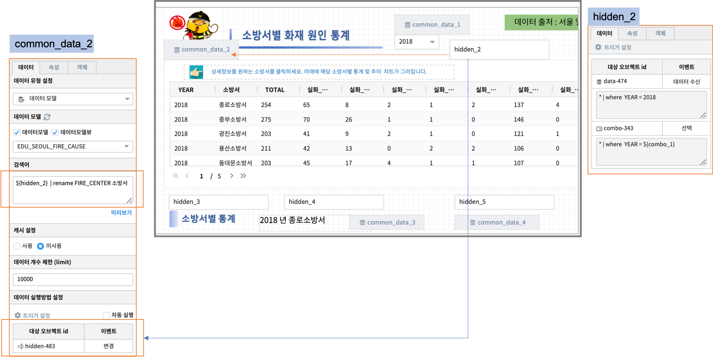

=======================================================================================================================
IRIS Studio - 서울시 안전센터와 소방서 위치 지도 / 화재 원인 통계
=======================================================================================================================

IRIS Studio 를 이용하여 `서울시 열린 데이터 광장 <https://data.seoul.go.kr/dataList/datasetList.do>`__ 에 있는 서울시 안전센터 및 소방서 위치 정보와 화재 원인 통계 데이터를 이용하여 지도와 챠트로 만들어 봅니다.

.. image:: ../images/demo/demo_fire_01.png
    :alt: 데이터 - 01 

.. contents::
    :backlinks: top

|

------------------------------
데이터 준비
------------------------------

''''''''''''''''''''''''''''''''
데이터 가져오기 
''''''''''''''''''''''''''''''''

- 출처 
    - 서울시 안전센터, 소방서, 화재 원인 데이터 : `서울시 열린 데이터 광장 <https://data.seoul.go.kr/dataList/datasetList.do>`__ 
    - 서울시 구단위 행정 경계 데이터 ( SHP 파일 ) : 국토교통부 행정구역도 `공공 데이터 포털 <https://www.data.go.kr/dataset/3046391/openapi.do>`__

'''''''''''''''''''''''''''''''''''
데이터 업로드
'''''''''''''''''''''''''''''''''''

로컬 PC 에 다운로드된 파일들은 각각의 데이터에 맞게 ``데이터 전처리과정`` 을 실행합니다.
데이터전처리과정은 생략합니다.

``IRIS Discovery >> 파일브라우저`` 메뉴에서 **MINIO** 를 선택하여 `MinIO 에 데이터 업로드 <http://docs.iris.tools/manual/IRIS-Usecase/usecase4-batting_data/index.html#minio>`__ 를 실시합니다.

'''''''''''''''''''''''''''''''''''''''''''''''
데이터모델 만들기 
'''''''''''''''''''''''''''''''''''''''''''''''

``IRIS Discovery >> 데이터 모델`` 메뉴에서 MinIO 에 저장된 파일들을 데이터모델로 생성합니다.

    - 참고 : `데이터모델 만들기 - MinIO <http://docs.iris.tools/manual/IRIS-Usecase/usecase4-batting_data/index.html#id3>`__

.. list-table::
    :header-rows: 1

    * - 모델 이름
      - 설 명  
    * - EDU_SEOUL_GU_WGS84
      - 서울 행정구 경계 polygon WGS_84
    * - EDU_SEOUL_SAFETY_CENTER_COOR
      - 서울시 안전센터 위치 위/경도
    * - EDU_SEOUL_FIRE_STA_COOR
      - 서울시 소방서 위치 위/경도
    * - EDU_SEOUL_GU_FIRE_CAUSE
      - 서울시 구별 화재원인 통계
    * - EDU_SEOUL_FIRE_CAUSE
      - 서울시 관할 소방서별 화재원인(2011 ~ 2018년)
    * - EDU_SEOUL_MELT_FIRE_CAUSE
      - 데이터모델 EDU_SEOUL_FIRE_CAUSE 를 피봇팅한 테이블(pivot)

**데이터모델 예시**

- 서울시 구단위 행정 경계 좌표 -  데이터모델 "EDU_SEOUL_GU_WGS84" 

.. image:: ../images/demo/demo_fire_02.png
    :alt: 데이터 - 02

- 서울시 관할 소방서 위치 위,경도 정보 - 데이터모델 "EDU_SEOUL_FIRE_STA_COOR"

.. image:: ../images/demo/demo_fire_03.png
    :alt: 데이터 - 03

- 서울시 안전센터 위치 위,경도 정보 - 데이터모델 "EDU_SEOUL_SAFETY_CENTER_COOR"

.. image:: ../images/demo/demo_fire_04.png
    :alt: 데이터 - 04

----------------------------------
Studio 보고서 따라하기
----------------------------------

''''''''''''''''''''''''''''''''''''''''''''''''''''''''''''''''''''''
지도 : 서울시 안전센터 및 관할 소방서 위치 정보
''''''''''''''''''''''''''''''''''''''''''''''''''''''''''''''''''''''

지도 API 레이어인 ``layer map(지도)`` 레이어(2021년 업그레이드 버전은 "Base Map" 으로 이름이 변경되었습니다) 와 ``구별화재건수``, ``안전센터``, ``소방서`` 3개의 데이터 레이어로 구성하였습니다.

^^^^^^^^^^^^^^^^^^^^^^^^^^^^^^^^^^^^^^^^^^^^^^^^^^^^^^^^^^^^^^^^^
레이어별 데이터와 시각화옵션 설정
^^^^^^^^^^^^^^^^^^^^^^^^^^^^^^^^^^^^^^^^^^^^^^^^^^^^^^^^^^^^^^^^^

**구별화재건수 레이어**

- 데이터
  
  - 서울시 행정구별 / 화재원인별 건수 통계가 있는 데이터모델 "EDU_SEOUL_GU_FIRE_CAUSE" 
  - 서울시의 행정구 경계 좌표가 있는 데이터모델  "EDU_SEOUL_GU_WGS84"
  
- 지도 유형
  
  - 지도의 시각화유형 ``도형`` 을 선택하여 각 행정구를 수십개의 꼭짓점이 있는 다각형 도형으로 표현합니다.

- 행정구별 색상

  - 행정구별 도형의 색상은 구별 화재건수의 합(TOTAL)이 증가하면 진한 색상이 되도록 그라디언트(색상의 진하기) 로 표시합니다.

- 검색어 구문
  
.. code::

    * | where YEAR=2018  
      | join LEFT_OUTER  EDU_SEOUL_GU_WGS84  EDU_SEOUL_GU_WGS84.GU_NAME = EDU_SEOUL_GU_FIRE_CAUSE.GU_NAME

.. image:: ../images/demo/demo_fire_07.png
    :alt: map - 07

**안전센터 레이어**

- 데이터

  - 서울시 안전센터의 위치 위,경도 좌표가 있는 데이터모델 "EDU_SEOUL_SAFETY_CENTER_COOR"

- 지도 유형 : 마커(포인트)

.. image:: ../images/demo/demo_fire_09.png
    :alt: map - 09 

**소방서 레이어**
  
- 데이터

  - 서울시 소방서 위치 위,경도 좌표가 있는 데이터모델  "EDU_SEOUL_FIRE_STA_COOR"

- 지도 유형 : 마커(포인트)

.. image:: ../images/demo/demo_fire_10.png
    :alt: map - 10 

'''''''''''''''''''''''''''''''''''''''''''''''''''''''''''''''''''''''''''''''''''''''''
선택한 연도의 소방서별 화재 원인 통계 테이블 & 챠트
'''''''''''''''''''''''''''''''''''''''''''''''''''''''''''''''''''''''''''''''''''''''''

.. image:: ../images/demo/demo_fire_11.png
    :alt: map - 11

- [1] 연도를 선택하는 콤보박스

  - 조회할 연도를 선택하기 위해 ``[1]콤보박스`` 를 만듭니다.
  - DSL manual 참조 : `콤보 박스 생성 <http://docs.iris.tools/manual/IRIS-Usecase/usecase4-batting_data/index.html#id7>`__
  - 데이터모델 "EDU_SEOUL_FIRE_CAUSE"
  - 검색어 : distinct 한 YEAR(연도)를 내림차순으로 정렬합니다.
  
.. code::

    ``* | fields +YEAR | distinct YEAR | sort -YEAR``

|

- [2] 데이터출처로 이동하는 버튼 객체

  - 데이터 출처로 이동할 수 있도록  ``[2]버튼 객체`` 에 문구를 입력하고, 버튼 클릭으로 데이터출처 사이트가 팝업되게 합니다.
  - `IRIS-Manual :  버튼 링크  <https://docs.iris.tools/manual/IRIS-Manual/IRIS-Studio/control.html#button>`__ 
  - 버튼문구는 "데이터 출처 : 서울 열린 데이터 광장" 를 입력합니다.
  - ``윈도우팝업`` 아이콘을 선택하고, 주소에 데이터 출처 URL 을 입력합니다.
  
    - 팝업 윈도우의 크기를 px 단위로 적습니다.

|

- [3] 해당 연도의 소방서별 화재 통계 테이블

  - ``[3]테이블`` 에는 ``[1]콤보박스`` 에 선택한 연도의 데이터로 필터링되어 출력됩니다. 
  - 디폴트로 "2018" 이 선택되어 있어서 콤보박스에서 연도를 선택하기 전에는 "2018년" 데이터로 필터링한 결과가 표시됩니다.
  
    - 히든 객체인 ``텍스트변환`` 객체를 활용합니다. 
    - 보고서 편집화면에서 "hidden_2" 객체를 확인하시기 바랍니다.
    
  - 콤보박스에서 연도를 선택하면 해당 연도로 필터링한 데이터가 테이블에 표시됩니다. 
  - `IRIS-Tutorial : 콤보박스를 활용하여 데이터 필터링 <http://docs.iris.tools/manual/IRIS-Tutorial/IRIS_Studio/combobox_report/combobox_report.html>`__ 

.. code::

    콤보박스에서 연도선택을 하기전에는 디폴트로 설정된 연도가 자동으로 테이블에 출력되고, 콤보박스의 연도를 선택하면 테이블 내용이 변경하게 하려면 
    히든객체인 "텍스트변환" 객체를 활용합니다.

- 테이블 클릭 이벤트 시 전달되는 변수와 값

  -  ``[3]테이블`` 결과에서 클릭하는 행의 **YEAR,소방서** 값을 ``${area_번호}`` 변수로 저장하여 다른 객체의 이벤트값으로 전달되도록 설정합니다. 
  -  `IRIS-Manual : 보고서 작성 <http://docs.iris.tools/manual/IRIS-Manual/IRIS-Studio/studio/index2.html#id8>`__  에서 `이벤트값 전달 설정 <http://docs.iris.tools/manual/IRIS-Manual/IRIS-WEB/data_browser/studio/04.html#id13>`__  과 `트리거 설정 <http://docs.iris.tools/manual/IRIS-Manual/IRIS-WEB/data_browser/studio/04.html#id13>`__  을 참조하세요.

- [4] 선택한 연도와 소방서를 표시하는 라벨 객체

  - ``[4]라벨``  객체는 ``텍스트변환`` 객체(hidden_3) 객체를 활용합니다.
  - 테이블을 클릭하기 전에는 디폴트로 "2018년 종로소방서" 로 챠트를 그립니다.
  - 테이블 클릭 이벤트가 발생하면  ``${area_번호}`` 변수에 저장된 값을 가져오도록 설정합니다.
  
    - 처음에는 "2018년 종로소방서" 가 표시되고, ``[3]테이블`` 에서 어떤 행을 클릭하면 해당 행의 연도와 소방서로 자동 변경됩니다.

|

- [5] 선택한 연도와 소방서의 화재원인별 가로막대챠트

  - ``[5]가로막대``  챠트도 동일하게 ``텍스트변환`` 객체(hidden_4) 를 이용합니다.
  
    - 디폴트로 "2018년 종로소방서" 의 화재원인별 건수가 표시됩니다.
    - ``[3]테이블`` 클릭 이벤트가 발생하면 클릭한 연도와 소방서의 데이터를 보여줍니다.

|
- [6] 선택한 소방서의 연도별 화재건수 추이 - 꺾은선형 챠트

  - ``[6]꺾은선형`` 챠트도 ``텍스트변환`` 객체(hidden_5) 를 사용합니다.
  
    - 처음에는 디폴트로 "종로소방서" 의 화재발생건수 추이를 꺾은선형으로 보여줍니다.
    - 테이블 클릭 이벤트가 발생하면 ``${area_번호}`` 변수에서 "소방서" 값을 가져와서 해당 소방서에 대한 화재발생건수 추이를 꺾은선형으로 보여줍니다

