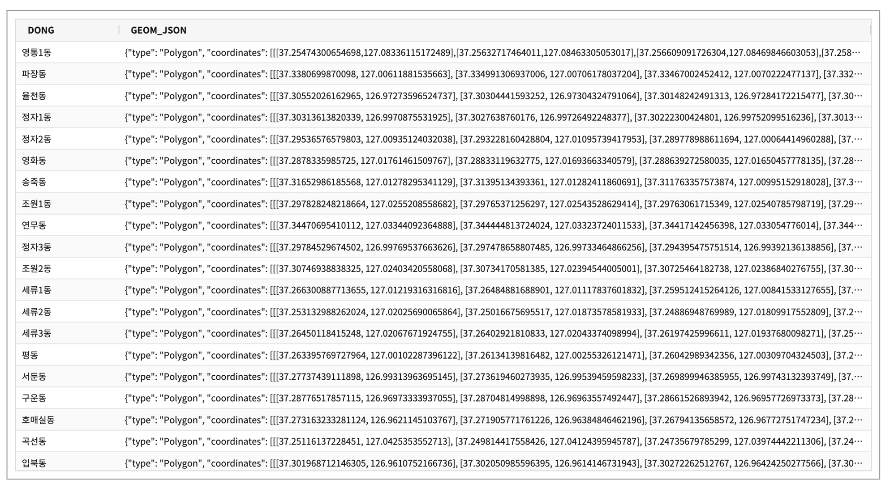
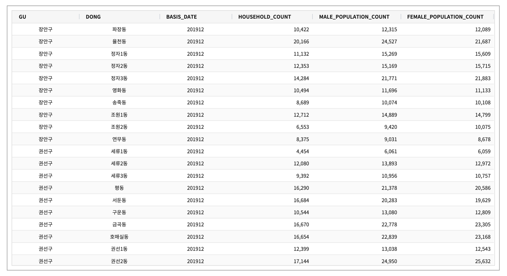
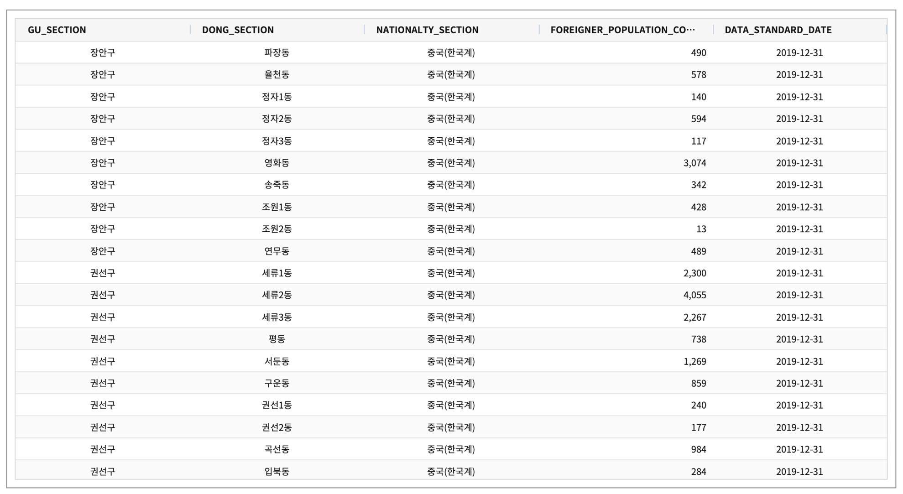
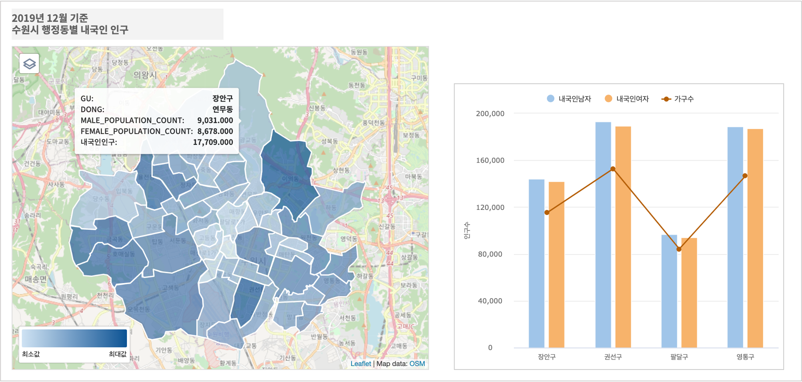
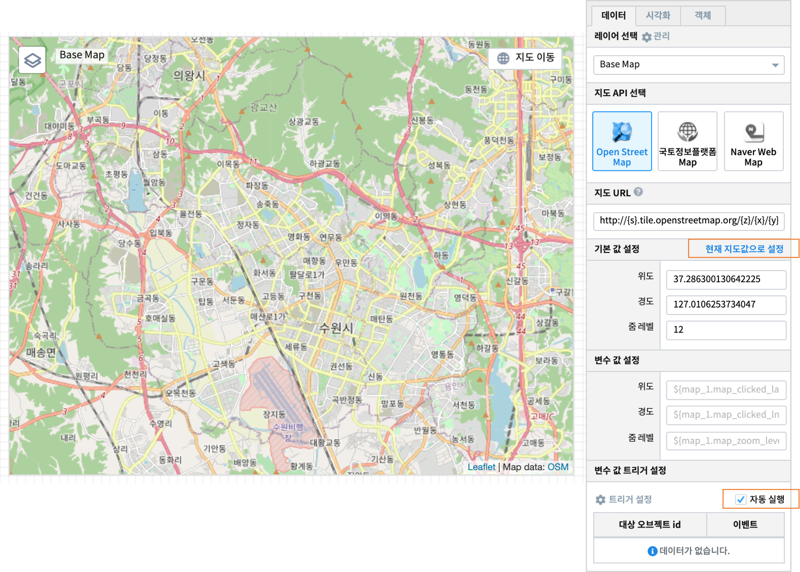
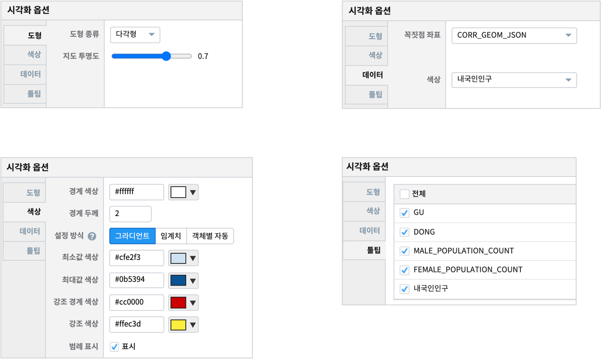
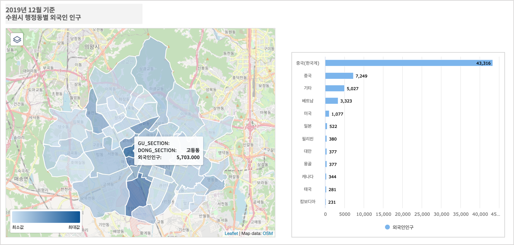
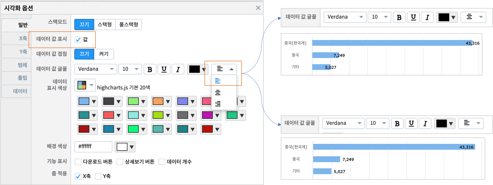

================================================================================
IRIS Studio - 행정 구역 지도와 챠트
================================================================================
    

읍/면/동, 시/군/구 와 같은 행정구역을 지도에 그리고, 행정 구역 별 통계 데이터를 지도와 챠트로 표현해 봅니다.
데이터는 수원시의 구/동별 인구 관련 데이터입니다.

수원시의 동단위 인구 분포를 지도로 표현해보고, 인구 구성 및 국적별 외국인 인구를 챠트로 그려봅니다.

출처 : 수원시 공공 데이터 `통계로 보는 수원 <http://stat.suwon.go.kr/stat/index.do>`__

.. contents::
    :backlinks: top

--------------------------------------
데이터 
--------------------------------------

- 데이터 모델 ``EDU_MAP_SUWON_DONG_CORR``
  - 수원시 행정동 경계 좌표
  - Polygon 타입의 geometry 정보

- 데이터모델 ``EDU_수원시_동별인구``
  - 수원시 행정동별 내국인 인구수

- 데이터모델 ``EDU_수원시_동별외국인인구``
  - 수원시 행정동별 / 국적별 외국인 인구

----------------------------------------------------------------------------------------------------
지도 (행정동별 내국인 인구) & 다중축 (남/여 내국인인구와 가구수)  
----------------------------------------------------------------------------------------------------

'''''''''''''''''''''''''
지도 레이어 - Base Map
'''''''''''''''''''''''''

지도 API 로 ``Open Street Map`` 을 선택합니다.
지도의 기본 위치로  **수원** 이 오도록 한 후 적당한 줌레벨로 확대/축소합니다. (지도의 우측 상단이 ``지도 이동`` 버튼 상태이면 지도에서 위치 이동이 됩니다.)

그리고 해당 위,경도, 줌레벨로 **현재 지도값으로 설정** 을 클릭하면 Base Map 지도 위치와 줌레벨이 저장됩니다.

''''''''''''''''''''''''''''''''''''''''''''''''''''''''''''''''''''
지도 레이어 - 행정동별 내국인인구
''''''''''''''''''''''''''''''''''''''''''''''''''''''''''''''''''''

수원시의 44개 행정동별로 내국인 인구를 색상의 진하기로 표시합니다.

- 지도 유형 : 도형(다각형)
- 데이터 : 데이터모델 "EDU_수원시_동별인구"
- 검색어 
  - 기준 시점은 "201912" 로 2019년 12월 통계 데이터
  - 행정동 컬럼인 ``DONG`` 에서 join 대상인 데이터모델 "EDU_MAP_SUWON_DONG_CORR" 의 ``DONG`` 컬럼의 값과 일치시키기 위해 빈 칸을 제외합니다. `replace <https://docs.iris.tools/manual/IRIS-Manual/IRIS-Discovery-Middleware/command/commands/replace.html#replace>`__ 
  - 수원시 행정동의 geometry 정보가 있는 데이터모델 "EDU_MAP_SUWON_DONG_CORR" 와 join 합니다. `merge <https://docs.iris.tools/manual/IRIS-Manual/IRIS-Discovery-Middleware/command/commands/merge.html#merge>`__ 
  - 데이터모델 "EDU_수원시_동별인구" 은 남자와 여자 내국인 인구가 따로 계산되어 있는데, 이를 합해서 ``내국인인구`` 로 생성합니다. `calculate <https://docs.iris.tools/manual/IRIS-Manual/IRIS-Discovery-Middleware/command/commands/calculate.html#calculate>`__ 
  
.. code::

    * | where BASIS_DATE = '201912' 
      | replace DONG  " " "" 
      | merge ( EDU_MAP_SUWON_DONG_CORR ) as CORR on CORR.DONG = DONG
      | calculate MALE_POPULATION_COUNT + FEMALE_POPULATION_COUNT as  내국인인구

- 시각화옵션

  - 시각화 유형을 ``도형`` 으로 선택하면 아래와 같은 시각화 옵션 설정창이 생성됩니다.
  - **도형** 유형은 다각형 / 원형 에서 선택할 수 있습니다. 행정동 경계를 그려야 하므로, ``다각형`` 을 선택합니다.
  - 지도 투명도를 0.7 로 조정하여 Base Map 레이어의 Open Street Map 이 약간 보이도록 설정할 수 있습니다.
  - **색상** 에서 행정동 경계의 두께와 색상을 선택합니다.
  - 각 행정동별 ``내국인인구`` 값에 따라 행정동 도형을 채우는 색상을 ``그라디언트`` 방식으로 최소값와 최대값 색상을 설정합니다.
  - **데이터** 에서 ``꼭짓점 좌표`` 에 행정동경계를 나타내는 Polygon geometry 정보가 있는 컬럼을 지정합니다.
  - ``색상`` 에서  행정동 도형을 채우는 색상의 정도를 정하는 컬럼을 지정합니다.
  

''''''''''''''''''''''''''''''''''''''''''''''''''''''''''''''''''''
다중축 챠트 
''''''''''''''''''''''''''''''''''''''''''''''''''''''''''''''''''''

세로막대 - 세로막대 - 꺾은선형 챠트로 다중축 챠트를 그립니다.

- 데이터 : 데이터모델 "EDU_수원시_동별인구"
- 검색어 : 

.. code::

    * | where BASIS_DATE = '201912' 
      | replace DONG  " " ""  
      | stats sum(MALE_POPULATION_COUNT) as 내국인남자, 
              sum(FEMALE_POPULATION_COUNT) as 내국인여자, 
              sum(HOUSEHOLD_COUNT) as 가구수 
        by GU

- X 축 : GU ( 행정구 )
- Y(1) 세로막대 : 내국인남자
- Y(2) 세로막대 : 내국인여자
- Y(3) 꺾은선형 : 가구수
  

----------------------------------------------------------------------------------------------------
지도 (행정동별 외국인 인구) & 가로막대챠트 (국적별 외국인수)  
----------------------------------------------------------------------------------------------------

**Base Map** 레이어는 행정동별 내국인 인구 지도와 동일합니다.

''''''''''''''''''''''''''''''''''''''''''''''''''''''''''''''''''''
지도 레이어 - 행정동별 외국인 인구
''''''''''''''''''''''''''''''''''''''''''''''''''''''''''''''''''''

수원시의 44개 행정동별로 외국인 인구를 색상의 진하기로 표시합니다.

- 지도 유형 : 도형(다각형)
- 데이터 : 데이터모델 "EDU_수원시_동별외국인인구"
- 검색어
  - 기준 시점은 "201912" 로 2019년 12월 통계 데이터
  - 수원시 행정동별로 합계를 구하여 ``외국인인구`` 컬럼을 생성합니다. `stats <https://docs.iris.tools/manual/IRIS-Manual/IRIS-Discovery-Middleware/command/commands/stats.html#stats>`__ 
  - 수원시 행정동의 geometry 정보가 있는 데이터모델 "EDU_MAP_SUWON_DONG_CORR" 와 join 합니다. `merge <https://docs.iris.tools/manual/IRIS-Manual/IRIS-Discovery-Middleware/command/commands/merge.html#merge>`__ 

  
.. code::

    * | stats sum(FOREIGNER_POPULATION_COUNT) as 외국인인구 by GU_SECTION,DONG_SECTION 
      | merge ( EDU_MAP_SUWON_DONG_CORR ) as CORR on CORR.DONG = DONG_SECTION

''''''''''''''''''''''''''''''''''''''''''''''''''''''''''''''''''''
가로막대 챠트
''''''''''''''''''''''''''''''''''''''''''''''''''''''''''''''''''''

수원시에 등록된 외국인을 국적별로 구하여 가로막대 그래프로 보여줍니다.

- 데이터 : 데이터모델 "EDU_수원시_동별외국인인구"
- 검색어 : 

.. code::

    * | stats sum(FOREIGNER_POPULATION_COUNT) as 외국인인구 by NATIONALTY_SECTION 
      | sort 외국인인구

- 시각화옵션에서 ``데이터 값 표시`` 를 체크한 후 데이터 값 정렬을 수정하여 챠트에서 값이 잘 보이게 합니다.
  

