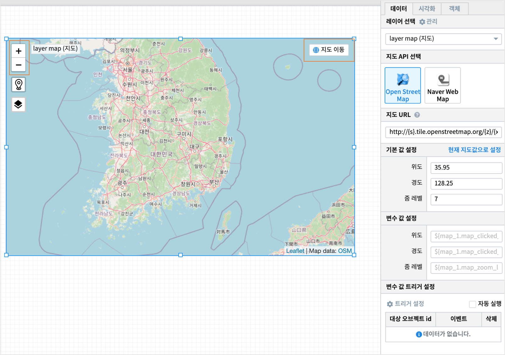

.. sectnum::

================================================================================
IRIS Studio - 수원시 공공 데이터를 map 에 표시 
================================================================================
    
|

-----------------
요약 
-----------------

| 지도에 위/경도가 있는 데이터를 마커(점 또는 깃발)로 찍어서 보여주려고 한다.
| 아래 처럼 5개의 아이템을 5개의 색깔로 점을 찍어서 전반적인 분포를 본다.
|
|     - 수원주차장표준데이터		: SUWON_PARKING_PLACE_INFORMATION
|     - 수원어린이보호구역표준데이터	: SUWON_CHILD_PROTECTION_AREA_INFORMATION
|     - 수원공공시설개방표준데이터	: SUWON_PUBLIC_FACILITY_OPENING_INFORMATION
|     - 수원CCTV표준데이터		: SUWON_CCTV_INFORMATION
|     - 수원보안등정보표준데이터	: SUWON_SECURITY_LAMP_INFORMATION

|

------------------
데이터 
------------------

|

- 모든 데이터는 IRIS DB 테이블에 있다는 가정이다.

- DB 브라우저에서 데이터 확인하기

.. image:: ../images/map_suwon/sw_1.png
    :height: 400
    :width: 800
    :scale: 100%
    :alt: DB브라우저에서 데이터 확인-1

|

- 위/경도 컬럼 확인 

.. image:: ../images/map_suwon/sw_2.png
    :height: 400
    :width: 800
    :scale: 100%
    :alt: DB브라우저에서 데이터 확인-2

|

--------------------
최종 지도 예시
--------------------

|

.. image:: ../images/map_suwon/최종1.png
    :height: 450
    :width: 800
    :scale: 100%
    :alt: 수원시 데이터 지도

|
|

----------------------------------
IRIS Studio : 지도 예제
----------------------------------

'''''''''''''''''''''''''''''''''''''''''
새 보고서 
'''''''''''''''''''''''''''''''''''''''''

- 보고서 메뉴에서 새보고서 클릭

.. image:: ../images/map_suwon/sw_4.png
    :height: 250
    :width: 800
    :scale: 100%
    :alt: 새보고서

|

- text 박스에 text 설명 추가하기

.. image:: ../images/map_suwon/sw_text01.png
    :height: 450
    :width: 800
    :scale: 100%
    :alt: 새보고서

- 첫번째 layer map(지도) : open street map 선택
- 지도의 기본 위치로 수원이 오도록 한 후 이 값으로 지도의 기본값 설정하기

|

- 레이어 5개를 추가로 설정한다. 각각 보여주려는 아이템 이름으로 layer 이름을 정한다.

.. image:: ../images/map_suwon/sw_layer_add_1.png
    :height: 250
    :width: 800
    :scale: 100%
    :alt: map layer add

|

- 아이템 선택을 위한 체크 박스 만들기 : 주차장, 어린이보호구역, 공공시설개방, CCTV, 보안등정보
    - 한 개의 layer에 1개의 아이템을 선정한다.

.. image:: ../images/map_suwon/sw_chb_1.png
    :height: 50
    :width: 800
    :scale: 100%
    :alt: 체크박스_1

|

.. image:: ../images/map_suwon/sw_chb_2.png
    :height: 400
    :width: 300
    :scale: 100%
    :alt: 체크박스_2

- 먼저 주차장 layer 의 데이터를 가져오기 위한 설정값 입력

.. image:: ../images/map_suwon/sw_layer1_1.png
    :height: 450
    :width: 800
    :scale: 100%
    :alt: layer_1 data

|

- 주차장 layer 의 데이터는 주차장 체크박스에서 선택되면 실행되도록 트리거 설정한다.

.. image:: ../images/map_suwon/sw_layer2_1.png
    :height: 450
    :width: 800
    :scale: 100%
    :alt: layer_1 ch

|

- 주차장의 위/경도 좌표를 마커(점) 으로 표시하고, 색상을 지정한다.

- 마커에 해당하는 컬럼과 커서를 대면 툴팁으로 표시될 컬럼을 지정한다.

.. image:: ../images/map_suwon/sw_layer3.png
    :height: 450
    :width: 800
    :scale: 100%
    :alt: layer_1 마커

- 동일한 방법으로 나머지 어린이보호구역/공공시설개방/CCTV/보안등정보 레이어를 생성한다.

|
|

- 각 레이어의 마커 색깔 정보를 보기 쉽게 하기 위해 범례를 따로 만들기로 한다.

.. image:: ../images/map_suwon/범례.png
    :scale: 100%
    :alt: 범례

- 주차장 레이어의 마커 색상 정보를 복사한다.

.. image:: ../images/map_suwon/범례2.png
    :height: 250
    :width: 300
    :scale: 100%
    :alt: layer_1 마커

- 메뉴바에서 텍스트상자 클릭

.. image:: ../images/map_suwon/범례3.png
    :scale: 100%
    :alt: 텍스트상자

- 텍스트 상자를 지도 위에 적당한 크기로 그리고, 속성탭에서 기본값으로 주차장 입력한다.

.. image:: ../images/map_suwon/주차장범례속성.png
    :height: 250
    :width: 300
    :scale: 100%
    :alt: 주차장범례 속성

- 메뉴바에서 사각형 을 선택하고, 주차장 텍스트 박스 아래에 두고 복사한 주차장 마커의 색상 정보를 설정한다.

.. image:: ../images/map_suwon/사각형속성.png
    :height: 250
    :width: 300
    :scale: 100%
    :alt: 주차장범례 속성

- 다른 레이어의 범례도 같은 방법으로 생성한다.

- 최종 보기

.. image:: ../images/map_suwon/최종.png
    :height: 450
    :width: 800
    :scale: 100%
    :alt: 최종

|

- 참고로 현재 체크박스에서 선택을 삭제해도 지도에서는 마커가 그대로 보이므로, 
    - re-load 하여 다시 체크박스에서 선택하거나
    - 지도의 레이어팝업 창에서 레이어별로 보기를 선택하는 방법을 사용해야 한다.

