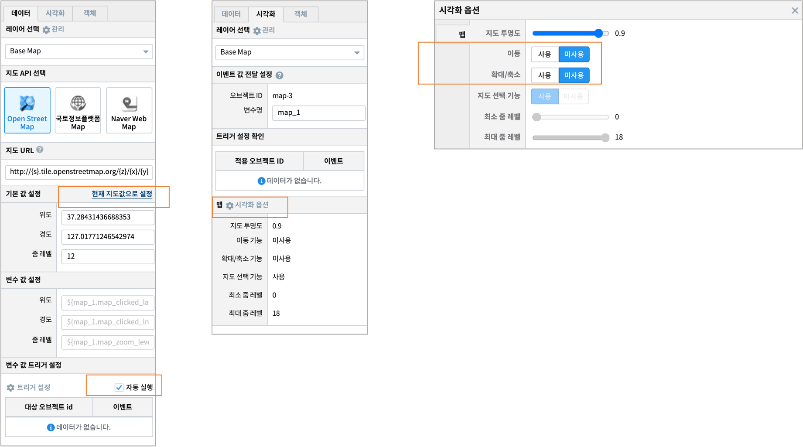
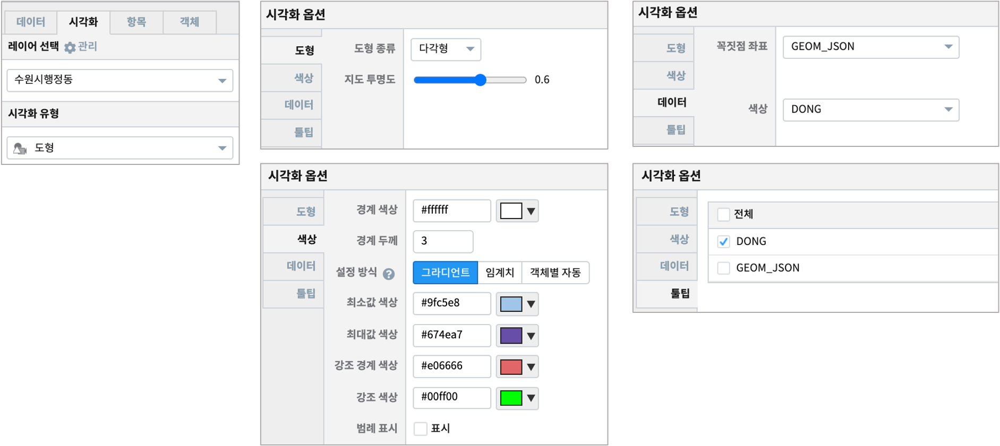
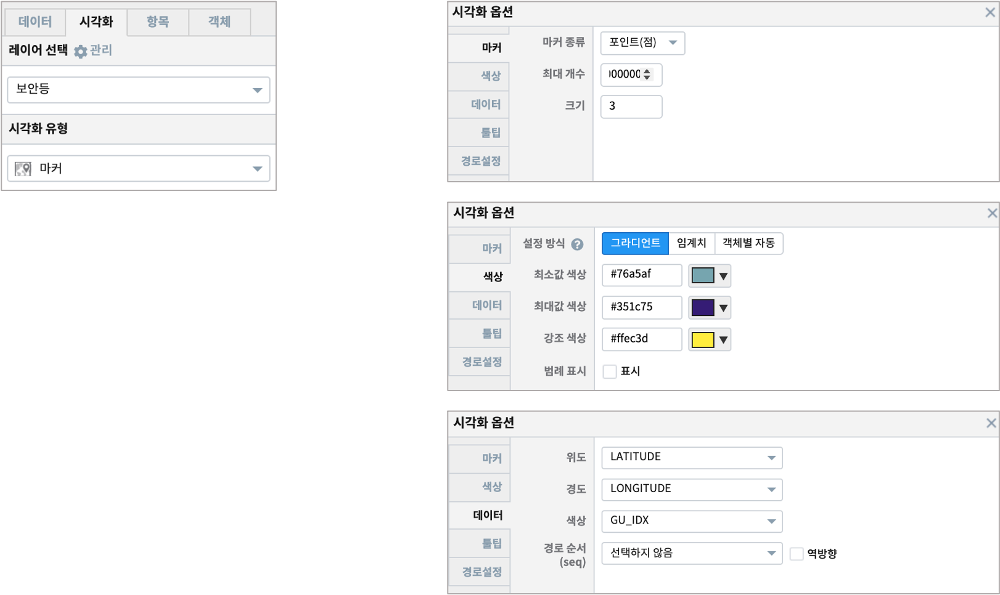

================================================================================
IRIS Studio - 수원시 공공 데이터 예제
================================================================================
  
| 수원시의 보안등 정보를 마커(포인트) 레이어로 만들어서 지도에 표시하여 분포를 보여줍니다.
|

| 데이터 원본 출처 : `공공데이터포털 <https://www.data.go.kr/search/index.do>`__ 의 "수원보안등정보표준데이터"

- 데이터
  
  - 수원시 행정동 경계 : EDU_MAP_SUWON_DONG_CORR
  - 수원시 보안등정보표준데이터 :  EDU_MAP_SUWON_SECURITY_LAMP  
     => 2019년 자료. 수원시 일부 3개 행정구(장안구, 권선구, 영통구) 의 관리 대상 보안등 정보

---------------------------------------------------------------
레이어 : Base Map 
---------------------------------------------------------------

| **Base Map** 레이어에서 지도 API 로 ``Open Street Map`` (default API) 을 선택합니다.
| 수원시 위치로 지도 이동하여 적당한 줌레벨로 지도 위치를 설정합니다.
|

| 1차로 수원시가 중앙에 오도록 이동하고, 적절히 확대를 합니다. 지도 위치 선정(여러번 할 예정입니다)이 완료되면  ``현재 지도값으로 설정`` 을 클릭합니다. 
| 그래야 설정한 위/경도가 중심좌표가 되고, 줌레벨에 따라 지도에 표시됩니다. 

레이어가 추가되면서 여러 번 Base Map 레이어로 돌아와서 지도이동으로 적절한 중심 좌표를 다시 설정하게 됩니다.
이 때에도 ``현재 지도값으로 설정`` 을 클릭해야 중심 좌표와 줌레벨이 저장됩니다.

최종 설정이 완료되어 지도 이동과 줌레벨을 고정하고 싶을 때는 시각화옵션에서 ``이동``, ``확대/축소`` 를 "미사용" 으로 설정합니다.

---------------------------------------------------------------
레이어 : 수원시행정동
---------------------------------------------------------------

| **수원시행정동** 레이어의 데이터탭에서 데이터모델과 검색어를 입력 후 실행합니다.
|
| 데이터모델 ``EDU_MAP_SUWON_DONG_CORR``  을 검색하고, 시각화 탭에서 ``도형``  으로 시각화 유형을 선택합니다.
|
- 시각화 옵션 예시

---------------------------------------------------------------
레이어 : 보안등 
---------------------------------------------------------------

| **보안등** 레이어는 수원시의 행정구 중 3개 행정구(장안구, 권선구, 영통구) 의 관리 대상 보안등을 ``마커(포인트)`` 로 지도에 표시합니다.
|
| 데이터모델 ``EDU_MAP_SUWON_SECURITY_LAMP`` 을 검색하고, 시각화 텝에서 ``마커`` 로 시각화 유형을 선택합니다.
|
- 검색어

.. code::

    * | fillna LATITUDE 
      | fields SECURITY_LAMP_LOCATION_NAME, INSTALLATION_COUNT, LATITUDE, LONGITUDE,OFFER_INSTITUTION_CODE, MANAGEMENT_INSTITUTION_NAME

      | indexer MANAGEMENT_INSTITUTION_NAME to GU_IDX_I 
      | calculate GU_IDX_I + 1 as GU_IDX

| ``indexer`` , ``calculate`` 명령어를 사용하여 text 타입인 MANAGEMENT_INSTITUTION_NAME 의 값을 1, 2, 3 숫자로(GU_IDX 컬럼) 변환합니다.
| 색상을 표시하는 컬럼은 숫자 타입이어야 하며, text 일 때는 검정색 단일 색상으로 점으로 표시됩니다.
| 시각화 옵션의 ``색상`` 에서 "그라디언트" 를 선택하고, 최소 ~ 최대값 색상을 지정하면 색상 컬럼의 값에 따라 색상이 지정됩니다. 
| GU_IDX 컬럼은 1,2,3 의 값을 가지며, 보안등 관리 행정구 3개를 인덱스 번호로 생성한 것입니다.
| 따라서 보안등 마커(포인트)는 관리 행정구별로 3가지 다른 색상으로 지도에 표시됩니다.
|
- 시각화 옵션 예시

