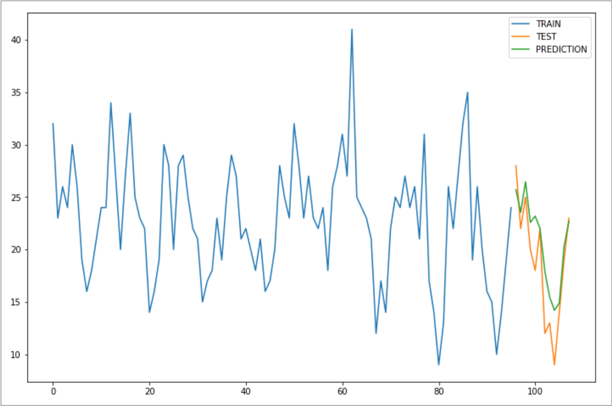

Python - IRIS 데이터모델을 이용한 분석 예제 
=============================================================================

| ``IRIS Playground >> Jupyter`` 의 **Python 3** notebook 에서 활용하는 예제입니다.
| API 를 통해 IRIS의 데이터 모델의 데이터를 DSL( `Domain-Specific Languag <http://docs.iris.tools/manual/IRIS-Manual/IRIS-Discovery-Middleware/index.html#iris-discovery-middleware-service>`__ ) 로 집계 및 필터링을 거친 데이터로 가져옵니다.
| 이 데이터로 ``IRIS Playground >> Jupyter`` 메뉴에서 Python notebook 으로 예측 모델링 과정을 진행합니다.
| 결과는 html 파일로 저장하여  IRIS Studio 보고서에서 링크를 통해 볼 수 있도록 합니다.
|

----------------------------------------------
IRIS 데이터 모델
----------------------------------------------

| 서울시 대기 정보 통계가 저장된 IRIS 데이터모델  : EDU_SEOUL_AIR_1987_2020
| 1987년 ~ 2020년 동안 서울특별시의 대기 정보 일일 통계입니다.
| 데이터 출처 : `서울 열린데이터광장 <http://data.seoul.go.kr/dataList/OA-2218/S/1/datasetView.do>`__ 
|
- ``IRIS Analyzer >> 검색`` 에서 "EDU_SEOUL_AIR_1987_2020" 을 검색 시간 2020년으로 설정하여 조회한 결과입니다.

.. image:: images/R_IRIS_Ana_01.png
   :alt: R_IRIS 01

---------------------------------------------------------
Jupyter - Python 3 : API 로 IRIS 데이터 가져오기
---------------------------------------------------------

| ``Playground >> Jupyter`` 를 선택합니다.
| Python 3 으로 Jupyter Notebook 을 생성합니다.
|
| API 로 IRIS 에 접속하여 IRIS데이터모델 데이터를 가져오는 예제 스크립트는 `IRIS Analyzer - 분석 코드 복사 <https://docs.iris.tools/manual/IRIS-Manual/IRIS-Analyzer/01_search/search.html?highlight=%EB%B6%84%EC%84%9D%EC%BD%94%EB%93%9C#id15>`__  를 참조합니다.
|
| 아래 코드는 이 스크립트를 참조하여 EDU_SEOUL_AIR_1987_2020 로 부터 조회한 결과를 가져오는 부분입니다.
|

.. code::

    #!/usr/bin/env python
    # coding=UTF-8
    import json
    import http.client # 3.7
    import sys

    addr = "angora-svc" # hostname 입력
    port = 6036 # port number 입력

    # 월단위 중간값
    q = "model name = 'EDU_SEOUL_AIR_1987_2020' model_owner = demo | fillna PM2_5 | \
         stats median(PM2_5) as median_VAL by date_group(YYYYMMDD, \"1m\" ) as YYYYMM | sort YYYYMM"

    size = -1
    user_id = "*****"
    user_passwd = '******' # 계정 암호 입력

   
    host, port = (addr, 6036)
    parameters = {}
    parameters['q'] = q
    parameters['size'] = size
    parameters['save'] = True

    # get token.
    #http_conn = HTTPConnection(host, port)  # old version
    http_conn = http.client.HTTPConnection(host, port)

    http_conn.request(
        "POST",
        "/angora/auth",
        json.dumps({"id": user_id, "password": user_passwd}))
    token = json.load(http_conn.getresponse())["token"]
   
    # Query / Fetch Session ID
    headers = {}
    headers["Accept"] = "application/json"
    headers["Content-Type"] = "application/json"
    headers["Authorization"] = "Angora %s" % token
    body = json.dumps(parameters)

    http_conn.request("POST", "/angora/query/jobs", body=body, headers=headers)
    r = json.load(http_conn.getresponse())
    try :
        sid = r["sid"]
    except Exception :
        sys.exit()

    http_conn.request(
        "GET",
        "/angora/query/jobs/%s" % sid,
        headers=headers)
    response = json.loads(http_conn.getresponse().read())

    cnt = 1  # print limit : 20
    for item in response['results']:
        print(item)

        if cnt > 20 : break
        cnt += 1

    http_conn.close()

----------------------------------------------------------------------
예측하기 - 초미세먼지농도(PM2_5) 의 월별 중간값 
----------------------------------------------------------------------

| IRIS 데이터모델에서 "월별 중간값 PM2_5" 을 DSL query로 조회합니다. 초미세먼지 농도 측정은 2012년부터 데이터가 존재합니다. 
| 
| 월단위로 PM2_5의 중간값을 가져와서 pandas dataframe ``data_df`` 이름으로 저장합니다.
| 2019/12/31 까지 데이터는 training 데이터로, 2020/01/01 이후 데이터는 test 데이터로 분리합니다.
|

.. code::

    import datetime
    import numpy as np
    import matplotlib.pyplot as plt
    import pandas as pd

    column_names = ["YYYYMM", "MEDIAN_VAL"]
    data_df = pd.DataFrame(response['results'], columns=column_names)
    data_df

    # train data 로 2019년 까지의 데이터, test data 로 2020년 데이터로 분리합니다.
    train_data_df = data_df.iloc[:96] 
    test_data_df = data_df.iloc[96:]

| 추세를 직선이 아닌 지수적으로 증가한다고 적용하여 승법모형 적용. triple exponetial 변환 즉, Holt-Winters 모형으로 예측합니다.
| train data 로 예측한 값과 test data 를 같이 plot 을 그려봅니다.

.. code:

    # statsmodels 라이브러리의 FutureWarning 을 미표시
    from warnings import simplefilter
    simplefilter(action='ignore', category=FutureWarning)

    from statsmodels.tsa.holtwinters import ExponentialSmoothing
    
    fitted_model_exp = ExponentialSmoothing(train_data_df['MEDIAN_VAL'], trend='mul',seasonal='mul',seasonal_periods=12).fit() 

    test_predictions_exp = fitted_model_exp.forecast(12).rename('HW_forecast')
 
    train_data_df['MEDIAN_VAL'].plot(legend=True,label='TRAIN')
    test_data_df['MEDIAN_VAL'].plot(legend=True,label='TEST',figsize=(12,8))
    test_predictions_exp.plot(legend=True,label='PREDICTION')
 

