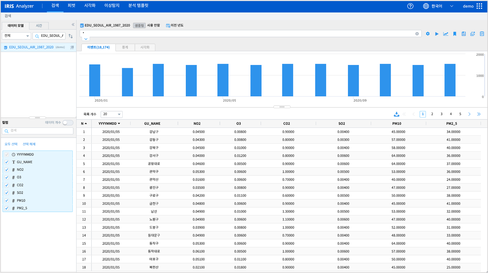
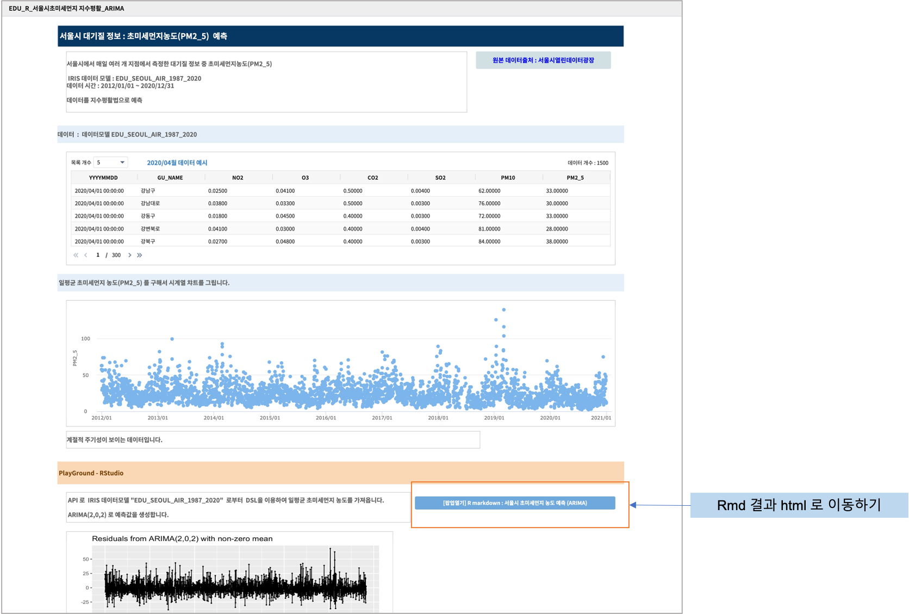

RStudio - IRIS 데이터모델을 이용한 분석 예제 
=============================================================================

| ``IRIS Playground >> RStudio`` 에서 API 를 통해 IRIS의 데이터 모델을 DSL( `Domain-Specific Languag <http://docs.iris.tools/manual/IRIS-Manual/IRIS-Discovery-Middleware/index.html#iris-discovery-middleware-service>`__ ) 로 가져옵니다.
| 이 데이터를 ``IRIS Playground >> RStudio`` 에서 탐색 / 전처리 / 모델링 합니다.
| 최종 분석 결과를 ``Studio`` 를 이용하여 보고서로 생성합니다.
|

----------------------------------------------
IRIS 데이터 모델
----------------------------------------------

| 서울시 대기 정보 통계가 저장된 IRIS 데이터모델  : EDU_SEOUL_AIR_1987_2020
| 1987년 ~ 2020년 동안 서울특별시의 대기 정보 일일 통계입니다.
| 데이터 출처 : `서울 열린데이터광장 <http://data.seoul.go.kr/dataList/OA-2218/S/1/datasetView.do>`__ 
|
- ``IRIS Analyzer >> 검색`` 에서 "EDU_SEOUL_AIR_1987_2020" 을 검색 시간 2020년으로 설정하여 조회한 결과입니다.

---------------------------------------------------------
RStudio : API 로 IRIS 데이터 가져오기
---------------------------------------------------------

| ``Playground >> RStudio`` 를 선택합니다.
| RStudio 에서 API 기반으로 IRIS 데이터모델의 데이터를 가져오는 방법은 `R 에서 IRIS 데이터모델 조회하기 <https://docs.iris.tools/manual/IRIS-Usecase/retrieve_data_from_iris_to_r/query_restapi_datamodel.html#r-iris-restapi>`__ 를 참조하시기 바랍니다.

.. code-block::

    ## REST API PART : httr, jsonlite
    library(httr)
    library(jsonlite)

    #######################################
    ## paramerter assign
    #######################################
    ADDR <- "angora-svc" # hostname
    PORT <- 6036 # port number
    SIZE <- -1
    SAVE_FLAG <- F

    # ID / PASSWRD part
    user_id <- "demo"
    user_passwd <- 'hello.demo'

    #########################################
    ## POST :  get angora_token : authenticate
    #########################################
    parameters <- list('q' = q, 'size' = SIZE, 'save'=SAVE_FLAG)

    auth_url <- sprintf("http://%s:%s/angora/auth", ADDR, PORT)
    body <- list("id" = user_id, "password"=user_passwd )

    auth_res <- POST(auth_url, body = body, encode = "json")
    res <- content(auth_res, as="text")
    token <- fromJSON(res)$token
    angora_token <- sprintf("Angora %s" , token)

    ########################################
    ## POST : get sid
    ########################################
    job_url <- sprintf("http://%s:%s/angora/query/jobs", ADDR, PORT)

| IRIS 데이터모델에서 "평균 PM2_5 농도/day" 을 DSL query로 조회합니다. 초미세먼지 농도 측정은 2012년부터 데이터가 존재합니다. 

.. code-block::

    q <- "model name = 'EDU_SEOUL_AIR_1987_2020' model_owner = demo  | fillna PM2_5 |  stats avg(PM2_5) as AVG_VAL by YYYYMMDD | sort YYYYMMDD"
    parameters <- list('q' = q, 'size' = SIZE, 'save'= SAVE_FLAG)

    sid_res <- POST(job_url,
                add_headers("Authorization"=angora_token),
                body = parameters, encode = "json")
    res <- content(sid_res, as="text")
    sid <- fromJSON(res)$sid

    ###############################################
    ## GET : query result data -> res_df(dataframe)
    ###############################################
    get_url <- sprintf("http://%s:%s/angora/query/jobs/%s", ADDR, PORT, sid)

    data_res <- GET(get_url, add_headers("Authorization" = angora_token))

    res <- fromJSON(content(data_res, as="text", encoding = "UTF-8"), flatten = T)
    res_df <- as.data.frame(res$results)

    colnames(res_df) <- res$fields$name

    res_df$AVG_VAL <- as.numeric(res_df$AVG_VAL)
    res_df$CTIME <- as.POSIXct(res_df$YYYYMMDD, format="%Y%m%d")
    head(res_df)

| 일단위로 PM2_5의 평균 값을 가져와서 res_df 라는 R dataframe 에 저장합니다. 
| train 데이터와 test 데이터로 분리합니다.
| 2020-03-01 이후 데이터를 검증을 위한 ``test_res_df`` 로 두고, 이전 데이터는 예측 모델을 학습할 train 데이터  ``tr_res_df`` 로 분리합니다.

.. code-block::

    tr_res_df <- res_df[res_df$YYYYMMDD < '20200301',]
    test_res_df <- res_df[res_df$YYYYMMDD >= '20200301',]
 
| R package ``timeSeries`` , ``forecast``  로 ARIMA 모델을 이용하여 예측을 합니다.
|
| ``Playground >> RStudio`` 에서 생성한 R Markdown 코드의 실행 결과인 html 파일을 다운로드합니다. ->  `NEW_usecase_R_IRIS.html <https://github.com/mobigen/IRIS-Usecase/blob/master/usecase_playground/images/NEW_usecase_R_IRIS.html>`__ 
| 관련한 내용을 IRIS Studio 에서 보고서 `EDU_R_서울시초미세먼지 지수평활_ARIMA <http://b-iris.mobigen.com:80/studio/exported/9ff2655ef1e547ca8d490bc842c059888998e753e81149b7a505cce9d05d1515>`__  로 생성하였습니다. 
| 아래는 보고서 일부를 화면 캡처한 것입니다. 

